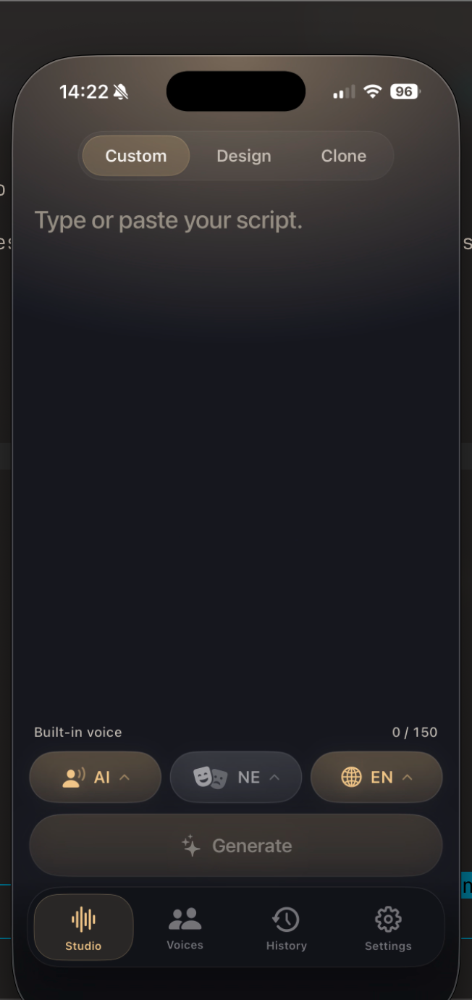

<h1 align="center">Vocello</h1>

<p align="center">
  A local, private voice studio for Apple Silicon — on Mac and iPhone. Write a script, shape how the voice should sound, and generate speech right on your device.<br>
  <strong>On your Mac today · iPhone arriving soon.</strong>
</p>

<p align="center">
  <a href="https://vocello.vercel.app/"></a>
  <a href="https://github.com/PowerBeef/QwenVoice/releases/tag/v2.1.0"></a>
  
  
  
  <a href="LICENSE"></a>
  <a href="https://github.com/PowerBeef/QwenVoice/releases/tag/v2.1.0"></a>
</p>

<p align="center">
  
</p>

<p align="center"><em>Formerly QwenVoice — now Vocello 2.1.</em></p>

---

- 🎙️ **Three ways to make a voice** — pick a built-in speaker, describe one in plain language, or clone from a reference clip you have rights to (record it right in the app, or import a file).
- 🔒 **Private by default** — after a one-time model download, every line renders on your device. No scripts uploaded, no audio sent to a cloud TTS service.
- ⚡ **Native Swift + MLX** — no Python runtime, no bundled weights, no per-line meter and no cloud queue.
- 📱 **iPhone arriving soon** — the same on-device engine on Apple Silicon iPhone; on-device generation already works, with the App Store / TestFlight distribution lane still in progress.

## Get Vocello

| Platform | Build | Notes |
| --- | --- | --- |
| **macOS 26+** (Apple Silicon) | **Vocello 2.1.0** — [Download DMG](https://github.com/PowerBeef/QwenVoice/releases/tag/v2.1.0) | Signed, notarized, stable. Double-click to open. |
| **macOS 15** | QwenVoice 1.2.3 — [Download legacy](https://github.com/PowerBeef/QwenVoice/releases/tag/v1.2.3) | Legacy build. No 2.x backport planned. |
| **iPhone** (iOS 26+, Apple Silicon) | **Arriving soon** | The same on-device engine; ships via App Store / TestFlight (not GitHub Releases). |

## 📱 Vocello for iPhone — arriving soon

<table>
  <tr>
    <td width="300" valign="top">
      
    </td>
    <td valign="top">
      <p>Vocello is coming to iPhone — the <strong>same local, private engine</strong>, running <strong>fully on-device</strong> on Apple Silicon. Write a script, pick or describe a voice, and generate speech without a cloud round-trip, exactly like the Mac app.</p>
      <p><strong>On-device generation already works.</strong> The remaining piece is the <strong>App Store / TestFlight</strong> distribution lane (not GitHub Releases), which is still in progress. No public release date yet.</p>
      <p>This is what the native Swift + MLX rebuild was for: replacing the old bundled Python runtime with an engine that runs entirely on-device — the only way to bring Vocello to iPhone.</p>
      <p><strong>Want to follow along?</strong> Star ⭐ and watch 👀 the repo for updates.</p>
    </td>
  </tr>
</table>

## Why Vocello

- **Private by default.** After models are installed, generation runs locally and your scripts, history, and generated audio stay in local app storage unless you export them.
- **No subscription meter.** Download the models you want, then generate on your own hardware without paying per line or waiting on a cloud queue.
- **Three voice workflows.** Use a built-in speaker, describe a new voice, or clone from a reference clip you own or have permission to use — recorded in the app or imported.
- **Built for Apple Silicon.** A native Swift + MLX engine (replacing the old bundled Python runtime) keeps generation local, private, and fully on-device — and it's what makes the iPhone app possible (Python can't ship on iPhone; on-device MLX can).

## Three voice workflows

<table>
  <tr>
    <td width="50%">
      
      <br>
      <strong>Custom Voice</strong><br>
      Pick one of nine built-in Qwen3 speaker presets, set delivery, and generate a clean spoken line. The fastest path when you want a consistent voice right away.
    </td>
    <td width="50%">
      
      <br>
      <strong>Voice Design</strong><br>
      Describe the voice you want in plain language, then write the script. Vocello shapes the take from that brief.
    </td>
  </tr>
  <tr>
    <td width="50%">
      
      <br>
      <strong>Voice Cloning</strong><br>
      Record a short reference clip with your Mac's microphone, or import one (WAV, MP3, AIFF, M4A, FLAC, or OGG). The optional transcript can auto-fill with on-device transcription. Only clone voices you own or have permission to use.
    </td>
    <td width="50%">
      
      <br>
      <strong>Model downloads</strong><br>
      Install and manage Speed and Quality packages for each voice mode from Settings. Generation screens own the Speed/Quality choice while you write.
    </td>
  </tr>
</table>

## Install (macOS)

1. Download [`Vocello-macos26.dmg`](https://github.com/PowerBeef/QwenVoice/releases/tag/v2.1.0).
2. Open the DMG and drag `Vocello.app` to `/Applications`.
3. Open Vocello.
4. Go to **Settings → Model downloads** and install the voice models you want.
5. Generate from Custom Voice, Voice Design, or Voice Cloning.

No Python setup or local server is required — install the app, download models from Settings, and generate locally.

The DMG is signed with an Apple Developer ID certificate and notarized with a stapled ticket, so the first launch opens with a double-click (no right-click bypass). To verify:

```sh
xcrun stapler validate Vocello-macos26.dmg              # "The validate action worked!"
spctl --assess --type install -vv Vocello-macos26.dmg   # accepted, source=Notarized Developer ID
```

A `release-metadata.txt` (commit SHA, Xcode version, SDK, marketing version, build number) is attached to the same release for build provenance.

## System requirements

- **macOS 26.0+** on an Apple Silicon Mac — available now.
- **iPhone (iOS 26.0+)** on Apple Silicon — arriving soon via App Store / TestFlight.
- Voice models installed from **Settings → Model downloads**.

**Speed** models are smaller 4-bit packages for faster startup and lower memory use. **Quality** models are larger 8-bit packages for devices with more headroom.

Vocello 2.1.0 is the current stable macOS release. For macOS 15, use [QwenVoice v1.2.3](https://github.com/PowerBeef/QwenVoice/releases/tag/v1.2.3); no 2.x backport is planned. Every macOS GitHub Release ships a notarized, stapled, Developer ID–signed DMG — a normal double-click install with no Gatekeeper workarounds.

## Local-first privacy

- Speech generation runs locally after models are installed.
- Generated audio, recorded reference clips, and history stay in local app storage unless you export them.
- Model downloads come from Hugging Face when you install a voice model.
- Recording a reference clip and transcript auto-fill ask for the **Microphone** and **Speech Recognition** permissions on first use. Both run entirely on your Mac — recognition is on-device only, and nothing is sent to Apple or anyone else. (Transcript auto-fill additionally requires Siri to be enabled, a macOS requirement; the app explains this and links the right Settings pane.)
- Voice cloning should only be used with voices you own or have permission to use.

## Build from source

The `main` branch contains the current Vocello codebase (macOS app, iPhone app, and the `vocello` CLI). The stable macOS release is tagged [`v2.1.0`](https://github.com/PowerBeef/QwenVoice/releases/tag/v2.1.0).

Vocello's engine is **native Swift + MLX** — no Python, no bundled weights. On macOS it runs **out-of-process** in an isolated XPC service; on iPhone it runs **in-process**, fully on-device. Architecture, engine invariants, and release policy live in [`CLAUDE.md`](CLAUDE.md).

```sh
git clone https://github.com/PowerBeef/QwenVoice.git
cd QwenVoice
./scripts/regenerate_project.sh
open QwenVoice.xcodeproj
```

The Xcode project is generated from [`project.yml`](project.yml) (edit it, not the `.xcodeproj`, then rerun `regenerate_project.sh`). SPM dependencies — MLX, Swift HuggingFace, GRDB, and the vendored mlx-audio — are deliberately **pinned to exact versions** for backend determinism; bumping them follows a benchmark-gated process documented in [`CLAUDE.md`](CLAUDE.md).

Useful checks:

```sh
./scripts/check_project_inputs.sh
./scripts/build_foundation_targets.sh macos
./scripts/build_foundation_targets.sh ios
```

More technical detail:

- [`CLAUDE.md`](CLAUDE.md) — repo guide: build, architecture, engine invariants, dependency pinning, release policy, conventions
- [`docs/reference/cli.md`](docs/reference/cli.md) — the headless `vocello` command-line tool
- [`docs/reference/privacy-storage.md`](docs/reference/privacy-storage.md) — local storage and deletion details

## Command-line tool (`vocello`)

Vocello ships a headless command-line tool, `vocello`, built from source alongside the app (it is not part of the app download). It drives the same local Swift + MLX engine in-process — no Python, no bundled weights — and serves two roles: scriptable local generation from the terminal, and the deterministic driver for the perf/quality benchmarks. It uses the models you install in the app (Settings → Model downloads); the CLI itself does not download weights.

```sh
./scripts/build.sh cli                 # build build/vocello
build/vocello <command> [options]      # run it (runs in place)
```

| Command | What it does |
| --- | --- |
| `generate` | Synthesize one clip (Custom Voice / Voice Design / Voice Cloning); supports `--stream`, `--json`, and piped stdin. |
| `custom` / `design` / `clone` | Shortcuts for `generate --mode …` (also pick the mode interactively, or list them with `modes`). |
| `batch` | Synthesize many clips from a file with a single model load. |
| `voices` | List, enroll, or delete saved clone voices. |
| `speakers` | List the built-in Custom Voice speakers. |
| `models` | Inventory installed/available models (state, size). |
| `bench` | Drive the perf/quality matrix and aggregate the results. |

```sh
# Generate a clip (mode shortcut), or pipe a script in
build/vocello custom --variant speed --text "The train left at dawn."
echo "Hello there." | build/vocello generate --variant speed --stream --json

# Discover modes/speakers/models, then bulk synth (one model load)
build/vocello modes
build/vocello speakers list
build/vocello batch --file lines.txt --mode custom --variant speed --out-dir /tmp/batch
```

stdout is machine-readable (an output path, or JSON with `--json`); progress notes go to stderr. Full reference: [`docs/reference/cli.md`](docs/reference/cli.md).

## License

Vocello is available under the [MIT License](LICENSE).

## Built on

Vocello builds on [Qwen3-TTS](https://github.com/QwenLM/Qwen3-TTS), [mlx-audio](https://github.com/Blaizzy/mlx-audio), [MLX](https://github.com/ml-explore/mlx), and [GRDB.swift](https://github.com/groue/GRDB.swift).
