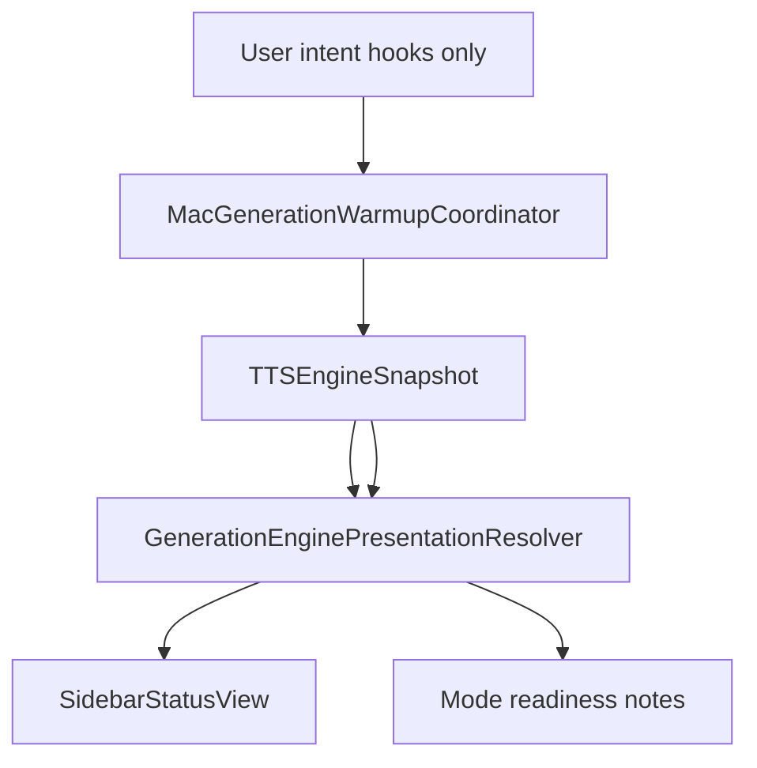

# macOS frontend engine status & warmup audit — 2026-06-29

**Scope:** macOS SwiftUI frontend — engine status indicator churn and weird warmup UX on **8 GB Mac (floor tier)**.  
**Method:** Six parallel Axiom auditors, code truth-table, three controlled runtime captures (`scripts/frontend_status_capture.sh`).  
**Engine perf:** Prior investigation confirmed no warm-path RTF regression at `-O`; this audit targets **UI/coordinator semantics**, not MLX speed.

**Capture artifacts:** `build/frontend-audit/` (service lifecycle meta + os_log snippets).  
**Helper scripts:** `scripts/frontend_status_capture.sh`, `scripts/perf_investigation.sh quit`.

---

## Implemented fixes (2026-06-29)

P0 items from this audit were implemented on `main`:

1. **`GenerationEnginePresentation`** — shared `ModelWarmPathState` resolver (`Sources/Services/GenerationEnginePresentation.swift`).
2. **Custom Voice cold idle** — `.idle` shows Ready (not busy Preparing) with floor-tier cold-start copy.
3. **Snapshot→warmup loop broken** — `ContentView.handleEngineSnapshotChange` no longer calls `scheduleGenerationWarmupIfNeeded`.
4. **Sidebar** — new `SidebarStatus.standby` for XPC-ready / model-unloaded; prefetch `.starting` maps to “Preparing model…”.
5. **Generate gate** — Custom Voice + Voice Design use `allowsGenerationStart`.

---

## Executive summary

The status indicator feels unstable because **three independent axes** are mapped inconsistently across UI surfaces:

1. **XPC process readiness** (`snapshot.isReady`) — sidebar “Ready”
2. **Model warm path** (`loadState`: idle / starting / loaded / running) — Custom Voice “Preparing”
3. **Floor-tier memory policy** (idle-unload, service retirement) — no dedicated UI vocabulary

The highest-impact bug: **sidebar shows “Ready” while Custom Voice shows a perpetual “Preparing” spinner on `loadState == .idle`**, even when the warmup coordinator has **deliberately stopped re-warming** (`completedContext` retained on floor tier).

Secondary driver: **`ContentView.handleEngineSnapshotChange` re-schedules warmup on every snapshot**, creating coordinator churn and brief `.starting` sidebar flashes during background prefetch.

---

## Status truth table (model loaded = active mode’s `modelID`)

Assumptions: model installed, script/brief/reference present, not user-generating, `snapshot.isReady == true` unless noted.

| loadState | model match | Sidebar (`AppEngineSelection`) | Custom Voice readiness | Voice Design readiness | Voice Cloning readiness |
|-----------|-------------|----------------------------------|------------------------|------------------------|-------------------------|
| `.idle` | n/a (unloaded) | **Ready** (idle) | **Preparing** (busy spinner) | **Ready to generate** | **Ready to generate** (if ref ok) |
| `.starting` | switching | **Starting engine…** | **Preparing Custom Voice** (busy) | **Ready to generate**¹ | **Ready to generate**¹ |
| `.loaded` | yes | **Ready** | **Ready to generate** | **Ready to generate** | **Ready to generate** |
| `.loaded` | no | **Ready** | will prepare on generate | **Ready to generate** | **Ready to generate** |
| `.running` | yes (warmup/prep) | **Active** (label) | **Preparing** (busy) | **Ready to generate**¹ | prep states via `contextStatus` |
| `.running` | no | **Active** | Engine busy | **Ready to generate**¹ | varies |
| `.failed` | — | error/crashed | Engine needs attention | draft-gated copy | draft-gated copy |
| `!isReady` | — | **Starting** / crashed | Engine starting | Engine starting | Engine starting |

¹ **Voice Design ignores `loadState`** for readiness when `isReady && draft complete` — shows “Ready to generate” during background `.starting` prefetch.

**Contradiction hotspots (floor tier after idle-unload):**

| Surface | User sees | Reality |
|---------|-----------|---------|
| Sidebar | Green **Ready** | XPC up; model weights unloaded |
| Custom Voice footer | **Preparing** + spinner forever | Coordinator **not** re-warming (`completedContext` kept) |
| Generate button | **Enabled** | `generateDisabled` only checks `isReady`, not readiness |

Refs: [`AppEngineSelection.swift`](../Sources/Services/AppEngineSelection.swift), [`CustomVoiceView.swift`](../Sources/Views/Generate/CustomVoiceView.swift), [`VoiceDesignView.swift`](../Sources/Views/Generate/VoiceDesignView.swift), [`GenerationDrafts.swift`](../Sources/Models/GenerationDrafts.swift), [`MacGenerationWarmupCoordinator.swift`](../Sources/Services/MacGenerationWarmupCoordinator.swift) L297–311.

---

## Runtime capture (floor tier, `QWENVOICE_FORCE_MEMORY_CLASS=floor_8gb_mac`)

Single Vocello instance enforced via `scripts/frontend_status_capture.sh quit` between runs.

| Run | Env | Service lifecycle (from meta) | Notes |
|-----|-----|------------------------------|-------|
| **A** normal warm | `QWENVOICE_DEBUG=1` | absent → **running @ 15s** → running @ 90s | Proactive warm spawns XPC within ~15s of launch |
| **B** suppress warmup | `+ QWENVOICE_SUPPRESS_WARMUP=1` | absent → **running @ 15s** → running @ 90s | Service still spawns (engine `initialize()`); only **proactive warm** skipped |
| **C** fast retirement | `+ RETIRE_DWELL_SECONDS=8` | spawn @ 1s → **RETIRED @ ~41s** | Log: `Engine service retired (expected exit); lazy relaunch on next use` |

Run C confirms XPC retirement on floor tier is **invisible in UI** — sidebar would show Ready + idle load state with no “engine resting” copy.

os_log volume during captures was minimal (subsystem stream); service PID transitions in meta are the reliable signal.

---

## Consolidated Axiom findings (deduplicated)

### Critical / P0

| ID | Symptom | Mechanism | Files |
|----|---------|-----------|-------|
| **UX-1** | Sidebar Ready vs panel Preparing on idle | Split semantics: sidebar uses `isReady`; Custom Voice treats `.idle` as busy Preparing | `AppEngineSelection`, `CustomVoiceReadinessPresentation` |
| **UX-2** | Perpetual spinner on 8 GB after idle-unload | UI ignores `completedContext`; coordinator intentionally skips re-warm | `MacGenerationWarmupCoordinator` L309–311, `CustomVoiceView` L77–84 |
| **UX-3** | Generate enabled while footer says Preparing | `generateDisabled` uses `ttsEngineStore.isReady` not `readinessPresentation.isReady` | `CustomVoiceView` L323 vs L60–68 |
| **ARCH-1** | Warmup feedback loop | Every snapshot → `scheduleGenerationWarmupIfNeeded` | `ContentView` L433–435 |
| **A11Y-1** | VoiceOver churn on status | Fragmented `SidebarStatusView` children; volatile `accessibilityValue(detail)` | `SidebarStatusView`, `WorkflowReadinessNote` |

### High / P1

| ID | Symptom | Mechanism | Files |
|----|---------|-----------|-------|
| **UX-4** | “Starting engine” vs “Preparing Custom Voice” | No shared vocabulary for prefetch vs XPC boot | `SidebarStatusView`, `CustomVoiceView` |
| **UX-5** | Voice Design “Ready” during prefetch | No `loadState` in `canGenerate` / readiness | `VoiceDesignView` L34–40, L278–307 |
| **ARCH-2** | Duplicate clone priming | Warmup coordinator + `VoiceCloningView.task` | `ContentView`, `VoiceCloningView` L247–254 |
| **ARCH-3** | Draft edits restart warmup debounce | 100 ms custom / 800 ms design identity churn | `ContentView` L444–446, `MacGenerationWarmupCoordinator` |
| **PERF-1** | Whole-store `@EnvironmentObject` invalidates sidebar + Generate on every snapshot | ObservableObject fan-out | `ContentView`, `SidebarView`, Generate views |
| **CONC-1** | Snapshot subject cross-isolation publish | Actor + MainActor both `send()` to `CurrentValueSubject` | `XPCNativeEngineClient` |
| **CONC-2** | `ensureModelLoadedIfNeeded` fire-and-forget | Warmup `dispatchedContext` cleared before load completes | `XPCNativeEngineClient`, `MacGenerationWarmupCoordinator` |

### Medium / P2

| ID | Symptom | Mechanism | Files |
|----|---------|-----------|-------|
| **UX-6** | Service retirement invisible | `publishRetiredSnapshot`: `isReady: true`, `loadState: .idle` | `XPCNativeEngineClient` L618–626 |
| **UX-7** | Clone prep: sidebar active, Generate enabled | `hasActiveGeneration` excludes clone prep label | `TTSEngineStore`, `VoiceCloningView` |
| **UX-8** | Reconnect shown as `.running` not `.starting` | `visibleErrorMessage` during `.starting` → running card | `AppEngineSelection` L52–63 |
| **MEM-1** | Duplicate pressure monitors (app) | Lifecycle + admission each start `NativeMemoryPressureMonitor` | `MacEngineServiceLifecycleCoordinator`, `MacWarmupAdmissionPolicy` |
| **PERF-2** | 250 ms animation on full status card | `stateKey` animates Liquid Glass subtree | `SidebarStatusView` L44 |

---

## Ruled out

| Hypothesis | Evidence |
|------------|----------|
| Engine RTF regression since v2.1.0 | [`perf-investigation-2026-06-29.md`](perf-investigation-2026-06-29.md): HEAD `-O` ≈ v2.1.0 |
| Debug telemetry overhead | ≤2% RTF on CLI bench |
| Per-chunk snapshot storms | `EngineServiceHost` dedupes; `loadState.running.fraction` always `nil` on macOS |
| Chunk events driving sidebar | Excluded from snapshot stream in service host |
| `QWENVOICE_SUPPRESS_WARMUP` prevents XPC spawn | Run B: service still spawns at ~15s (initialize path) |

---

## Prioritized fix proposals (implementation follow-up)

### P0 — stop contradictory status

1. **Unify readiness semantics** — Introduce `GenerationEnginePresentation` (or use dormant `TTSEngineFrontendState`) with explicit cases: `xpcBooting`, `modelCold`, `modelWarming`, `modelReady`, `generating`, `resting`. Map sidebar + all mode readiness notes from one resolver.
2. **Fix Custom Voice `.idle`** — When `isReady && modelAvailable && !dispatchedWarmup`, show **“Ready (cold start)”** with `isBusy: false`, not Preparing. On floor tier after idle-unload, copy: *“Model unloaded to save memory — first generate reloads it.”*
3. **Break snapshot→warmup loop** — In `handleEngineSnapshotChange`, call only `observe()` + lifecycle; remove `scheduleGenerationWarmupIfNeeded`. Schedule warmup only from user-intent hooks (selection, draft debounced, model availability).
4. **Align Generate gate** — `generateDisabled` should use shared resolver output (allow cold generate explicitly if product intent).

### P1 — reduce churn and align modes

5. **Sidebar prefetch vocabulary** — Background prefetch: sidebar stays **Ready** or **“Warming in background…”** (non-blocking); reserve **Starting engine…** for `!isReady` XPC connect only.
6. **Voice Design parity** — Port `VoiceDesignReadinessPresentation` with `loadState` branches matching Custom Voice.
7. **Single clone priming owner** — Remove duplicate path (warmup coordinator *or* view `.task`, not both).
8. **Narrow SwiftUI observation** — Equatable subviews for `SidebarStatusView` / `WorkflowReadinessNote`; stop `@EnvironmentObject TTSEngineStore` on full `SidebarView`.
9. **Serialize snapshot publishes** — Fix `CurrentValueSubject` cross-isolation race in `XPCNativeEngineClient`.

### P2 — floor-tier polish

10. **Service retirement UI** — After `publishRetiredSnapshot`, sidebar **“Engine resting”** until next command (or brief non-modal notice).
11. **Clone priming alignment** — Disable Generate during `.preparing` *or* copy **“Generate now (may be slower)”** everywhere.
12. **Accessibility** — Consolidate `SidebarStatusView` to single label/value (mirror `SidebarPlayerView` inline pattern); hide decorative spinners from VO tree.
13. **Share one pressure monitor** between lifecycle and admission coordinators.

---

## Test plan (post-fix)

- Extend `VocelloMacSmokeUITests` or add unit tests for shared readiness resolver covering truth-table rows.
- Floor-tier UI test with `QWENVOICE_FORCE_MEMORY_CLASS=floor_8gb_mac` + `QWENVOICE_ENGINE_RETIRE_DWELL_SECONDS=8`: after idle, assert `sidebar_backendStatus_idle` **and** `customVoice_readiness` not stuck on busy Preparing.
- VoiceOver pass: ≤2 announcements during 30s idle on Custom Voice after warm completes.
- Re-run `scripts/frontend_status_capture.sh all` and compare service meta + user-visible identifiers.

---

## Architecture diagram (target state)

Today, `ContentView` connects `snapshot` directly to both `warmup` and UI, closing a feedback loop. Target: UI reads resolver; warmup schedules only from intent.

---

## Auditor references

Parallel Axiom runs (2026-06-29): swiftui-architecture, swiftui-performance, ux-flow, concurrency, memory, accessibility — scoped to macOS Views/ViewModels/ContentView + warmup coordinators.
