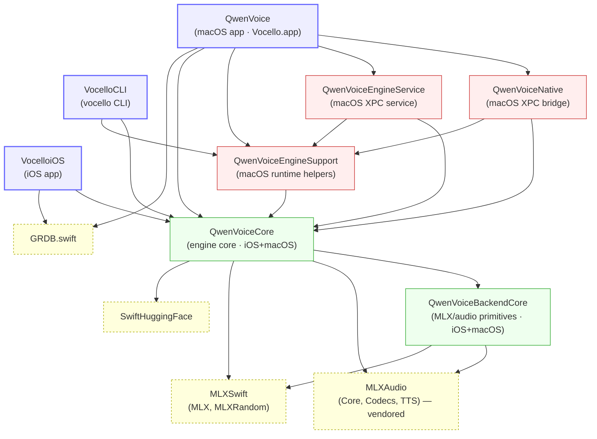
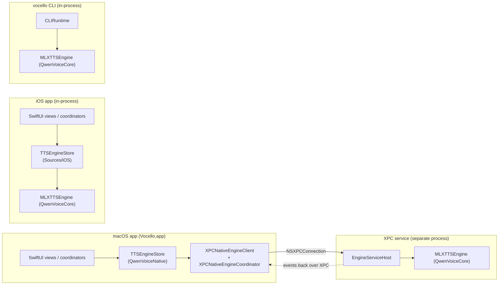
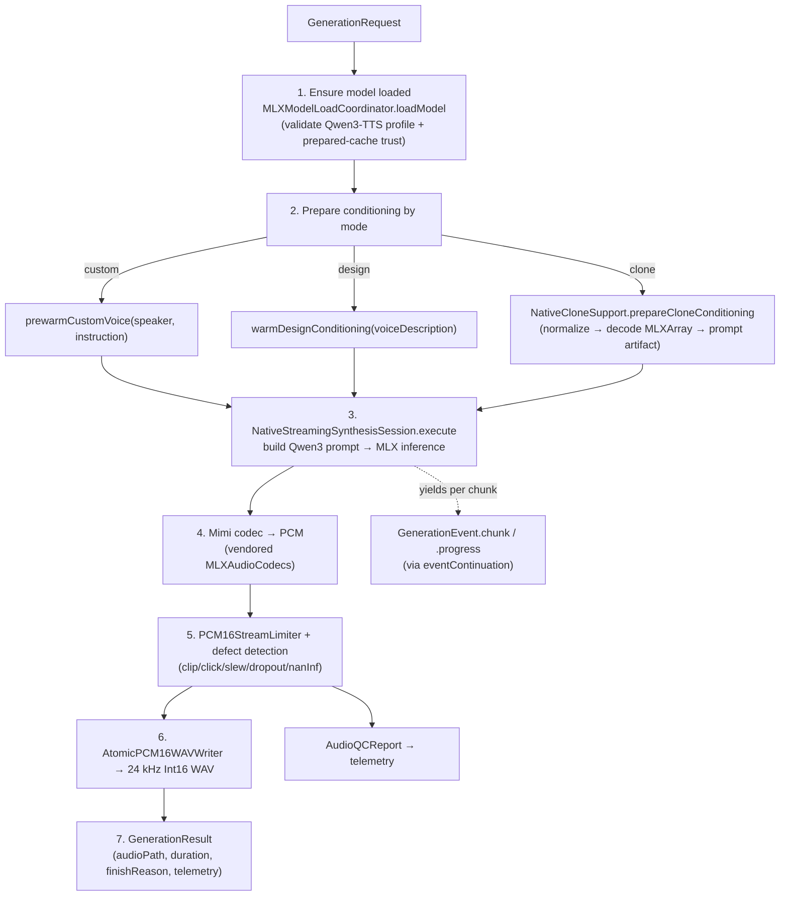
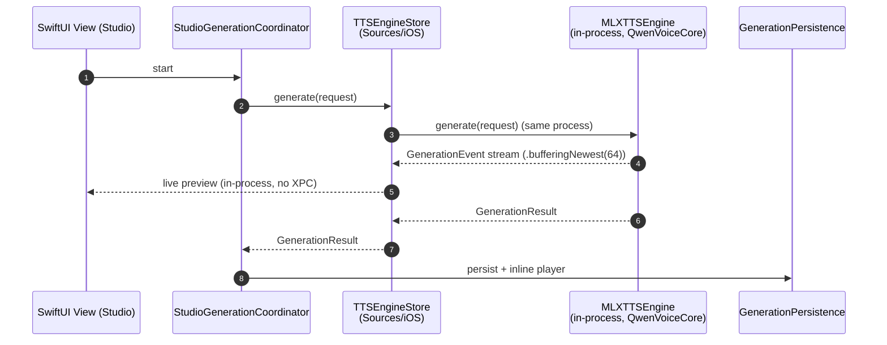

# Vocello (QwenVoice) — Architecture Reference

> **Living document.** This is the code-verified architecture reference for how Vocello fits
> together: modules, runtime architecture, the request/generation
> lifecycle, persistence, model management, and telemetry. When this doc disagrees
> with the code, **the code wins** — fix this doc.
>
> Last reviewed: 2026-07-13.

## TL;DR

**Vocello** (repo *QwenVoice*; macOS app module `QwenVoice`, iOS app module
`QVoiceiOS`) is a local-first, private text-to-speech app for Apple Silicon. It
synthesizes speech **on-device** with **Qwen3-TTS** models accelerated through
**MLX** — native Swift packages, no Python runtime, no bundled weights, no cloud
generation. Models download on demand from Hugging Face after install.

One engine core (`QwenVoiceCore` / `MLXTTSEngine`) is hosted three ways:

| Host | Process model | Wired by | Used by |
| --- | --- | --- | --- |
| **macOS app** | Engine runs **out-of-process** in an XPC service (`QwenVoiceEngineService`) | `QwenVoiceNative` (XPC client + `TTSEngineStore`) | `Vocello.app` |
| **iOS app** | Engine runs **in-process** (`MLXTTSEngine` via `NativeRuntimeFactory`) | `Sources/iOS/TTSEngineStore.swift` | `VocelloiOS` |
| **CLI** | Engine runs **in-process** | `VocelloCLI` (`CLIRuntime`) | `vocello` binary |

Platforms: macOS 26+, iOS 26+, Apple Silicon (`arm64`), Xcode 26, Swift 6.
Stable macOS release: **Vocello 2.1.0**. iOS is on-device-capable on `main` but
not yet distributed.

> Start with the canonical interactive [`project map`](project-map.html). For repo conventions,
> build commands, engine invariants, and release process, read [`AGENTS.md`](../AGENTS.md).
> This document provides the deeper architecture narrative.

---

## 1. Module & target dependency graph

The Xcode project is generated from [`project.yml`](../project.yml) (XcodeGen
2.45.4). There are ten Swift targets split into **cross-platform frameworks**,
**macOS-only frameworks + XPC service**, and **apps/CLI/tests**.



(SPM products are also linked directly by the macOS frameworks/service/CLI where
needed — e.g. `QwenVoiceCore` pulls `MLXRandom` for deterministic seeding. Only
the architectural edges are shown above; see `project.yml` for the exact link
graph.)

### Targets

| Target | Type | Platform | Module name | Bundle ID | Responsibility |
| --- | --- | --- | --- | --- | --- |
| `QwenVoice` | application | macOS | `QwenVoice` | `com.qwenvoice.app` | macOS SwiftUI app (`Vocello.app`). Links the full XPC stack. |
| `VocelloiOS` | application | iOS | `QVoiceiOS` | `com.patricedery.vocello` | iOS SwiftUI app; engine runs in-process. App Group `group.com.patricedery.vocello.shared`. |
| `VocelloCLI` | tool | macOS | `VocelloCLI` | `com.qwenvoice.cli` | Headless `vocello` binary; engine in-process. |
| `QwenVoiceCore` | framework.static | iOS + macOS | `QwenVoiceCore` | `com.qwenvoice.core` | **Engine core**: `TTSEngine` protocol, `MLXTTSEngine`, generation semantics, runtime, memory policy, telemetry. |
| `QwenVoiceBackendCore` | framework.static | iOS + macOS | `QwenVoiceBackendCore` | `com.qwenvoice.backend-core` | Low-level MLX + audio primitives (model load, synthesis, codecs). |
| `QwenVoiceEngineSupport` | framework.static | macOS | `QwenVoiceEngineSupport` | `com.qwenvoice.engine-support` | macOS runtime helpers + the **XPC wire protocol** (`EngineCommand`, envelopes, codec). |
| `QwenVoiceNative` | framework.static | macOS | `QwenVoiceNative` | `com.qwenvoice.native` | macOS app-facing XPC client/coordinator/store bridging XPC to SwiftUI. |
| `QwenVoiceEngineService` | xpc-service | macOS | `QwenVoiceEngineService` | `com.qwenvoice.app.engine-service` | Out-of-process engine host for crash isolation + memory containment. |
| `VocelloCoreTests` | bundle.unit-test | macOS | `VocelloCoreTests` | `com.qwenvoice.core.tests` | Core semantics, typed telemetry compatibility, and atomic/readable output contracts. |
| `VocelloEngineIntegrationTests` | bundle.unit-test | macOS | `VocelloEngineIntegrationTests` | `com.qwenvoice.engine-integration.tests` | Injectable XPC client/transport lifecycle and correlation contracts; never launches frontend UI. |
| `VocelloMacUITests` | bundle.ui-testing | macOS | `VocelloMacUITests` | `com.qwenvoice.app.uitests` | Explicit native-app smoke and benchmark XCUITest lanes. |
| `VocelloiOSUITests` | bundle.ui-testing | iOS | `VocelloiOSUITests` | `com.patricedery.vocello.uitests` | Explicit paired-physical-iPhone smoke and benchmark XCUITest lanes; never Simulator. |

### Testing lanes (see [`docs/reference/testing-runbook.md`](reference/testing-runbook.md))

| Layer | macOS | iOS | Development publishing policy |
| --- | --- | --- | --- |
| **Deterministic verification** | Core + XPC integration + `Qwen3RuntimeTests` + app build | Project-input checks + physical-device SDK compile | Required by ordinary CI; sufficient for commit, push, pull request, and merge |
| **Platform runtime gate** | `macos_test.sh gate` | `ios_device.sh gate` | Deterministic/device diagnostics; independent of XCUITest |
| **UI regression** | `ui_test.sh macos smoke\|benchmark` XCUITest | `ui_test.sh ios smoke\|benchmark` XCUITest on a paired physical iPhone | Explicit frontend QA only; never required for publishing or packaging |
| **Headless engine** | `vocello bench`, `lang-bench` | `bench`, `lang-bench` device diagnostics | Explicit performance/release QA |
| **UI evidence** | Named XCTest attachments from the native app | Named XCTest attachments from the physical iPhone | Independent explicit-acceptance artifacts |

Release packaging is deterministic and does not consume UI results. Frontend evidence remains
platform-specific and is created only when explicitly requested.

**Four schemes**: `QwenVoice` (macOS app + deterministic unit/integration tests), `VocelloiOS`
(iOS app), `VocelloMacUI` (explicit macOS XCUITest), and `VocelloiOSUI` (explicit physical-device
iOS XCUITest). The UI schemes are isolated from ordinary test actions. A single shippable config,
**`Release`**, is the only config — there is no `Debug` config or generic `DEBUG` symbol.

### Key layering rule

`QwenVoiceBackendCore` ← `QwenVoiceCore` ← {macOS frameworks, apps, CLI}. The
**iOS app deliberately does not link** `QwenVoiceNative`, `QwenVoiceEngineService`,
or `QwenVoiceEngineSupport` — those are macOS-only (the XPC stack). iOS reaches
the engine in-process through `QwenVoiceCore` alone. This single dependency
difference is what enforces the XPC-vs-in-process split.

---

## 2. Technology stack & SPM dependencies

SPM dependencies are declared in `project.yml` and **pinned to exact versions**
for backend determinism. `mlx-swift` and `mlx-swift-lm` must move **in lockstep**
(never one alone); don't float pins without a benchmark-gated review. `mlx-audio-swift`
is **vendored** under `third_party_patches/mlx-audio-swift/` (see
[`reference/mlx-audio-swift-patching.md`](reference/mlx-audio-swift-patching.md)).

Resolved versions (`QwenVoice.xcodeproj/.../Package.resolved`):

| Package | Version | Role |
| --- | --- | --- |
| **mlx-swift** | `0.30.6` | MLX runtime bindings (`MLX`, `MLXRandom`). |
| **mlx-swift-lm** | `2.30.6` | LM utilities (transitive via vendored `mlx-audio-swift`). |
| **mlx-audio-swift** | vendored (`v0.1.2` snapshot) | `MLXAudioCore`, `MLXAudioCodecs`, `MLXAudioTTS` — Qwen3-TTS load, tokenize, decode. |
| **GRDB.swift** | `7.10.0` | SQLite for local `history.sqlite`. |
| **SwiftHuggingFace** | `0.9.0` | Hugging Face model download / hub client. |
| swift-transformers | `1.1.9` | Tokenizer (transitive). |
| swift-jinja | `2.3.5` | Chat/template formatting (transitive). |
| swift-nio | `2.98.0` | Networking (transitive, via SwiftHuggingFace). |
| swift-crypto | `4.4.0` | Hashing (transitive). |
| swift-collections | `1.4.1` | Deque/OrderedSet (transitive). |
| swift-atomics | `1.3.0` | Atomics (transitive). |
| swift-numerics | `1.1.1` | Numerics (transitive). |
| swift-system | `1.6.4` | System types (transitive). |
| swift-asn1 | `1.7.0` | ASN.1 parsing (transitive). |
| EventSource | `1.4.1` | Server-sent events (transitive). |
| yyjson | `0.12.0` | Fast JSON parser (transitive). |

Shipped models (`Sources/Resources/qwenvoice_contract.json`): Qwen3-TTS 1.7B in
**Speed (4-bit)** and **Quality (8-bit)** variants across three modes —
`pro_custom`, `pro_design`, `pro_clone` (see [§11 Model management](#11-model-management--contract)).

---

## 3. Runtime architecture: three engine hosts

All three hosts share one engine implementation — `MLXTTSEngine` (an
`@MainActor … ObservableObject` conforming to the `TTSEngine` protocol) — built
by `NativeRuntimeFactory.make(...)`. The hosts differ only in **where the engine
lives** and **how the UI talks to it**.



- **macOS** — the engine runs **out-of-process** in `QwenVoiceEngineService`
  (`EngineServiceHost`). This isolates MLX crashes from the app and lets the
  service be **retired under memory pressure** (`shutdownWhenIdle`) to return
  memory that model unload can't (MLX heap fragmentation + Metal shader caches).
  The app talks to it over `NSXPCConnection` through `QwenVoiceNative`.
- **iOS** — the engine runs **in-process** (`MLXTTSEngine` built by
  `NativeRuntimeFactory`). The old ExtensionKit extension was removed because
  non-UI extensions are Jetsam-capped independently of the
  `increased-memory-limit` entitlement. iOS holds the engine behind its own
  `Sources/iOS/TTSEngineStore.swift`.
- **CLI** — `vocello` links `QwenVoiceCore` (+ `QwenVoiceEngineSupport`) and
  drives `MLXTTSEngine` in-process, reusing models the app already installed.

`AppEngineSelection.current()` returns `.native` on every platform; the actual
platform differences are enforced by the runtime factory and the XPC/in-process
wiring, not by engine selection.

---

## 4. Engine core (`QwenVoiceCore`)

### 4.1 The `TTSEngine` abstraction

Defined in `Sources/QwenVoiceCore/TTSEngine.swift`. `TTSEngine` is an
`@MainActor … ObservableObject` protocol; the streaming surface is split into a
companion `TTSEngineEventStreaming` protocol (`var events: AsyncStream<GenerationEvent>`).

`MLXTTSEngine` (`MLXTTSEngine.swift`) is the single concrete implementation. It
exposes generation, batch generation, model load/unload, prewarm, clone-reference
priming, cancellation, and capability queries; it publishes `loadState`,
`clonePreparationState`, `latestEvent`, and snapshot state. Around it sit several
actors that own the heavy, isolated work:

| Type | File | Role |
| --- | --- | --- |
| `NativeEngineRuntime` | `NativeEngineRuntime.swift` | Owns model-load + clone/design conditioning; serializes prewarm through the reentrancy gate. |
| `MLXModelLoadCoordinator` | `MLXModelLoadCoordinator.swift` | Loads/validates/unloads Qwen3-TTS checkpoints; manages the prepared-cache trust markers. |
| `NativeStreamingSynthesisSession` | `NativeStreamingSynthesisSession.swift` | Executes one generation: prompt build → MLX inference → codec → PCM → WAV + QC. |
| `NativeCloneSupport` | `NativeCloneSupport.swift` | Three-level clone cache (normalized audio → decoded `MLXArray` → prompt artifact). |
| `NativeMemoryPolicyResolver` | `NativeMemoryPolicyResolver.swift` | Per-device-tier MLX memory policy (see [§4.5](#45-memory-policy)). |
| `UnsafeSpeechGenerationModel` | `UnsafeSpeechGenerationModel.swift` | `@unchecked Sendable` wrapper over `MLXAudioTTS.SpeechGenerationModel`; the bridge into the vendored stack. |

### 4.2 Generation domain model

`GenerationSemantics.swift` + `SemanticTypes.swift`:

- `GenerationMode { custom, design, clone }`
- `GenerationRequest` — `mode`, `modelID`, `text`, `outputPath`, `shouldStream`,
  `streamingInterval`, `languageHint`, `payload`, `generationID`, `seed`,
  `variation`, plus batch (`batchIndex`/`batchTotal`).
  - `GenerationRequest.Payload`:
    - `.custom(speakerID:deliveryStyle:)`
    - `.design(voiceDescription:deliveryStyle:)`
    - `.clone(reference: CloneReference)`
  - `CloneReference { audioPath: String, transcript: String?, preparedVoiceID: String? }`
- `GenerationEvent { .progress(GenerationProgress), .chunk(GenerationChunk), .completed(GenerationResult), .failed(String) }`
- `GenerationResult { audioPath, durationSeconds, finishReason, telemetrySummary }`
- `EngineLoadState { idle, starting, loaded(modelID), running(modelID: String?, label: String?, fraction: Double?), failed(message: String) }`
- `ClonePreparationState { idle, preparing(...), primed(...), failed(...) }`

`EmotionPreset.swift` defines the delivery/tone presets (`neutral`, `happy`,
`sad`, `angry`, `fearful`, `surprised`, `excited`, `calm`, `whisper`, `dramatic`).

### 4.3 Factory & paths

`NativeRuntimeFactory.make(...)` (`NativeRuntimeFactory.swift`) wires the whole
core from a contract manifest URL + a `NativeRuntimePaths` root:

```
NativeRuntimeFactory.make
  ├── ContractBackedModelRegistry(manifestURL)        // speakers/models/variants
  ├── LocalModelAssetStore(registry, root, seed)       // installed-model inventory
  ├── NativeAudioPreparationService(preparedAudioDir)  // 24 kHz PCM normalization
  ├── LocalDocumentIO(importedReferenceDir)            // user imports
  └── MLXTTSEngine(...)
        └── NativeEngineRuntime(modelLoadCoordinator, cloneSupport, ...)
              └── MLXModelLoadCoordinator(assetStore, hubCacheDirectory)
```

`NativeRuntimePaths.rooted(at:)` defines the on-disk layout (`models/`,
`cache/prepared_audio`, `cache/imported_references`, `cache/native_mlx`,
`cache/stream_sessions`, …).

### 4.4 Synthesis pipeline

`MLXTTSEngine.generate(_:)` runs this flow (see
`NativeStreamingSynthesisSession.execute`):



`UnsafeSpeechGenerationModel` wraps `MLXAudioTTS.SpeechGenerationModel` and
exposes the three mode entry points (`generateCustomVoiceStream`,
`generateVoiceDesignStream`, `generateVoiceCloneStream`) plus prewarm.

### 4.5 Memory policy

`NativeMemoryPolicyResolver` (`NativeMemoryPolicyResolver.swift`) classifies the
device into `NativeDeviceMemoryClass` and resolves an `NativeMemoryPolicy` per
tier + mode + batch. Classification: iPhone → `.iPhonePro`; Mac ≤10 GB →
`.floor8GBMac`; ≤24 GB → `.mid16GBMac`; else `.highMemoryMac`. Override via
`QWENVOICE_FORCE_MEMORY_CLASS` (propagated to the engine over the `initialize`
handshake).

| Tier (`NativeDeviceMemoryClass`) | MLX cache | Clone slots | Idle-unload | Token clear cadence | Post-batch trim |
| --- | --- | --- | --- | --- | --- |
| `.floor8GBMac` | 256 MB | 1 | 120 s | 50 | `.hardTrim` |
| `.mid16GBMac` | 512 MB | 8 | 600 s | 50 | — |
| `.highMemoryMac` | 1 GB | 16 | never (`nil`) | 200 | — |
| `.iPhonePro` | 128 MB* | 1 | 30 s | 50 | — |

\* iPhone cache default 128 MB, overridable with `QVOICE_IOS_MLX_CACHE_LIMIT_MB`.
A hard `Memory.memoryLimit` is **only** set on iPhone **and only** when the
`QVOICE_IOS_MLX_MEMORY_LIMIT_MB` env override is present — so **there is no hard
memory limit in production**, and no Quality→Speed OOM fallback. `apply(_:)`
also configures `Qwen3StreamingMemoryTuning` (per-token cache clear cadence +
optional sliding-window talker KV cache via `QVOICE_TALKER_KV_WINDOW`).
Trim levels (`NativeMemoryTrimLevel`): `.softTrim`, `.hardTrim`, `.fullUnload`.

### 4.6 Streaming

`MLXTTSEngine.events` is an `AsyncStream<GenerationEvent>`. Buffering policy is
platform-specific (`MLXTTSEngine.swift`):

- **macOS**: `.unbounded` — never drop playback chunks under load.
- **iOS**: `.bufferingNewest(64)` — bounded for the memory-tight in-process engine.

`NativeStreamingPreviewDataPolicy` controls whether chunk events carry preview
PCM for live playback; default `.emit` on all platforms, `.skip` when
`QWENVOICE_STREAMING_PREVIEW_DATA=off`. Output is 24 kHz mono Int16 PCM WAV.

### 4.7 Prewarm

`NativeEngineRuntime` serializes prewarm through a reentrancy gate —
`acquirePrewarmSlot()` / `releasePrewarmSlot()`. **Never** pair a throwing
`try? await acquirePrewarmSlot()` with an unconditional `defer { releasePrewarmSlot() }`
(on a throw the slot isn't held and the defer releases someone else's slot).
Prewarm identity keys are per mode (e.g.
`custom:<speakerID>:<instruction-hash>`); `NativeCustomPrewarmPolicy` is `.eager`
on capable tiers and `.skipDedicatedCustomPrewarm` on `.floor8GBMac`. Depth is
tunable via `CustomVoicePrewarmDepth { .full, .skipDecoderBucket, .skipStreamStep }`.

### 4.8 Voice cloning cache

`NativeCloneSupport` (actor) keeps a three-level cache keyed by audio/transcript
hashes: normalized reference audio → decoded `MLXArray` → `VoiceClonePromptArtifact`
(embedding + prompt tensors written under `voice_clone_prompt/`). Capacities per
tier come from `NativeMemoryPolicyResolver.cloneCacheCapacity(...)`.

### 4.9 Cancellation

`MLXTTSEngine` admits one model-mutating operation at a time. **macOS** can
cancel via the `ActiveGenerationCancellable` capability. **iOS** cancel is
**cooperative only** — `MLXTTSEngine` does not conform to
`ActiveGenerationCancellable`, so the iOS generate flow must discard the result
on `Task.isCancelled` so cancelled takes never land in History. `MLXTTSEngine.generate`'s
catch must not rethrow `CancellationError` early (it would skip the `loadState`
reset and strand the engine in `.running`).

### 4.10 Audio prep & QC

`AudioPreparation.swift` normalizes reference audio to the canonical 24 kHz /
1-channel / 16-bit little-endian PCM format and emits quality warnings.
`PCM16StreamLimiter` applies lookahead limiting and flags defects
(`clip`, `click`, `slew`, `dropout`, `nanInf`); the verdict + flags become an
`AudioQCReport` on the telemetry record.

---

## 5. Request lifecycle — macOS

The macOS app never touches `MLXTTSEngine` directly. It goes through the XPC
stack:

```mermaid
sequenceDiagram
    autonumber
    participant V as SwiftUI View
    participant C as Coordinator<br/>(CustomVoice/VoiceDesign/<br/>VoiceCloning)
    participant S as TTSEngineStore<br/>(QwenVoiceNative)
    participant X as XPCNativeEngineClient<br/>+ XPCNativeEngineCoordinator
    participant H as EngineServiceHost<br/>(XPC service)
    participant E as MLXTTSEngine<br/>(QwenVoiceCore)
    participant B as GenerationChunkBroker

    V->>C: generate(draft)
    C->>S: generate(request)
    S->>X: generate(request)
    X->>X: encode EngineRequestEnvelope(.generate)
    X->>H: perform(payload) via NSXPCConnection
    H->>E: generate(request)
    E-->>H: AsyncStream<GenerationEvent>
    Note over H: drained on Task.detached(.utility)<br/>(off MainActor); lastPublishedEvent hops to MainActor
    H-->>X: handleEvent(payload) — reverse XPC
    X-->>B: publish(event) on MainActor
    B-->>V: Combine publisher (live preview)
    E-->>H: GenerationResult
    H-->>X: EngineReplyEnvelope(.generationResult)
    X-->>S: GenerationResult
    S-->>C: GenerationResult
    C->>C: GenerationPersistence.persist + autoplay
```

**XPC wire protocol** (`Sources/QwenVoiceEngineSupport/EngineServiceIPC.swift`):
a single envelope method —
`QwenVoiceEngineServiceXPCProtocol.perform(_:withReply:)` — carrying an
`EngineCommand`. The reverse event channel is
`QwenVoiceEngineClientEventXPCProtocol.handleEvent(_:)`. Codec:
`EngineServiceCodec` (= `QwenVoiceWireCodec`); envelopes are versioned
(`QwenVoiceWireSchema`) with a legacy fallback path.

`EngineCommand` cases (the full surface): `initialize`, `ping`, `loadModel`,
`unloadModel`, `ensureModelLoadedIfNeeded`, `prewarmModelIfNeeded`,
`prefetchInteractiveReadinessIfNeeded`, `ensureCloneReferencePrimed`,
`cancelClonePreparationIfNeeded`, `generate`, `generateBatch`,
`cancelActiveGeneration`, `listPreparedVoices`, `enrollPreparedVoice`,
`deletePreparedVoice`, `clearGenerationActivity`, `clearVisibleError`,
`shutdownWhenIdle`.

**Service retirement**: under memory pressure the app calls `shutdownWhenIdle`;
the service refuses while a generation is active, then exits. The client marks
this `expectedRetirement` (no error UI, no auto-reconnect) and lazily relaunches
on next use. Events are drained off `MainActor` so the synchronous XPC encode
can't lag the producer; only `lastPublishedEvent` hops to `MainActor`.

macOS generation flows through three coordinators in `Sources/ViewModels/`:
`CustomVoiceCoordinator`, `VoiceDesignCoordinator`, `VoiceCloningCoordinator`
(all `@MainActor @Observable`). Each builds a `GenerationRequest` from its draft
and calls `TTSEngineStore.generate(...)`; `VoiceCloningCoordinator` additionally
primes the clone reference via `ensureCloneReferencePrimed(...)`.

---

## 6. Request lifecycle — iOS

iOS links only `QwenVoiceCore`, so the engine is in-process and the XPC stack is
absent. The iOS app has its **own** `Sources/iOS/TTSEngineStore.swift` (a
distinct type from the macOS one) that wraps the in-process `MLXTTSEngine`.



iOS casts the engine to capability protocols at runtime
(`TTSEngineRuntimeControlling`, `NativeMemoryReporting`) rather than depending on a
concrete type. Key iOS behaviors:

- **No batch on iOS** (removed 2026-07-02, maintainer decision): the affordance was
  dead UI (`onBatch` nil everywhere; native engine unsupported, Jetsam risk).
  `IOSBatchSheet` + `IOSBatchGenerationCoordinator` deleted; macOS batch unaffected.
  If batch returns it must be sequential streaming, validated on device.
- **Cooperative cancel**: results are discarded on `Task.isCancelled`.
- **Thermal gate** (2026-07-02): `TTSEngineStore.startThermalObservation` records
  thermal transitions and blocks PROACTIVE warm work (prewarm/clone priming) at
  serious/critical; generation is never thermally blocked
  (`QVOICE_IOS_THERMAL_GATE=off` escape hatch).
- **Interruption recorder** (2026-07-02): `IOSInterruptionRecorder` (CXCallObserver +
  UIApplication lifecycle) runs during headless device diagnostics only; events land in
  `device-diagnostics-done.json` as `interruptions` so doomed runs self-report calls/backgrounding.
- **Memory posture**: `.iPhonePro` policy; `Qwen3TTSMemoryCaches.clearAll()` on
  hard-trim/unload/failure (macOS preserves cache warmth).
- **Clone load profile**: `.fullCapabilities` vs `.iOSProductionDefault`
(`.withoutCloneEncoders`) depending on the entitled memory limit.
- **Hardware gate**: `IOSDeviceSupport.isSupportedHardware` (iPhone 15 Pro+).

---

## 7. CLI (`VocelloCLI`)

`Sources/VocelloCLI/CLIRuntime.swift` (`@MainActor struct CLIRuntime`) bootstraps
the in-process engine the same way the iOS app does — `NativeRuntimeFactory.make`
over a data directory — and reuses models already installed by the app. It is
both a user-facing generator and the deterministic driver for
benchmarks/quality gates (no Python, no bundled weights).

`bootstrap` resolves the contract via `locateManifestURL()`, which searches (in
order): the bundled resource (shipped CLI), repo-relative
`Sources/Resources/qwenvoice_contract.json` (dev + benchmarks), next to the
executable, then walking up from the cwd. Commands (`VocelloMain.swift`):
`generate`, `custom`/`design`/`clone`, `batch`, `voices`, `speakers`, `models`,
`bench`. stdout is machine-readable (a path, or JSON with `--json`); progress
goes to stderr. Full reference: [`reference/cli.md`](reference/cli.md).

---

## 8. App surfaces

### macOS app (`Sources/`, module `QwenVoice`)

- Entry: `QwenVoiceApp.swift` → `ContentView.swift`. Layout is a
  `NavigationSplitView` with a `SidebarItem` enum: `customVoice`, `voiceDesign`,
  `voiceCloning`, `history`, `voices`, `settings`.
- State: a mix of `@Observable` and `ObservableObject`. Coordinators are
  `@MainActor @Observable`; `TTSEngineStore`, `AudioPlayerViewModel`, and
  `ModelManagerViewModel` are `ObservableObject`.
- `Sources/Services/` — app-level services: `DatabaseService` (GRDB),
  `BatchGenerationRunner`, `GenerationTelemetryMerger`,
  `MacGenerationWarmupCoordinator`, `MacEngineServiceLifecycleCoordinator`
  (idle XPC service retirement), `AudioService`, `WaveformService`.
- `Sources/ViewModels/` — `ModelManagerViewModel` (model install/variant).
- `Sources/QwenVoiceCore/` — `HuggingFaceDownloader` (SwiftHuggingFace + SHA-256).
- `Sources/Models/` — `TTSModel`, `Generation` (GRDB record), `Voice`,
  `GenerationDrafts` (`CustomVoiceDraft` / `VoiceDesignDraft` /
  `VoiceCloningDraft`), `TTSContract` (contract loader).

### iOS app (`Sources/iOS/`, module `QVoiceiOS`)

- Entry: `QVoiceiOSApp.swift` → `QVoiceiOSRootView.swift`. Four-tab IA
  (`IOSAppTab`): **Studio / Voices / History / Settings**.
- Dependencies container: `IOSAppDependenciesContainer` / `IOSAppBootstrap`
  (`@ObservableObject`) holding `registry`, `engine` (`TTSEngineStore`),
  `modelManager`, `modelInstaller`. Built via `makeBackend(...)`.
- Model downloads: `IOSModelDownloadCoordinator` (shared download engine wrapper).
- Studio: `IOSStudioCanvas.swift` with a mode segmented control
  (custom/design/clone), input area, generate button, and live-preview rail.
  Sheets under `Sources/iOS/Sheets/` (e.g. `IOSVoicePreviewPlayer`).
- Reference import: `IOSVoicesView` presents a native `fileImporter` for WAV, MP3, AIFF, and M4A;
  `RootView.onOpenURL` routes supported documents opened from Files through the same production
  flow. `TTSEngineStore.importReferenceAudio` / `LocalDocumentIO` materializes the security-scoped
  audio and adjacent `.txt` transcript sidecar into app-owned storage. `IOSRecordVoiceSheet` then
  collects the visible name/transcript, enrolls the saved voice, and hands it to Studio Clone.
  `Info.plist` declares `public.audio`, in-place document opening, and Files sharing for this route.
- iOS UI conventions: `IOSScrollView` (not raw `ScrollView`) for vertical
  surfaces, `TabDock`, voice previews from `Resources/voice-previews/`.

---

## 9. Cross-platform sharing

- **`Sources/SharedSupport/`** is compiled into **both** apps — the dual-platform
  UI-layer share point: `AudioPlayerViewModel` (playback + live streaming),
  `ReferenceClipRecorder` + `ClipReviewPlayer` (reference capture),
  `VoiceClipTranscriber` (on-device transcription), `GenerationPersistence`
  (async GRDB writes), `LanguageSelectionPresentation`, `VoiceDesignBriefCatalog`,
  `AppGenerationTimeline` + `MainThreadStallWatchdog` (telemetry), and
  `Database/GenerationMigrations.swift`.
- **`Sources/iOSSupport/`** is the iOS-only counterpart to macOS
  `Services/` + `QwenVoiceEngineSupport/`: runtime helpers + model wrappers
  coordinating through the **App Group** container
  (`group.com.patricedery.vocello.shared`) and a `UserDefaults` suite.
- macOS uses `Sources/Services/` + the XPC stack; iOS uses `Sources/iOS/` +
  `iOSSupport/` + the in-process engine. The divergence point is exactly the
  XPC-vs-in-process choice from [§3](#3-runtime-architecture-three-engine-hosts).

---

## 10. Persistence & storage

**GRDB** (`history.sqlite`) via `Sources/Services/DatabaseService.swift` (macOS)
and `Sources/SharedSupport/Database/GenerationMigrations.swift`. `generations`
table (final schema, after migrations `v1_create_generations` →
`v2_add_sortOrder` → `v3_drop_sortOrder` → `v4_index_generations_createdAt`):

| Column | Type | Notes |
| --- | --- | --- |
| `id` | integer | autoincrement PK |
| `text` | text | not null |
| `mode` | text | not null — `custom` / `design` / `clone` |
| `modelTier` | text | not null — `pro` |
| `voice` | text | speaker id (nullable) |
| `emotion` | text | delivery style (nullable) |
| `speed` | double | reserved/unused (nullable) |
| `audioPath` | text | not null — `file://…/output.wav` |
| `duration` | double | seconds (nullable) |
| `createdAt` | datetime | not null, default `CURRENT_TIMESTAMP` |

Index `idx_generations_createdAt` on `createdAt`. `DatabaseService` uses a GRDB
`DatabaseQueue` with async, off-main writes (`saveGenerationAsync`).

**Locations** (release vs debug):

- macOS: `~/Library/Application Support/QwenVoice/` (debug: `QwenVoice-Debug/`).
- iOS: App Group `group.com.patricedery.vocello.shared/Vocello/`.

Layout under the root: `models/` (downloaded HF weights, staged in
`.qwenvoice-downloads/`), `outputs/{CustomVoice,VoiceDesign,VoiceCloning}/`,
`voices/`, `history.sqlite`, and `cache/` (`prepared_audio`,
`imported_references`, `normalized_clone_refs`, `stream_sessions`). Full detail:
[`reference/privacy-storage.md`](reference/privacy-storage.md).

**`UserDefaults` keys**: `QwenVoice.DebugModeEnabled` (debug toggle, mirrored to
`TelemetryGate`), per-mode variant choices
(`QwenVoice.{CustomVoice,VoiceDesign,VoiceCloning}.VariantID`), and UI state
(`QwenVoice.LastSelectedSidebarItem`, `QwenVoice.LastVoiceCloningSavedVoiceID`).

### Repository-local generated output

`config/build-output-policy.json` is the machine-readable owner and lifetime contract for ignored
repository output. Local development has two persistent Xcode platform caches,
`build/cache/xcode/macos/` and `build/cache/xcode/ios-device/`, plus one serialized shared package
checkout at `build/cache/xcode/source-packages/`. The vendored MLX Audio runtime uses its separate
policy-owned SwiftPM scratch cache and must not leave `.build` state in the source tree.

Release, XcodeBuildMCP, package-resolution, CI, and compile-safety DerivedData are isolated below
`build/scratch/`; no third persistent platform cache is permitted. Validator-owned telemetry,
profiles, UI results, crash data, and UUID-matched current dSYMs live below `build/artifacts/`.
Signing, archives, exports, and packages live below `build/dist/` and are never removed by routine
or aggressive cache cleanup. The compatibility paths `build/Vocello.app` and `build/vocello` are
symlinks to the canonical macOS cache products, not copied binaries.

Every supported build records an atomic `last-build.json` provenance stamp with its producer,
scheme, configuration, destination, architecture, optimization, signing class, DerivedData, and
package store. Local macOS app, XPC, CLI, and relevant framework products are arm64-only. Preserved
dSYMs are accepted only when their Mach-O UUIDs match the current app/XPC or iOS product. Run
`python3 scripts/build_output_policy.py status|validate`; use
`scripts/clean_build_caches.sh --routine --dry-run` before bounded cleanup. The generated owner and
lifetime table is maintained in [`reference/privacy-storage.md`](reference/privacy-storage.md).

---

## 11. Model management & contract

The contract — `Sources/Resources/qwenvoice_contract.json` — is the canonical
schema. It defines `defaultSpeaker`, `speakers` (+ `speakerMetadata`), and a
`models[]` array. Each model entry carries: `id`, `name`, `tier`, `mode`,
`folder`, `huggingFaceRepo`, `huggingFaceRevision`, `iosDownloadEligible`,
`estimatedDownloadBytes`, `outputSubfolder`, `requiredRelativePaths[]`, and
`variants[]` (speed/quality with platforms + hardware recommendation).

The shipped model ids:

| Model ID | Mode | Speed repo (4-bit) | Quality repo (8-bit) |
| --- | --- | --- | --- |
| `pro_custom` | Custom Voice | `mlx-community/Qwen3-TTS-12Hz-1.7B-CustomVoice-4bit` | `…-8bit` |
| `pro_design` | Voice Design | `mlx-community/Qwen3-TTS-12Hz-1.7B-VoiceDesign-4bit` | `…-8bit` |
| `pro_clone` | Voice Cloning | `mlx-community/Qwen3-TTS-12Hz-1.7B-Base-4bit` | `…-8bit` |

`ContractBackedModelRegistry` loads the contract and is expanded per-platform
(`expandedForPlatform(_:deviceClass:includeBaseAliases:)`). Built-in speakers:
`aiden`, `ryan`, `vivian`, `serena`, `uncle_fu`, `dylan`, `eric`, `ono_anna`,
`sohee`.

**iOS** also bundles `qwenvoice_ios_model_catalog.json` (an iOS-eligible subset,
served at `bundle://vocello/ios/catalog/v1/models.json` via
`Info.plist … QVoiceModelCatalogURL`) and `voice-previews/` (24 kHz mono Int16
WAVs named by speaker id, played by `IOSVoicePreviewPlayer`).

**Download** (`Sources/QwenVoiceCore/HuggingFaceDownloader.swift`, SwiftHuggingFace):
list files at the pinned revision → stage under `.qwenvoice-downloads/` → verify
each file's size + **CryptoKit SHA-256** → atomic move → persist a
`ModelAssetIntegrityManifest.json`. Downloads come from Hugging Face over HTTPS;
**no cloud inference**. iOS catalog validation: `scripts/check_ios_catalog.sh`.
Headless install: `vocello models install <id>` (CLI) or the app Settings UI.

**macOS test fixtures:** UI smoke and bench lanes with `QWENVOICE_DEBUG=1` read
`QwenVoice-Debug/models`; the test driver symlinks that path to the canonical
`QwenVoice/models` store. See [`reference/testing-runbook.md`](reference/testing-runbook.md)
"Model readiness"
and [`scripts/lib/test_models.sh`](../scripts/lib/test_models.sh).

---

## 12. Telemetry

Telemetry is **off in production** and on only when `TelemetryGate.isEnabled` —
resolved from `QWENVOICE_DEBUG` (1/true/on/yes) or
`QWENVOICE_NATIVE_TELEMETRY_MODE`, then mirrored to `UserDefaults` and
propagated to the engine over the `initialize` handshake. All diagnostic writers respect
`TelemetryGate.resolvedEnabled` — when the gate is off, no JSONL is appended.

Records are written by the `GenerationTelemetryJSONLSink` actor as JSONL under
`…/QwenVoice[-Debug]/diagnostics/`:

- `app/generations.jsonl`
- `engine/generations.jsonl`
- `engine-service/generations.jsonl` (macOS)
- `generations-merged.jsonl` (merged by `Sources/Services/GenerationTelemetryMerger.swift`)
- `*/native-events.jsonl` (chunk gaps, warm-admission, XPC retirement — gated)
- `<documents>/generation-failures.jsonl` (`GenerationFailureDiagnosticLogger` — gated)

`GenerationTelemetryRecord` schema v8 is a versioned Codable struct keyed by `generationID`
with `layer { engine, engineService, app, merged }`. New validation consumes typed
`FrontendGenerationMetrics`, `EngineTransportMetrics`, `BackendGenerationMetrics`, and
`GenerationOutputMetrics`, plus typed model/runtime identity. The generation sampler starts before
model preparation, adds lifecycle boundary samples to its 500 ms cadence, and reports capture time,
lateness, effective interval, drift, resource deltas, and safe run context. Frontend timing calls
playback what it can prove—**scheduled**, not acoustically audible—and reports sampled delayed-heartbeat
counts with coverage plus typed playback queue, continuity, and underrun health. The legacy timing/counter/note dictionaries remain serialization compatibility
output and v1–v7 rows still decode. The transport layer records request acceptance, first-chunk,
session/chunk/order/terminal evidence; the backend records typed stages/timings/counters, final barrier,
atomic output, process-owned memory, and audio QC v3's separate pre-limiter-instability and
persisted-WAV written-output verdicts. Schema v8 adds absolute-uptime sample alignment, independent
memory/thread/headroom/Metal capture success and coverage, total-RAM/implied-process-limit context,
start/end/delta/peak memory fields, aligned extrema snapshots, and explicit app/engine lifecycle
boundaries. Publishable benchmark-evidence v2 binds exact verbose sidecars and rejects <95%
coverage, capture failures, critical pressure, memory warnings/exits, `hardTrim`, and `fullUnload`.
macOS UI/XPC aggregates pair app and engine samples by uptime; independent process peaks are never
summed. Older telemetry remains decodable but cannot enter memory-qualified trends.
No telemetry persists raw script, transcript, path, or voice description.
Aggregate with `scripts/summarize_generation_telemetry.py`; UI-driven tests join matching typed
records by `generationID` before accepting a take.
Logs are budget-capped (`QWENVOICE_DIAGNOSTICS_MAX_MB`, default ~8 MB, pruned
oldest-first); raw `*.jsonl` is gitignored; committed summaries must be ≤256 KB.

Retained-memory qualification is separate from Instruments profiling. The versioned
`retained-memory-v1` policy runs fixed Custom→Design→Clone Speed/medium sequences and limits
within-mode first-to-last retained-take physical-footprint growth to 5% of physical RAM. Successful lanes
publish `memory-qualification`; `profile --kind memory` records exact-PID CPU Profiler,
Allocations, VM Tracker, and signposts. iOS MetricKit daily aggregates are bounded, local-only field
diagnostics and are never attributed to a benchmark take.

---

## 13. Security, entitlements & platform restrictions

**macOS** (`Sources/QwenVoice.entitlements`):
- App sandbox **disabled** (`com.apple.security.app-sandbox = false`) — MLX needs it.
- `com.apple.security.cs.allow-unsigned-executable-memory` + `disable-library-validation` (MLX JIT).
- `files.user-selected.read-write` (output folders), `device.audio-input` (microphone).
- Release uses hardened runtime + Developer ID signing/notarization; local dev auto-signs with an Apple Development identity so TCC grants survive rebuilds.

**iOS** (`Sources/iOS/VocelloiOS.entitlements`):
- App Group shared container.
- `com.apple.developer.kernel.increased-memory-limit` — raises the Jetsam ceiling for model load.

**Info.plist usage descriptions**: `NSMicrophoneUsageDescription` (reference
clip recording), `NSSpeechRecognitionUsageDescription` (on-device transcript
auto-fill; `requiresOnDeviceRecognition` only, nothing leaves the device; macOS
requires Siri enabled). `ITSAppUsesNonExemptEncryption = false`.

All generation, recording, transcription, and model storage happen locally.
`Sources/PrivacyInfo.xcprivacy` declares no tracking and no collected data types.

---

## 14. Apple frameworks used

Most-frequent imports across `Sources/**/*.swift`:

| Framework | Usage |
| --- | --- |
| Foundation | Base types, JSON, files, processes. |
| SwiftUI | macOS + iOS UI. |
| AppKit / UIKit | Platform-specific UI. |
| AVFoundation | Audio playback, recording, PCM/WAV. |
| Combine | Reactive event delivery (`GenerationChunkBroker`). |
| Observation | `@Observable` state. |
| Speech | On-device recognition for clone transcripts. |
| NaturalLanguage | Language detection. |
| CryptoKit | SHA-256 download integrity. |
| Metal / MLX | GPU compute via MLX. |
| CoreMedia / Accelerate | Media timing/types, DSP. |
| UniformTypeIdentifiers | File-type handling. |
| OSLog / os | Logging + signposts. |
| XPC (`NSXPCConnection`) | macOS engine-service IPC. |

---

## 15. Key design decisions

- **No Python backend** — everything runs natively in Swift + MLX.
- **No bundled weights** — models download on demand from Hugging Face.
- **Single shippable config** — `Release` only; debug is runtime-gated (`DebugMode`), not compiled.
- **macOS engine out-of-process via XPC** for crash isolation + retireable memory; **iOS engine in-process** (ExtensionKit removed over Jetsam caps).
- **Local-first / privacy-first** — scripts, history, recordings, and generated audio stay on-device unless exported.

---

## 16. Glossary

| Term | Meaning |
| --- | --- |
| `TTSEngine` | `@MainActor ObservableObject` protocol — the engine abstraction (`Sources/QwenVoiceCore/TTSEngine.swift`). |
| `MLXTTSEngine` | The single concrete `TTSEngine`, built on MLX. |
| `TTSEngineStore` | Observable engine facade. macOS one wraps the XPC client (`QwenVoiceNative`); iOS one wraps the in-process engine (`Sources/iOS`). |
| `NativeRuntimeFactory` | Builds the whole core (registry, asset store, audio prep, engine) from a contract + paths root. |
| `NativeEngineRuntime` | Actor owning model load + conditioning + the prewarm reentrancy gate. |
| `NativeStreamingSynthesisSession` | Runs one generation end-to-end (prompt → MLX → codec → PCM → WAV + QC). |
| `NativeMemoryPolicyResolver` | Per-device-tier MLX cache/clone/idle/cadence policy. |
| `EngineServiceHost` | `@MainActor` XPC service host (`QwenVoiceEngineService`) running the engine out-of-process. |
| `XPCNativeEngineClient` | macOS XPC client conforming to `MacTTSEngine`; `XPCNativeEngineCoordinator` manages the connection. |
| `EngineCommand` | The XPC command enum carried inside the single `perform(_:withReply:)` envelope. |
| `GenerationChunkBroker` | Combine bridge delivering streaming events to SwiftUI (macOS). |
| `EngineServiceTransportAccumulator` | Pure bounded XPC probe state: accepted chunks, gaps/duplicates/reordering, cancellation, and single terminal record. |
| `ContractBackedModelRegistry` | Loads `qwenvoice_contract.json` and expands it per platform. |
| `GenerationRequest` / `Payload` | The generation ask + its mode-specific payload (custom/design/clone). |
| `CloneReference` | Reference audio + transcript + language for voice cloning. |
| `UnsafeSpeechGenerationModel` | `@unchecked Sendable` wrapper over the vendored `MLXAudioTTS.SpeechGenerationModel`. |

---

## 17. Related documents

- [`development-progress.md`](development-progress.md) — active checkpoint: deterministic development status, the completed XCUITest stack, and the Codex resume route.
- [`project-map.html`](project-map.html) — canonical interactive project map: product features, build graph, runtime flows, source ownership, dependencies, contracts, and Codex routes.
- [`AGENTS.md`](../AGENTS.md) — repo operating manual: build, conventions, engine invariants, dependency pinning, release/QA.
- [`README.md`](../README.md) — product overview + install.
- [`PRODUCT.md`](../PRODUCT.md) — product/brand guidance.
- Per-subsystem deep-dives in `docs/reference/`:
  [`mlx-guide.md`](reference/mlx-guide.md),
  [`qwen3-tts-guide.md`](reference/qwen3-tts-guide.md),
  [`mimi-codec-guide.md`](reference/mimi-codec-guide.md),
  [`metal-guide.md`](reference/metal-guide.md),
  [`swift-performance-guide.md`](reference/swift-performance-guide.md),
  [`ios-engine-optimization.md`](reference/ios-engine-optimization.md),
  [`telemetry-and-benchmarking.md`](reference/telemetry-and-benchmarking.md),
  [`cli.md`](reference/cli.md),
  [`macos-release-qa.md`](reference/macos-release-qa.md),
  [`ios-device-testing.md`](reference/ios-device-testing.md),
  [`testing-runbook.md`](reference/testing-runbook.md),
  [`ios-app-guide.md`](reference/ios-app-guide.md),
  [`privacy-storage.md`](reference/privacy-storage.md),
  [`macos-permissions.md`](reference/macos-permissions.md),
  [`mlx-audio-swift-patching.md`](reference/mlx-audio-swift-patching.md).
