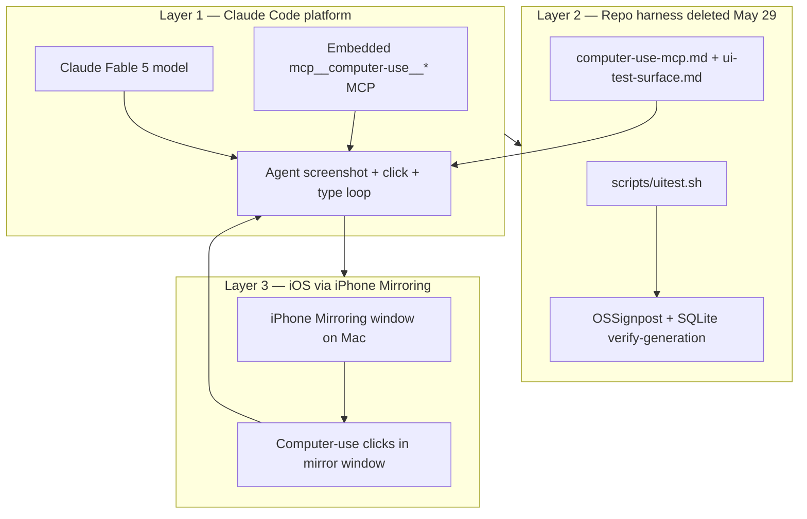
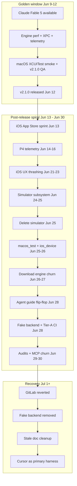
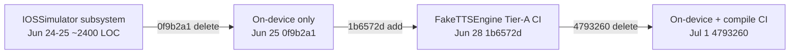

# Post-Fable development post-mortem (June 9 – July 1, 2026)

Commit-backed analysis of the period after **Claude Fable 5** became unavailable in Claude Code, through the **v2.1.0** release and the post-release churn that followed until stabilization in **Cursor** (July 1, 2026).

**Scope:** Git history on `main` from `v2.1.0` (`c60dd08`, 2026-06-12) through `cf78de0` (2026-07-01). When this doc disagrees with the code, the code wins.

---

## Executive summary

**v2.1.0 shipped on 2026-06-12** ([GitHub release](https://github.com/PowerBeef/QwenVoice/releases/tag/v2.1.0)) at the end of a **high-quality four-day sprint** (67 commits, June 9–12) that delivered real engine wins: 8 GB Mac realtime generation, warm-admission gating, XPC idle retirement, delivery presets v2, a standing macOS XCUITest smoke suite, and release QA.

**The 19 days after release added 199 commits** (~25k lines inserted) but **did not ship a new release**. The repo entered a period of **development hell** characterized by:

1. **Harness and model churn** — Claude Fable 5 was unavailable after June 12; subsequent agents (Claude Code / Opus 4.8, Kimi Code CLI, then Cursor) each rewrote agent guides and testing strategy without stable grounding.
2. **Architectural ping-pong on iOS testing** — a simulator subsystem was built (~2,400 LOC), deleted, a fake backend was added for CI, then removed again (July 1).
3. **Feature thrashing without gate discipline** — download pause/resume and delivery-picker UX went through add → break → revert cycles.
4. **Documentation as a substitute for verification** — 55 doc-heavy commits (~28% of post-release work); docs repeatedly contradicted code (the Tier-A/B testing model persisted in multiple files until July 1).
5. **Infrastructure distractions** — a GitLab primary-forge migration was attempted and fully reverted the same day (July 1).
6. **Loss of the computer-use operator loop** — leaving Claude Code removed the embedded `mcp__computer-use__*` MCP that drove macOS Vocello and iPhone Mirroring UI tests by sight; the repo harness (`uitest.sh` + runbooks) was deleted May 29 and never restored; subsequent XCUITest/fake-backend attempts did not replicate agent-driven exploratory testing.

The move to **Cursor** (July 1+) is the first coherent stabilization: a single harness, compile-only iOS CI, on-device-only iOS testing, and doc/code realignment (`4793260`, `cf78de0`).

---

## Background: Claude Fable 5 and the computer-use harness

**Claude Fable 5** was available in Claude Code from approximately **June 9 through June 12, 2026**, when Anthropic suspended worldwide access under U.S. export-control policy. During that window it drove major optimizations that shipped in **v2.1.0** — often while operating the app through Claude Code's **embedded computer-use MCP** (`mcp__computer-use__*`: screenshot, click, type, key).

The best UI validation path was never a single thing. It was **three layers** that stacked:

| Layer | What it was | Status today |
| --- | --- | --- |
| **Platform** | Claude Code's native `mcp__computer-use__*` tools + Fable 5 as operator | **Lost** when leaving Claude Code; not available in Cursor |
| **Repo harness** | `scripts/uitest.sh` + runbooks (`computer-use-mcp.md`, `ui-test-surface.md`, smoke/bench docs) | **Deleted** `6d1cca4` (2026-05-29); **never restored** |
| **iOS mirror driving** | Agent clicks the iPhone Mirroring window by sight | **Deprecated** 2026-06-01 (`7346cc0`); current [`scripts/ios_device.sh`](../../scripts/ios_device.sh) uses mirroring for **observation only** |

**May 27–28** (`86d7823`, `a052be3`) built the peak repo harness: vision-first computer-use on macOS (screenshot → click by sight, keyboard-first `cmd+Return` generation) with **deterministic measurement** decoupled in `uitest.sh` (OSSignpost bench-step, SQLite verify-generation). iOS used the same operator against the **iPhone Mirroring** window on the Mac — real device UI, mouse-simulated touch, no iOS accessibility tree on macOS.

**May 29 01:32** (`6d1cca4`) **nuclear removal**: deleted `uitest.sh`, the old `ios_device.sh`, 20 docs including `computer-use-mcp.md` and `ui-test-surface.md` — reason: "computer use confusion." The **platform MCP in Claude Code still worked**; the repo shell and runbooks were gone.

**June 1** (`7346cc0`) unblocked iOS device work but **deprecated screen-mirror UI-driving** in favor of hybrid headless telemetry + XCUITest. **June 9** (`90e16b3`) rebuilt macOS XCUITest smoke in parallel — the durable regression backbone, not a full replacement for exploratory agent driving.

When Fable disappeared (~June 12) and development later moved off Claude Code, agents lost:

- A model that could hold the full XPC + MLX + SwiftUI + dual-platform architecture in working memory across long sessions,
- The **embedded computer-use MCP** that drove macOS Vocello and mirrored iPhone UI seamlessly, and
- The deleted repo harness that documented keyboard-first patterns, picker quirks, and bench/smoke orchestration.

Post-Fable agents stayed active (**70 of 199** post-release commits are `Co-Authored-By: Claude`) but **quality and coherence dropped**, visible as revert cycles, duplicate subsystems, and doc drift.

---

## Timeline

| Period | Commits | Net diff (approx.) | Character |
| --- | --- | --- | --- |
| Jun 9–12 (Fable window) | 67 | +6,263 / −40,044 | Focused, shippable (includes mlx-audio specialization) |
| Jun 12–Jul 1 (post v2.1.0) | 199 | +25,057 / −6,335 | High churn, no release |
| Jul 1 (Cursor stabilization) | 12 | Corrective | Fake backend removed, docs synced, CI simplified |

**Commit volume by day (post v2.1.0):** spikes on Jun 13 (26), Jun 23 (25), Jun 25–26 (20 each), Jun 28 (13), Jul 1 (12).

---

## Part 1 — What the Fable-era work got right (June 9–12)

Evidence: [`docs/releases/v2.1.0.md`](../releases/v2.1.0.md), commits on `main` before tag `v2.1.0`.

### Engine and performance (high leverage, benchmark-gated)

| Commit | Date | What shipped |
| --- | --- | --- |
| `f3cd2aa` | Jun 9 | RoPE fusion — 8 GB Mac crosses RTF 1.0 |
| `3e955ce`, `50c74ff` | Jun 9 | Warm-admission + XPC idle retirement on constrained Macs |
| `cd8983a` | Jun 9 | MainThreadStallWatchdog (UI responsiveness KPI) |
| `a2b5f15` | Jun 9 | mlx-audio-swift specialized to Qwen3-TTS only (major dead-code removal) |
| `1c8d9f5` | Jun 11 | Sampler-order fix (temperature scaling before top-p/min-p) |
| `eceeb6d` | Jun 11 | Auto-language Latin-script fix |
| `e9671c7` | Jun 11 | Delivery presets v2 |

### Release discipline

| Commit | Date | What shipped |
| --- | --- | --- |
| `90e16b3` | Jun 9 | Permanent macOS XCUITest smoke suite (standing pre-release gate) |
| `64b291d` | Jun 9 | Pre-release audit fixes (cancel race, task lifecycles) |
| `8dccda4`, `a590293` | Jun 12 | Version bump + release-QA ledger row |
| `c60dd08` | Jun 12 | CI release workflow artifact path fix |

### Why it worked

- **Single milestone:** everything pointed at v2.1.0.
- **Benchmark anchoring:** work tied to [`benchmarks/OPTIMIZATION.md`](../../benchmarks/OPTIMIZATION.md) workstreams (§D RoPE, §G UI smoothness, §H program record).
- **Deterministic gates:** macOS XCUITest smoke, not agent screen-driving.
- **Scope control:** engine fixes and release QA, not parallel forge/harness migrations.

---

## Part 2 — What went wrong after v2.1.0

### 2.1 Loss of the operator model

When Fable 5 was pulled (~June 12), subsequent models (notably **Opus 4.8** in Claude Code) struggled to:

- Maintain architectural coherence across XPC, in-process iOS, vendored MLX codec, and SwiftUI surfaces.
- Complete multi-phase plans without oscillating or contradicting prior commits.
- Distinguish **retired** workflows (computer-use UI driving) from **current** ones (scripts + XCUITest).

**Symptom in git:** creation of `AGENT_HANDOFF.md` on June 22 (`db345dd`) with **33 subsequent touches** — a stateless-agent band-aid for cross-session coordination. Retired in `fafc147` (June 25) when CLAUDE.md became primary again, but the underlying problem persisted.

### 2.2 Agent guide ping-pong

The canonical onboarding file flipped repeatedly, leaving agents with conflicting instructions:

| Date | Commit | Action |
| --- | --- | --- |
| Jun 15 | `2224f23` | Delete CLAUDE.md → consolidate into AGENTS.md |
| Jun 22 | `bb886b4` | Re-create CLAUDE.md |
| Jun 25 | `fafc147` | CLAUDE.md primary; retire AGENTS.md + handoff |
| Jun 28 | `0f64fdd` | Replace AGENTS.md with Claude Code–adapted CLAUDE.md |
| Jun 28 | `814f84b` | Align docs for **Kimi Code CLI** |
| Jun 28 | `c7b3234` | Migrate back to AGENTS.md + `.agents/` role files |
| Jun 28 | `b2cfaba` | Cursor-native rules + testing runbook |

**Impact:** Each harness migration rewrote testing strategy in prose **without** completing validation. Docs described Tier-A fake-backend CI while code was torn down days later.

### 2.3 iOS testing architecture ping-pong (worst failure mode)

Agents treated “MLX cannot run on the iOS Simulator” as a **test infrastructure problem** to solve with fake engines, instead of accepting **device-only validation** as a hard constraint.

**Phase A — Simulator subsystem (June 24–25, ~2,400 LOC)**

- `2743b07` … `ae6927a`: `IOSSimulatorTTSEngine`, `Sources/iOS/Simulation/`, typed env config, sim-only XCUITest classes, `scripts/ios_sim.sh`, `.github/workflows/ios-simulator-ui-test.yml`

**Phase B — Delete it (June 25, same day)**

- `0f9b2a1`: Remove entire simulator subsystem — commit message: “The iOS app is on-device only now, matching the hard rule.”

**Phase C — Re-introduce fake backend (June 28)**

- `1b6572d`, `2c497cc`: `FakeTTSEngine`, Tier-A XCUITest, Simulator CI in `ci.yml`

**Phase D — Delete again (July 1)**

- `4793260`: Remove fake backend; compile-only CI; on-device only

**Doc lag:** [`docs/reference/ios-engine-optimization.md`](../reference/ios-engine-optimization.md) incorrectly listed `IOSSimulatorTTSEngine` as production architecture until the July 1 doc fix (`cf78de0`).

### 2.4 Feature thrashing — downloads and delivery UX

**Model downloads (June 23 → June 27)**

| Step | Commit | Event |
| --- | --- | --- |
| 1 | `6a49a8b` | Add pause/resume |
| 2 | `4792562` | **Revert** pause/resume (user request; sim backend entangled) |
| 3 | `dcc6990` | Reimplement with pause/resume + simulator backend |
| 4 | `e29f6fb` … `1bd4b13` | macOS parallel/byte-range download mega-phase (Jun 26) |
| 5 | `69f0dd2` | **Revert** macOS Pause/Resume |
| 6 | `528d82c` | iOS: remove Pause; Cancel discards |
| 7 | `d95feee` | iOS: foreground + byte-range (macOS parity) |
| 8 | `39485bc` | **Revert byte-range on iOS** after on-device testing showed uneven throughput |

**Delivery picker (June 21–23)**

- 15+ commits iterating the custom-tone sheet (chips, categories, 500-char cap, antonyms, keyboard layout…)
- `e66f63c`: **Revert** to emotion grid + intensity

**Pattern:** Large batches landed without **`scripts/ios_device.sh gate`** first; reverts followed user feedback or failed on-device validation. `AGENT_HANDOFF.md` entries document the firefighting.

### 2.5 Productive work buried in noise

Not everything post-release was wasted:

| Window | Commits | Value retained today |
| --- | --- | --- |
| Jun 13 | 26 | iOS App Store lane, a11y, batch gen, website v2.1 — legitimate shipping prep |
| Jun 14–16 | 40 | P4 telemetry schema v5, streaming-by-default CLI, prosody QA |
| Jun 25–26 | 40 | `ios_device.sh` + `macos_test.sh` lane matrix — **durable infrastructure** |
| Jun 29 | 7 | Benchmark audit fixes, macOS multi-mode UI smokes |

**Problem:** High-value harness work (Jun 25–26) was **undermined** by fake-backend CI (Jun 28) and doc drift, so pre-merge gates were unreliable until July 1.

### 2.6 Infrastructure and tooling distractions

| Event | Commits | Outcome |
| --- | --- | --- |
| GitLab migration | `5f89d8a`, `67a1fbb`, `217c149` | Fully reverted (`aa63ccb`, `073777f`, `4a4d86e`) same day |
| XcodeBuildMCP | `375244e` → `3b044ba` → `00543f8` | Added, removed, re-added within 24 hours |
| CI simulator picker | `e0ace28`, `adacf02`, `96e1b5e` | Three fixes for a CI path deleted in `4793260` |

### 2.7 Quantitative churn signals

Post `v2.1.0` (`c60dd08`..`cf78de0`):

- **199 commits** in 19 days
- **69 fix/revert commits** (~35%)
- **55 docs commits** (~28%)
- **Most touched paths:** `AGENT_HANDOFF.md` (33), `AGENTS.md` (28), `project.pbxproj` (26), iOS sheets/settings (17–23), testing reference docs (17–18 each)
- **No new GitHub release** despite iOS App Store prep landing Jun 13

### 2.8 Loss of the computer-use operator loop

This was the **biggest practical regression** when moving from Claude Code to other harnesses: not just losing Fable 5, but losing the **embedded computer-use MCP** that made UI-driven testing feel seamless on macOS and on a mirrored iPhone.

#### What the harness was (recovered from git at `6d1cca4^`)

**macOS — vision-first computer-use + `scripts/uitest.sh`**

The deleted `computer-use-mcp.md` runbook (May 2026, removed `6d1cca4`) described a deliberately thin driving model:

1. `scripts/uitest.sh activate` (shell) — bring Vocello to the front.
2. `mcp__computer-use__screenshot` — agent sees the UI.
3. `mcp__computer-use__left_click` / `type` / `key` — act **by sight** in screenshot pixel space (no accessibility-id coordinate math on the happy path).
4. Re-screenshot to confirm each step.

| Intent | Computer-use call |
| --- | --- |
| Capture screen | `mcp__computer-use__screenshot` |
| Click | `mcp__computer-use__left_click`, `coordinate: [x, y]` |
| Type into focused field | `mcp__computer-use__type` (click field first) |
| Key chord | `mcp__computer-use__key`, e.g. `cmd+Return` (Generate) |

Keyboard-first shortcuts minimized clicks: `cmd+Return` for Generate, `cmd+a` / `BackSpace` to replace script text, `Down`/`Up`/`Return` for SwiftUI Picker menus (fixed pixel coords fail after the first picker open because menus re-anchor to the current selection).

**Measurement stayed deterministic and separate from driving.** Timing came from OSSignposts via harness commands — UI driving latency did not pollute bench numbers:

| `uitest.sh` command | Purpose |
| --- | --- |
| `prep` / `reset` | Launch Debug build; wipe generations/outputs for cold samples |
| `smoke-check <mode>` | Precondition gate (models installed, clone voice present) |
| `bench-step …` | One bench sample: wait on signpost + record |
| `verify-generation …` | Post-generate WAV + SQLite check |
| `bench-summarize` / `bench-compare` | Aggregate vs baselines |
| `artifacts-dir` | Timestamped evidence bundle |

The deleted `ui-test-surface.md` catalog (611 lines, removed `6d1cca4`) catalogued every `accessibilityIdentifier` as a **semantic reference for what to look for on screen** — not as the primary click path.

**iOS — iPhone Mirroring + computer-use**

The deleted `ios-device-screen-mirror-testing.md` runbook (removed `6d1cca4`) workflow:

1. `scripts/ios_device.sh start` — build/install Debug on a paired iPhone, launch app, open **iPhone Mirroring**.
2. Agent drives the **Mirroring window** on the Mac by visible labels, tab icons, and buttons (the mirrored content does not expose a meaningful macOS accessibility tree).
3. Smoke scenarios: Settings model download, Custom/Design/Clone generation, memory-guard probes.
4. Milestone captures via `scripts/ios_device.sh screenshot`.

This exercised the **real MLX engine on a physical iPhone** without writing Swift for every flow — the agent explored settings, sheets, downloads, and generation like a human watching the mirror and clicking with the mouse.

#### Why it felt seamless with Fable + Claude Code

- **Natural-language agent loop** with vision — no new XCUITest class per UI change.
- **Real engine paths** on macOS (Debug/XPC) and iOS (mirrored device).
- **Flexible exploration** — ad-hoc settings tours, delivery picker checks, download UX, error toasts — beyond what a fixed smoke suite covers.
- **Dense in-repo runbooks** (`smoke-custom-voice.md`, bench matrices, `bench-agent-gate.md`, `benchmark-baselines.json`) that Fable could follow in long sessions.

#### Timeline: built → deleted → never fully replaced

| Date | Commit | Event |
| --- | --- | --- |
| 2026-05-27 | `86d7823` | Migrate macOS smoke/bench docs to computer-use MCP; expand `uitest.sh` |
| 2026-05-28 | `a052be3` | Vision-first native model: `mcp__computer-use__*` + screenshot-by-sight |
| 2026-05-29 01:32 | `6d1cca4` | **Delete** `uitest.sh`, old `ios_device.sh`, 20 docs — "computer use confusion" |
| 2026-05-29 later | `3ecf595` | Re-add UI-driving playbook (docs only; scripts still gone) |
| 2026-06-01 | `7346cc0` | Unblock iOS device work; **deprecate screen-mirror driving** → hybrid XCUITest |
| 2026-06-09 | `90e16b3` | Rebuild macOS XCUITest smoke (Fable window) |
| 2026-06-15 | research report §4.7 | Documents mirror-pixel automation as unreliable (post-hoc) |
| 2026-06-30 | `374ae74` | "Human-like" XCUITest journey/review drivers — closest code-based mimic |

#### What was lost when leaving Claude Code

1. **Embedded `mcp__computer-use__*` MCP** — Cursor has browser MCP, XcodeBuildMCP, and Axiom auditors, but **no equivalent** for macOS Vocello.app pixel driving or iPhone Mirroring window touch simulation.
2. **`scripts/uitest.sh` orchestration** — never restored after `6d1cca4`; even if computer-use returned to a harness, the lifecycle/measurement shell is gone.
3. **Documented runbooks** — element catalog, per-mode smoke scripts, bench-agent-gate, baseline JSON.
4. **Operational fluency** — Fable + dense May 2026 docs; post-Fable Opus 4.8 and later agents lacked both the model and the runbooks.

#### Why replacements failed to match

| Replacement | Gap vs computer-use |
| --- | --- |
| XCUITest (`VocelloMacSmokeUITests`, `VocelloiOSUITests`) | Swift per flow; brittle on UI churn; iOS needs attended device + unlock |
| Fake backend + Simulator CI (Jun 28 – Jul 1) | No real MLX; false confidence; removed Jul 1 |
| `IOSSimulatorTTSEngine` subsystem (Jun 24–25) | ~2,400 LOC built then deleted same day |
| mac-control MCP mention (`7454eba`, Jun 15) | Brief Kimi-era note; never wired as full replacement |
| Jun 30 "human-like" XCUITest (`374ae74`) | Closest attempt — still code-bound, not agent-explorable |
| iPhone Mirroring today | [`ios_device.sh shot`](../../scripts/ios_device.sh) = observation only; coordinate driving **explicitly deprecated** in script comments |

#### Honest tension

The repo **deprecated mirror-driving on June 1** (`7346cc0`) citing flakiness, and the June 15 research report documents technical limits (no AX tree on the mirror window, focus races, disconnects). **Lived experience with Fable + Claude Code computer-use was nonetheless better** than what post-Fable agents delivered with XCUITest-only or fake-backend pivots. The gap is real in both directions: mirror automation is inherently brittle *and* losing the platform MCP removed the operator that made it work well enough to ship v2.1.0-era validation. Today the repo correctly treats mirroring as **observation only** ([`ios-device-testing.md`](../reference/ios-device-testing.md)); recovering agent-driven UI requires a **new platform MCP**, not resurrecting coordinate hacks in shell scripts alone.

---

## Part 3 — Root cause analysis

### Primary causes (systemic)

1. **Model capability gap** — Post-Fable models could not maintain the same architectural coherence as Fable 5 on this codebase (XPC + MLX + dual-platform + GRDB + vendored codec).

2. **Harness fragmentation** — Claude Code → Kimi Code CLI → Cursor each brought different MCP/tool assumptions. Agent guides were rewritten per harness instead of stabilizing **scripts + XCUITest** as the only automation surface.

3. **Missing frozen invariants during churn** — The hard rule “iOS real engine = physical device only” was violated repeatedly (simulator subsystem, fake backend, Tier-A CI). Invariants existed in prose but agents did not treat them as non-negotiable.

4. **Verification lag** — `scripts/ios_device.sh gate` existed from June 25 but was not enforced before merge; CI ran Simulator fake tests (Jun 28–Jul 1) that gave **false confidence**.

5. **Scope creep after release** — Post v2.1.0 work mixed iOS App Store prep, telemetry P4, download engine rewrite, testing architecture, forge migration, and doc audits without a single release train.

6. **Computer-use capability gap** — The project's best UI validation path was **agent + platform MCP + repo shell**. Removing any layer degraded the whole loop: repo shell deleted May 29 (`6d1cca4`), Fable unavailable June 12, platform MCP lost when leaving Claude Code. Post-Fable agents tried to rebuild with XCUITest and fake engines instead of restoring or replacing the operator model (see §2.8).

### Secondary causes (process)

- **`AGENT_HANDOFF.md` as a band-aid** — 33 commits logging SHAs instead of one harness owning context.
- **Doc-first “completion”** — agents marked work done by updating docs before gates were green.
- **Revert-as-workflow** — legitimate user corrections, but signals planning failure (downloads, delivery picker, GitLab, pause/resume).

---

## Part 4 — What the Cursor migration fixed (July 1)

Commits `4793260` and `cf78de0` align with current [`AGENTS.md`](../../AGENTS.md):

| Area | Stable end-state |
| --- | --- |
| iOS testing | On-device only via `scripts/ios_device.sh`; no Simulator, no fake backend |
| GitHub CI | `ios-compile-check` — compile-only; no XCUITest on hosted runners |
| Pre-merge gate | Local `scripts/ios_device.sh gate` on a paired iPhone |
| Agent onboarding | Single `AGENTS.md` + `.agents/` roles + `.cursor/rules/` |
| Docs | Stale Tier-A/B and `IOSSimulatorTTSEngine` references removed |

This is the **first stable testing and harness end-state** since June 25’s simulator deletion.

---

## Part 5 — Recommendations

### Keep (durable assets from the spiral)

- [`scripts/ios_device.sh`](../../scripts/ios_device.sh) and [`scripts/macos_test.sh`](../../scripts/macos_test.sh) lane matrix
- [`docs/reference/testing-runbook.md`](../reference/testing-runbook.md) as single testing source of truth
- [`.agents/*.md`](../../.agents/) role split + [`.cursor/rules/`](../../.cursor/rules/)
- P4 telemetry + streaming-default bench path (June 14–16)
- macOS `VocelloMacSmokeUITests` (12 tests)

### Never repeat

- Building parallel iOS fake/simulator engine implementations
- CI that runs tests the engine cannot support (Simulator MLX)
- Per-harness agent guide rewrites without a green code gate
- Multi-hundred-line features without `ios_device.sh gate` / `macos_test.sh gate` first
- Forge/tooling migrations during active product work

### Computer-use gap (open)

The Jul 1 stabilization gives a **deterministic regression backbone** (XCUITest + script gates). It does **not** replace exploratory agent-driven UI validation.

- **Short term:** Treat `macos_test.sh gate` + `ios_device.sh gate` as pre-merge gates; iPhone Mirroring stays **observation-only** per current policy.
- **Do not resurrect** mirror-coordinate driving in shell scripts without a platform MCP — the repo already deprecated it (`7346cc0`); [`scripts/ios_device.sh`](../../scripts/ios_device.sh) `shot` captures the mirror window for human review, not agent clicks.
- **If revisiting agent-driven UI:** user-scoped **Peekaboo + mirroir** pilot (Jul 2026) — see [`docs/reference/computer-use-mcp-alternatives-cursor.md`](../reference/computer-use-mcp-alternatives-cursor.md). Appium + `appium-mcp` remains Option 2 for AX-native iOS.
- **If computer-use returns to any harness:** restore a minimal **`uitest.sh`-style lifecycle shell** (prep / reset / verify-generation / bench-step) **decoupled** from UI driving method — the May 2026 design got this separation right; measurement must not depend on how the agent clicked.

### Suggested release train

1. **Freeze scope** to iOS TestFlight / App Store (infra largely prepped June 13).
2. **Pre-merge gates:** `macos_test.sh gate` + `ios_device.sh gate` (attended iPhone).
3. **CI:** compile-only iOS; add macOS UI smoke on GitHub when macOS-26 runners support app launch reliably.
4. **One agent guide:** `AGENTS.md` only — do not resurrect `CLAUDE.md` or `AGENT_HANDOFF.md`.
5. **Benchmark-gated engine changes** per [`.agents/backend-mlx.md`](../../.agents/backend-mlx.md).

---

## Appendix — Key commit index

| SHA | Date | Summary |
| --- | --- | --- |
| `86d7823` | May 27 | computer-use MCP docs + `uitest.sh` expansion |
| `a052be3` | May 28 | Vision-first native computer-use model |
| `6d1cca4` | May 29 | Delete entire UI-driving harness (`uitest.sh`, runbooks) |
| `7346cc0` | Jun 1 | Deprecate screen-mirror driving; hybrid XCUITest path |
| `90e16b3` | Jun 9 | macOS XCUITest smoke suite |
| `f3cd2aa` | Jun 9 | RoPE fusion — 8 GB realtime |
| `c60dd08` | Jun 12 | v2.1.0 tag point / CI release fix |
| `374ae74` | Jun 30 | "Human-like" XCUITest journey/review attempt |
| `0f9b2a1` | Jun 25 | Delete iOS Simulator subsystem |
| `986272a` | Jun 26 | `macos_test.sh` gate complete |
| `8362c75` | Jun 25 | `ios_device.sh` gate complete |
| `1b6572d` | Jun 28 | Fake backend + Tier-A XCUITest |
| `5f89d8a` | Jul 1 | GitLab migration (reverted same day) |
| `4793260` | Jul 1 | Remove fake backend; compile-only CI |
| `cf78de0` | Jul 1 | Stale doc cleanup |

---

*Written 2026-07-01; computer-use expansion 2026-07-01. Method: `git log`, diff stats, file churn analysis, and recovery of deleted harness docs at `6d1cca4^`.*
