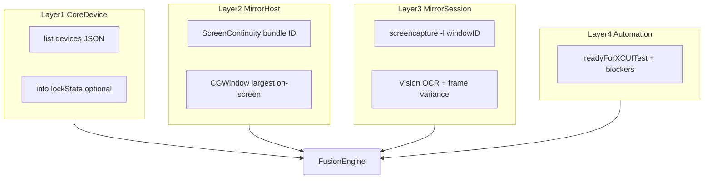

# iOS device-state probe reference

Authoritative implementation: [`scripts/lib/ios_device_state.sh`](../../scripts/lib/ios_device_state.sh),
[`scripts/lib/ios_coredevice_probe.py`](../../scripts/lib/ios_coredevice_probe.py),
[`scripts/lib/mirror_state_ocr.swift`](../../scripts/lib/mirror_state_ocr.swift).

## Purpose

Detect run-dooming interference **before** expensive on-device lanes (`test`, `bench-ui`, agent
bench) abort with a named cause instead of timing out.

## Layered architecture



| Layer | Signal | Source |
| --- | --- | --- |
| CoreDevice | `tunnelState`, `pairingState`, reachability | `devicectl list devices --json-output` |
| CoreDevice | Lock (physical device) | `devicectl device info lockState --device <id>` when available |
| Mirror host | Process running | Bundle `com.apple.ScreenContinuity` (not localized process name) |
| Mirror host | Window present | `CGWindowListCopyWindowInfo` via `mirror_state_ocr window-id` |
| Session | Interference overlay | Vision OCR (fr+en) + low-variance frame heuristic |
| Automation | XCUITest readiness | Lock state + Mac Gate 1 + mirror verdict |

## Verdicts and exit codes

| Verdict | Exit | Safe for bench? | Safe for XCUITest? |
| --- | --- | --- | --- |
| `MIRROR_ACTIVE` | 0 | Yes | Yes (if unlocked for auth handshake) |
| `PHONE_IN_USE` | 10 | No | No (lock phone to resume mirror) |
| `CALL_ACTIVE` | 11 | No | No |
| `MIRROR_CONNECTING` | 12 | No | No |
| `MIRROR_DISCONNECTED` | 13 | No | No |
| `DEVICE_UNREACHABLE` | 14 | No | No |
| `PROBE_DEGRADED` | 15 | **No** | **No** — fix permissions/helper, do not fail-open |
| `DEVICE_LOCKED` | 16 | Yes (advisory) | Unlock once before attach |

**Lock vs in-use:** iPhone Mirroring **requires a locked phone**. `DEVICE_LOCKED` (from
`lockState`) is healthy for mirroring. `PHONE_IN_USE` means the user unlocked or took the phone
and the mirror session paused — different from the XCUITest one-time unlock handshake.

## Commands

```sh
# One-shot (legacy line + exit code)
scripts/ios_device.sh device-state

# Structured v2 (all sub-signals)
scripts/ios_device.sh device-state --json-v2

# Poll with hysteresis (2 consecutive agreeing samples)
scripts/ios_device.sh device-state watch --interval 2 --count 3

# CoreDevice only
python3 scripts/lib/ios_coredevice_probe.py probe --device "$QVOICE_IOS_DEVICE_ID"
python3 scripts/lib/ios_coredevice_probe.py lock-state --device "$QVOICE_IOS_DEVICE_ID"
```

## French macOS

The Mirroring **process name** is localized (`Recopie de l'iPhone`). All process discovery uses
bundle ID `com.apple.ScreenContinuity`. For osascript/Accessibility and mirroir MCP, set
`mirroringProcessName` in `~/.mirroir-mcp/settings.json` (see [`.mirroir-mcp/settings.json`](../../.mirroir-mcp/settings.json)).

If `ios_device.sh device-state` passes but mirroir `check_health` fails: restart Cursor MCP after
settings change; keep Cursor in the same macOS Space as the mirror window.

## Operator decision tree

1. Run `device-state --json-v2`.
2. **`PROBE_DEGRADED`** → grant Screen Recording to the terminal; rebuild helper (`swiftc` via first probe); same Space as mirror.
3. **`MIRROR_DISCONNECTED`** → `ios_device.sh mirror`.
4. **`PHONE_IN_USE`** → lock iPhone; wait for mirror to reconnect.
5. **`CALL_ACTIVE`** → end/decline call.
6. **XCUITest lane** → check `signals.automation.blockers`; if `device_locked`, unlock once before attach.
7. **Conflicting shell vs MCP** → verify `mirroringProcessName` parity; restart mirroir MCP.

## Offline tests (no phone)

```sh
python3 scripts/test_device_state_classifier.py
scripts/test_mirror_state_ocr.sh
```

Fixtures: [`Tests/DeviceProbeFixtures/`](../../Tests/DeviceProbeFixtures/).

## Validation matrix (when phone available)

| Scenario | Expected verdict | automationReady (XCUITest) |
| --- | --- | --- |
| Locked phone, mirror live | `MIRROR_ACTIVE` | false until unlock handshake |
| Unlock phone while mirroring | `PHONE_IN_USE` | false |
| Lock again, mirror resumes | `MIRROR_ACTIVE` | false until unlock for XCTest |
| Mirroring app quit | `MIRROR_DISCONNECTED` | false |
| USB unplugged | `DEVICE_UNREACHABLE` | false |
| Screen Recording denied | `PROBE_DEGRADED` | false |

Record results in [`computer-use-mcp-pilot-log.md`](computer-use-mcp-pilot-log.md) §11.

## Apple references

- [iPhone Mirroring support](https://support.apple.com/en-au/120421) — locked phone required; pause on direct use.
- [TN3210](https://developer.apple.com/documentation/technotes/tn3210-optimizing-your-app-for-iphone-mirroring) — app compatibility only; no iOS-side mirror detection API.
- `devicectl device info lockState` — physical devices (Xcode 26+); distinct from non-existent `screenIsLocked` field.
