# iOS on-device testing — lanes + operator guide

The iOS testing/debugging/benchmarking/UI-review lanes. The engine runs **in-process** in
the app (not an ExtensionKit extension — Jetsam would cap it independently of the
`increased-memory-limit` entitlement). GitHub CI runs **compile-only** for iOS; the real
pre-merge gate is `scripts/ios_device.sh gate` on a paired physical iPhone.

> Build/run stay in [`build.sh`](../../scripts/build.sh) / [`ios_device.sh`](../../scripts/ios_device.sh).
> For the canonical testing strategy (on-device model, CI compile lane, determinism rules)
> see [`testing-runbook.md`](testing-runbook.md). For the app map + driving flows see
> [`ios-app-guide.md`](ios-app-guide.md).

Two automated backends — neither drives the UI by pixels:

1. **Headless generation harness** (`IOSAutorunHarness`) — launch via `devicectl` with an
   autorun spec; one generation with no UI; telemetry + sentinel pulled back and summarized.
2. **XCUITest** (`VocelloiOSUITests`) — deterministic UI regression on a **paired iPhone only**
   (real in-process MLX engine).

iPhone Mirroring is for **observation**, not scripted generation (focus races, disconnects,
no headless trigger). Use the headless harness for unattended real-engine proof.

See [§ Visual reference](#visual-reference-diagrams) for workflow diagrams. The iOS Simulator
is **never** used for Vocello testing.

---

## Visual reference (diagrams)

Quick index — each diagram matches [`scripts/ios_device.sh`](../../scripts/ios_device.sh).

| # | Diagram | Jump |
| --- | --- | --- |
| 1 | [System overview](#diagram-system) | Mac ↔ iPhone, two backends |
| 2 | [CI vs local verification](#diagram-ci-local) | What GitHub runs vs pre-merge gate |
| 3 | [One-time setup flow](#diagram-setup) | First-run checklist order |
| 4 | [Daily command picker](#diagram-daily) | Which verb for your change |
| 5 | [Pre-merge `gate` pipeline](#diagram-gate) | Four gate steps + verdict |
| 6 | [`test` / `ui-test` pipeline](#diagram-uitest) | Build, install, batched class run |
| 7 | [Headless `bench` + data pull](#diagram-bench) | Autorun loop and diagnostics path |
| 8 | [XCUITest session model](#diagram-xcuitest-sessions) | Warm vs cold app sessions |
| 9 | [Security gates](#diagram-security-gates) | Three layers blocking XCUITest |
| 10 | [Model fixture states](#diagram-models) | Ready, after `--download`, missing |
| 11 | [Agent session flow](#diagram-agent-mcp) | Preflight MCP → shell gate → Axiom triage |
| 12 | [Model verification ladder](#diagram-model-ladder) | Advisory → inventory pull → late XCTSkip |

<a id="diagram-system"></a>

### 1. System overview

Mac operator runs `ios_device.sh` and `xcodebuild`; the paired iPhone runs the real
in-process MLX engine. iPhone Mirroring keeps a locked device observable and
`devicectl`-reachable.

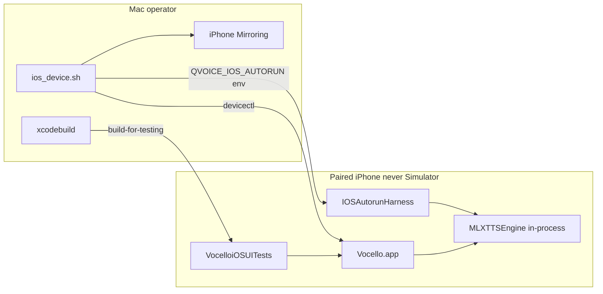

<a id="diagram-ci-local"></a>

### 2. CI vs local verification

GitHub CI catches compile regressions; only a physical iPhone proves the real engine.

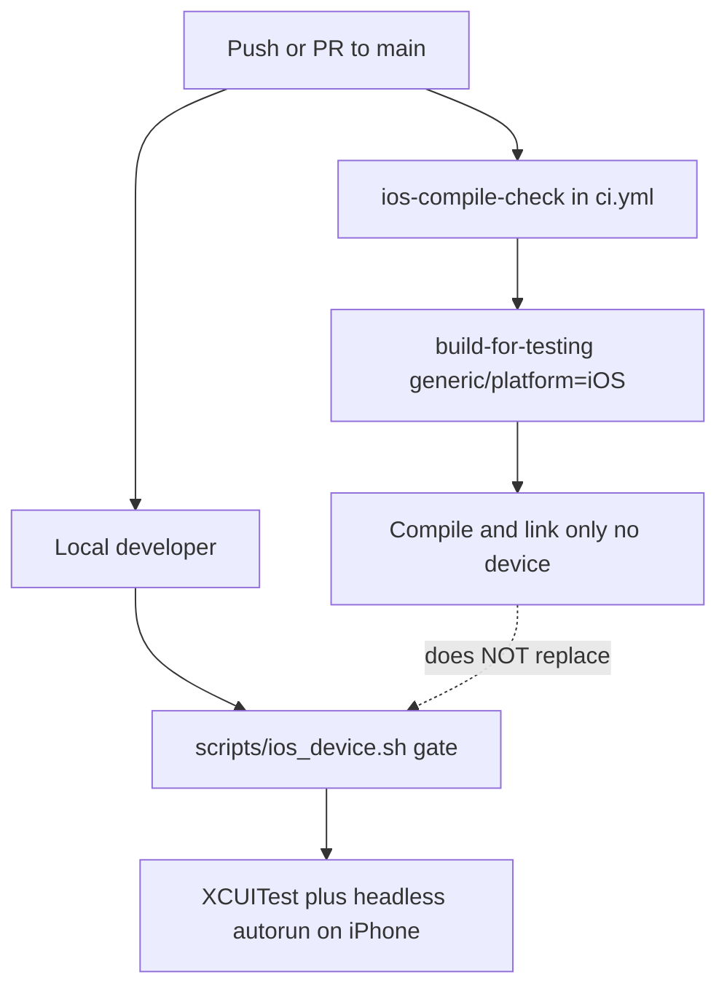

<a id="diagram-setup"></a>

### 3. One-time setup flow

Run once per Mac + test iPhone. Order matters — see [§ One-time setup checklist](#one-time-setup-checklist).

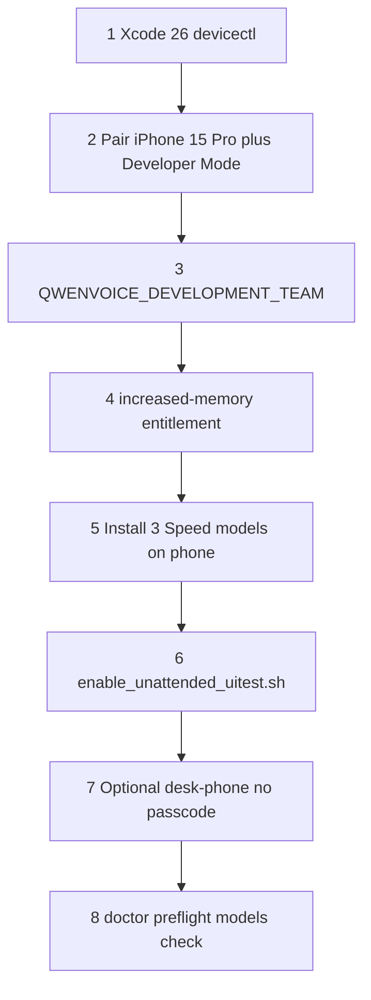

<a id="diagram-daily"></a>

### 4. Daily command picker

Pick the smallest lane that matches your change. Pre-merge default: `gate`.

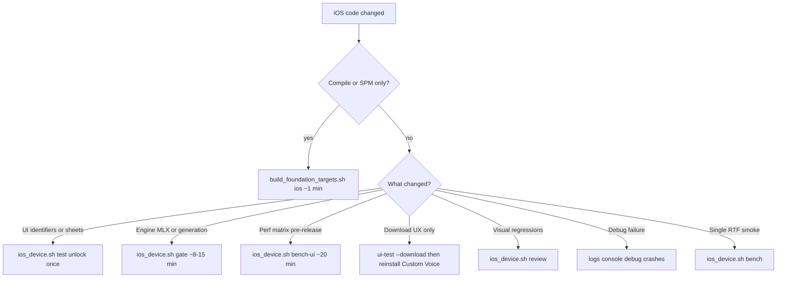

<a id="diagram-gate"></a>

### 5. Pre-merge `gate` pipeline

Artifacts land in `build/ios/gate-<runID>/` (`verdict.txt`, per-step logs).
ColdGeneration (real UI generation) runs inside step 2 — step 3 is a separate headless proof.

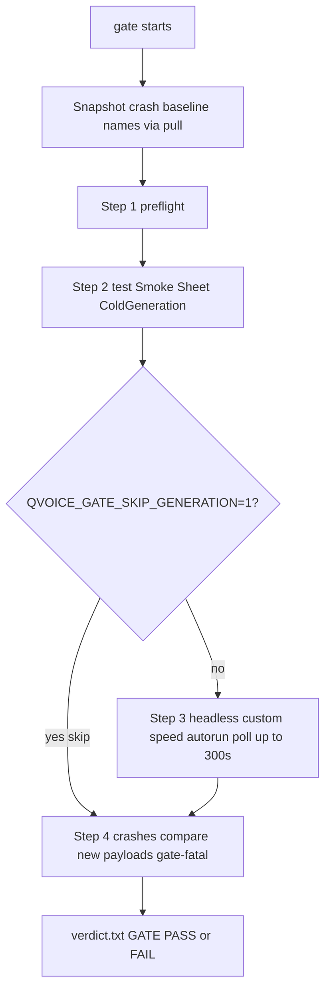

<a id="diagram-uitest"></a>

### 6. `test` / `ui-test` pipeline

Default scope batches Smoke, Sheet, and ColdGeneration into **one** `xcodebuild
test-without-building` invocation (three `-only-testing:` flags).

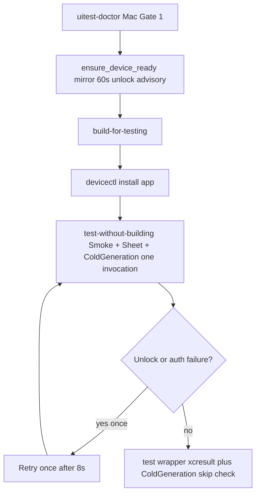

Phone must be **unlocked once** at attach; it may auto-lock after the handshake.

<a id="diagram-bench"></a>

### 7. Headless `bench` + data pull

Phone can stay **locked**. App Group diagnostics are not `devicectl`-readable — the harness
mirrors into the app container first.

**Pipeline:**

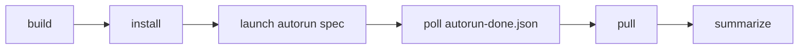

**Data path:**

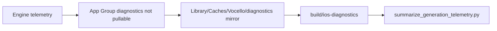

<a id="diagram-xcuitest-sessions"></a>

### 8. XCUITest session model

Default `test` mixes warm suites (Smoke, Sheet) with one cold suite (ColdGeneration).

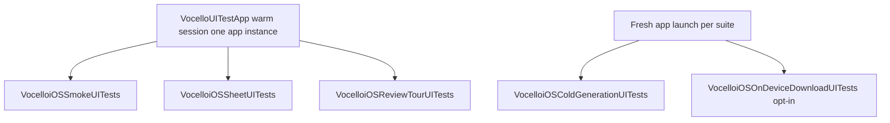

<a id="diagram-security-gates"></a>

### 9. Security gates (three layers)

XCUITest lanes hit all three gates. Headless `bench` / gate generation step bypasses gates 2–3.

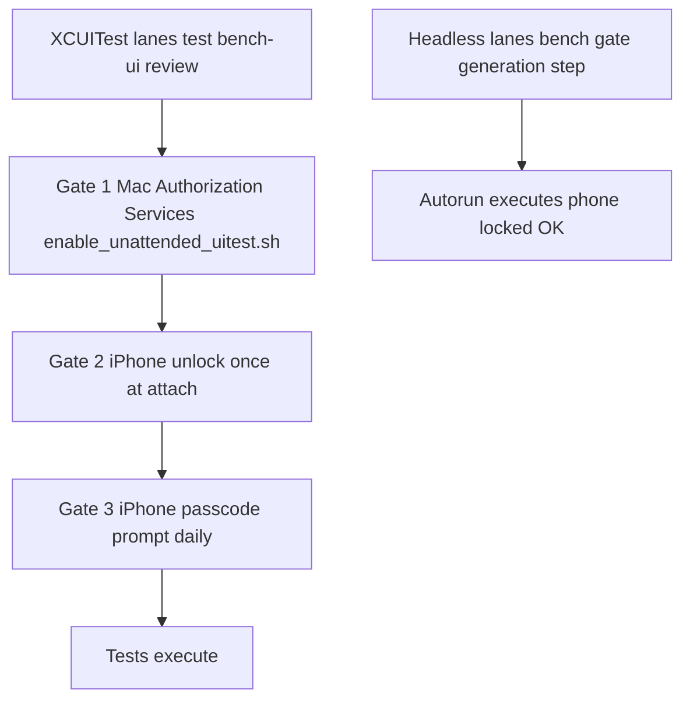

<a id="diagram-models"></a>

### 10. Model fixture states

Models live in the iPhone App Group. The Mac verifies install state via headless inventory
pull (`models check`) or late XCTSkip during XCUITest.

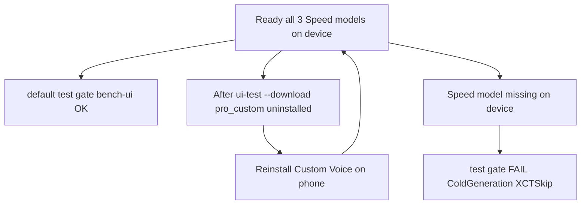

<a id="diagram-agent-mcp"></a>

### 11. Agent session flow (MCP + shell)

[`scripts/ios_device.sh`](../../scripts/ios_device.sh) runs all **gates**; MCPs augment
preflight, observation, and post-run triage only.

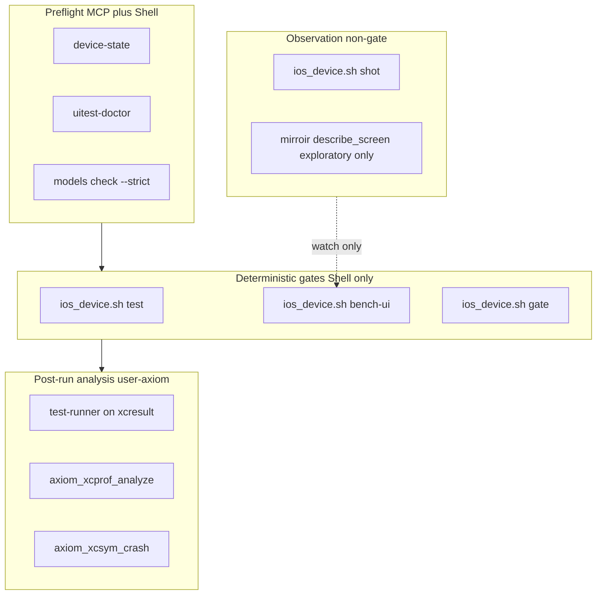

<a id="diagram-model-ladder"></a>

### 12. Model verification ladder

Headless inventory closes the macOS `models check` parity gap. Until inventory is built,
use the bench probe workaround.

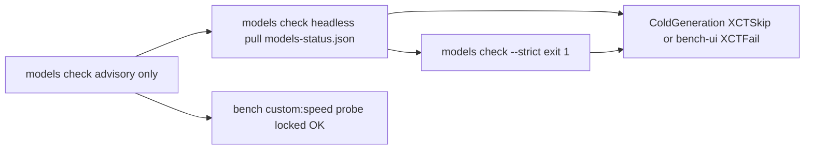

---

## One-time setup checklist

See [diagram 3 — One-time setup flow](#diagram-setup). Run once per Mac + test iPhone. Order matters.

1. **Xcode 26** with CoreDevice (`devicectl`).
2. **Pair an iPhone 15 Pro or newer** (iPhone 17 Pro preferred when multiple devices are
   paired). USB, Mac trusted, **Developer Mode ON** on the device.
3. **Signing:** `export QWENVOICE_DEVELOPMENT_TEAM=<your-apple-team-id>` (matches
   `project.yml`; never commit). Optional: `export QVOICE_IOS_DEVICE_ID=<id|name|udid>` to
   pin the target device.
4. **Increased-memory entitlement** on the app App ID — see
   [`ios-increased-memory-entitlement-request.md`](ios-increased-memory-entitlement-request.md).
5. **Install all three Speed models on the iPhone** (~6.9 GB total): Vocello → Settings →
   Model Downloads (`pro_custom`, `pro_design`, `pro_clone`). Required for default `test` /
   `gate` / `bench-ui`. Verify with `scripts/ios_device.sh models check --strict` (headless
   inventory pull — phone locked OK).
6. **Mac Gate 1 (UI Automation):** `scripts/enable_unattended_uitest.sh` (sudo once; persists
   across reboots). Or `scripts/ios_device.sh uitest-doctor --enable-gate1`.
7. **Optional desk-phone pattern:** remove the device passcode for fully unattended XCUITest
   (re-enable when the phone leaves the desk). See § UI test machine setup.
8. **Verify:**

```sh
export QWENVOICE_DEVELOPMENT_TEAM=<team-id>
scripts/ios_device.sh doctor
scripts/ios_device.sh preflight
scripts/ios_device.sh models check
```

**Mirroring (on by default):** every device verb auto-starts macOS **iPhone Mirroring** so you
watch on the Mac while the phone stays locked + screen-dark (OLED-safe). Mirroring also keeps
a locked device `devicectl`-reachable. Opt out with `QVOICE_IOS_NO_MIRROR=1`.

**Unlock vs lock:** `bench`, `launch`, `pull`, and gate generation work with a **locked** phone.
**`ui-test` / `test` require the iPhone unlocked once** at the start for the XCUITest automation
auth handshake; it may auto-lock again after.

---

## Daily workflow — which command when

See [diagram 4 — Daily command picker](#diagram-daily).

| You changed… | Run |
| --- | --- |
| Swift compile / SPM only | `scripts/build_foundation_targets.sh ios` |
| SwiftUI identifiers, sheets, navigation | `scripts/ios_device.sh test` |
| Engine, generation, memory, download | `scripts/ios_device.sh gate` |
| Native/Views before release; perf matrix | `scripts/ios_device.sh bench-ui --label "why"` |
| Download/cancel UX only | `scripts/ios_device.sh ui-test --download` then reinstall Custom Voice |
| Visual regressions | `scripts/ios_device.sh review` |
| Single headless generation + RTF | `scripts/ios_device.sh bench "custom:speed:…"` |

**Pre-merge default:** `scripts/ios_device.sh gate` on your paired iPhone.

---

## Lane map

Driver: [`scripts/ios_device.sh`](../../scripts/ios_device.sh). Signing team from
`$QWENVOICE_DEVELOPMENT_TEAM` (or keychain auto-derive); device from `$QVOICE_IOS_DEVICE_ID`
or auto-discovery.

| Lane | Verb | Typical duration | Phone state | Models | Proves | Artifacts | Deeper analysis |
| --- | --- | --- | --- | --- | --- | --- | --- |
| Doctor | `doctor` | ~10 s | any | — | Xcode, team, device, entitlements | — | — |
| Preflight | `preflight` | ~30 s | locked OK | optional `--strict-models` | mirror + reachability + app + dSYM | — | — |
| UITest doctor | `uitest-doctor` | ~10 s | — | — | Mac Gate 1 + unlock guidance | — | — |
| Device state | `device-state` | ~5 s | — | — | call / phone-in-use / mirror dead | — | § Interference |
| Models | `models check` | ~15 s | locked OK | `--strict` gates | headless inventory pull | `build/ios-diagnostics/models-status.json` | § Model verification |
| Build / install | `build`, `install` | 1–3 min | locked OK | — | signed `-Onone` app | `build/ios/` | — |
| Test | `test` / `ui-test` | **~4–6 min** | **unlock once** | all Speed | Smoke + Sheet + ColdGeneration (batched) | `build/ios/uitest-artifacts/` | `axiom_get_agent` → `test-runner` |
| Gate | `gate` | **~7–12 min** | unlock for test step | all Speed | preflight → test → headless gen → crash delta | `build/ios/gate-<runID>/` | — |
| Bench | `bench [spec]` | ~3–6 min | locked OK | Custom Speed min. | headless RTF / audioQC / telemetry | `build/ios-diagnostics/` | summarizer |
| Lang bench | `lang-bench [--subset quick\|full]` | ~15–45 min | locked OK | Custom Speed min. | language-hint matrix (autorun × N) | `build/ios/lang-bench-<runID>/` | `check_language_hints.py` |
| Bench UI | `bench-ui` | **~20+ min** | unlock once | all Speed + clone voice | 29-take UI matrix; optional `--profile` | `build/ios/bench-ui-<runID>/` | `check_ios_ui_bench.py` |
| Crash | `crashes [--test]` | ~1 min | locked OK | — | MetricKit payloads | `build/ios-diagnostics/` | `axiom_xcsym_crash` |
| Debug / logs | `debug`, `logs`, `console` | varies | locked OK | — | stdout / LLDB attach | `build/ios-logs/` | `build-fixer` |
| Profile | `profile [spec]` | ~2 min | locked OK | Speed | xctrace + autorun | `build/ios/profile-*.trace` | `axiom_xcprof_analyze` |
| Review | `review [--baseline]` | ~3 min | unlock once | — | screenshot tour | `build/ios/review-shots/` | `screenshot-validator` |
| Observe | `mirror`, `shot`, `launch`, `pull` | varies | locked OK | — | visual / manual | `build/device-shot.png` | — |

Every verb (except `doctor` / `models check` alone) runs **auto-mirror preflight** unless
`QVOICE_IOS_NO_MIRROR=1`.

### Preflight verbs — do not conflate

| Verb | Checks | Use when |
| --- | --- | --- |
| `doctor` | Xcode, team, device id, built app entitlements | First-time env sanity |
| `preflight` | mirror + devicectl reachability + signing + app + dSYM | Before `gate` or expensive lanes |
| `uitest-doctor` | Mac Gate 1 + iPhone unlock/passcode guidance | Before **any** XCUITest |
| `device-state` | OCR mirror window: call / in-use / mirror dead | Before `bench-ui`; when runs hang |
| `models check` | Headless inventory pull (`models-status.json`); `--strict` exits 1 | Before gate / `bench-ui`; `preflight --strict-models` |

macOS has `models ensure` (headless install). iOS has **manual install on the phone only**.

---

## Model fixture policy

See [diagram 10 — Model fixture states](#diagram-models).

| Lane | Models required | How to prepare |
| --- | --- | --- |
| Default `test` / `gate` | All three Speed (`pro_custom`, `pro_design`, `pro_clone`) | Settings → Model Downloads on iPhone (~6.9 GB once) |
| `bench`, gate generation | Custom Voice Speed minimum | Same (Custom Voice) |
| `bench-ui` | All three Speed | Same + **saved clone voice on phone** for clone cells |
| `ui-test --download` | None at start (test uninstalls `pro_custom`) | **Opt-in only.** Reinstall Custom Voice before next default `test` / `gate` |
| `ui-test --cold` | Custom Voice Speed | ColdGeneration only |
| CI | None | `build-for-testing` compile-only |

**Escape hatches:**

- `QVOICE_GATE_SKIP_GENERATION=1` — skip gate headless generation step (UI tests still run).
- ColdGeneration **skipped** (missing model) → `test` / `gate` **FAIL** (not a silent pass).

**Asymmetry vs macOS:** `macos_test.sh models ensure` installs from the Mac. iOS downloads
on the phone only — `models check` pulls headless inventory via `QVOICE_IOS_MODELS_CHECK=1`
→ `Library/Caches/Vocello/diagnostics/models-status.json`. Use `models check --strict` or
`preflight --strict-models` before long lanes. Interim probe:
`bench "custom:speed:Model probe."` (~1–3 min, locked phone OK). See
[diagram 12 — Model verification ladder](#diagram-model-ladder).

---

## Why `gate` runs ColdGeneration and headless autorun

See [diagram 5 — Pre-merge gate pipeline](#diagram-gate).

The gate runs **two** real-engine proofs on purpose — they overlap on Custom Voice but
exercise different surfaces:

| Step | Mechanism | What it proves |
| --- | --- | --- |
| **ColdGeneration** (in `test`) | XCUITest cold launch → composer → Generate → player | UI cold-start path, warm-app teardown, end-user flow |
| **Gate generation** | Headless `custom:speed` autorun (no UI) | Entitlement/memory headroom, RTF, `audioQC`, durable telemetry without UI flake |

Skip the generation step when merging UI-only changes: `QVOICE_GATE_SKIP_GENERATION=1`.
Use `bench` alone for quick headless iteration without the full XCUITest attach cycle.

---

## XCUITest vs headless — when to use which

| Need | Use |
| --- | --- |
| Identifiers, tabs, sheets, navigation | `test` (Smoke + Sheet) |
| Cold-start UI generation | ColdGeneration (in default `test`) |
| Download/cancel UX | `ui-test --download` (destructive — reinstall Custom Voice after) |
| RTF, audioQC, memory, unattended proof | `bench` or gate generation step |
| Full perf matrix through Studio UI | `bench-ui` |
| Fully unattended (passcode policy blocks XCUITest) | `bench` — no automation auth handshake |

---

## UI test machine setup

See [diagram 9 — Security gates](#diagram-security-gates) and
[diagram 8 — XCUITest session model](#diagram-xcuitest-sessions).
[diagram 6](#diagram-uitest) shows the full `test` pipeline.

Three **independent** security layers block on-device XCUITest:

| Gate | Where | Symptom | Fix |
| --- | --- | --- | --- |
| **1 — Mac Authorization Services** | This Mac | Login password to “Enable UI Automation” | **One-time:** `scripts/enable_unattended_uitest.sh` |
| **2 — iPhone unlock handshake** | Paired iPhone | “device was not unlocked”, auth error 12 | Wake + **unlock once** when the runner attaches |
| **3 — iPhone passcode (iOS 15+)** | Paired iPhone | Passcode/Touch ID to authorize UI automation (~daily) | No supported bypass with passcode ON |

```sh
scripts/ios_device.sh uitest-doctor
scripts/ios_device.sh uitest-doctor --enable-gate1
```

**Fully unattended ui-test:** close Mac Gate 1; use a dedicated desk iPhone with passcode
removed; Developer Mode + “Enable UI Automation” on; phone awake and unlocked when
`ui-test` starts. If passcode must stay on: unlock once before the first ui-test of the day,
or use `bench` for unattended engine validation.

`ui-test` fails fast when Mac Gate 1 is still open (unless `--skip-uitest-doctor`).
Cross-link macOS gates: [`macos-testing.md`](macos-testing.md) § UI test machine setup.

### Default scope and suites

See [diagram 6 — test / ui-test pipeline](#diagram-uitest).

| Command | Classes | Notes |
| --- | --- | --- |
| `ui-test` / `test` | Smoke, Sheet, ColdGeneration | Default. Requires all Speed models. |
| `ui-test --download` | OnDeviceDownload | **Uninstalls `pro_custom` in setUp.** |
| `ui-test --cold` | ColdGeneration only | |
| `ui-test --all` | All classes | Debug/soak only |

`Tests/VocelloiOSUITests/` (host `VocelloiOS`):

- `VocelloUITestApp.swift` — warm-app coordinator (real engine); resets to Studio between cases.
- `VocelloiOSSmokeUITests` — launch + 4-tab reachability + mode segments.
- `VocelloiOSSheetUITests` — sheet regressions (voice, preview, language, brief).
- `VocelloiOSColdGenerationUITests` — cold-launch real generation (or XCTSkip if model missing).
- `VocelloiOSOnDeviceDownloadUITests` — download cancel UX (opt-in lane).
- `VocelloiOSReviewTourUITests` — screenshot tour for baseline diffing.

Smoke and Sheet do **not** exercise real audio generation. ColdGeneration and
OnDeviceDownload prove the real engine and download stack.

**Driving identifiers:** Studio uses `screenPresenceMarker("screen_generateStudio")` — a 1pt
leaf marker so the screen id is queryable without shadowing descendants. Query
`studioChip_*`, `textInput_*`, `textInput_generateButton` directly. See
[`ios-app-guide.md`](ios-app-guide.md) and `VocelloiOSSheetUITests.swift`.

```sh
# Default (Smoke + Sheet + ColdGeneration):
export QWENVOICE_DEVELOPMENT_TEAM=<team-id>
scripts/ios_device.sh test

# Opt-in download lane (reinstall Custom Voice before gate):
scripts/ios_device.sh ui-test --download
```

Always pass `-derivedDataPath build/ios` for direct `xcodebuild` so builds reuse one tree.

Launch env vars: see [`testing-runbook.md`](testing-runbook.md) §2 (`QVOICE_IOS_SKIP_ONBOARDING=1`,
`QWENVOICE_DEBUG=1` for ColdGeneration telemetry).

---

## Quality lanes (detail)

**Crash.** `IOSCrashObserver` writes MetricKit payloads to the pullable diagnostics dir;
`build` preserves `.dSYM` under `build/ios/dsyms/`. `crashes --test` deliberately crashes
(`QVOICE_IOS_CRASH_TEST`) to verify capture → pull → symbolication.

**Debug.** `get-task-allow` on dev entitlements. `debug` prints LLDB attach command;
`logs` tees attached-launch stdout to `build/ios-logs/<run>.log`.

**Profile.** `profile [spec]` records xctrace while `IOSAutorunHarness` runs one generation.
Override template/duration via `QVOICE_IOS_PROFILE_TEMPLATE` / `QVOICE_IOS_PROFILE_DURATION`.

**Review.** `VocelloiOSReviewTourUITests` captures key screens; `review --baseline` seeds
`docs/ios-review-baselines/`. Capture-and-dismiss — no static burn-in dwell.

**Burn-in policy.** Mirroring keeps the device screen dark. Headless lanes never light the
phone. Review tour opens each sheet only long enough to screenshot.

---

## Headless generation harness (reference)

See [diagram 7 — Headless bench + data pull](#diagram-bench).

### Verb reference

| Verb | What it does |
| --- | --- |
| `launch [spec]` | Launch via `devicectl`. With spec → autorun + telemetry env; prints `runID`. |
| `console [spec]` | Attached launch — streams `[autorun]` stdout live. |
| `pull [dest]` | Copy diagnostics mirror from app container (default `build/ios-diagnostics`). |
| `bench [spec] [--label]` | `build → install → launch-with-autorun → poll sentinel → pull → summarize`. |
| `lang-bench [--subset quick\|full] [--label]` | Headless language-hint matrix — one autorun per cell; gated by `check_language_hints.py`. See [`language-bench.md`](language-bench.md). |

```sh
scripts/ios_device.sh bench "custom:speed:Hello from Vocello on device" --label "in-process engine"
```

### Autorun spec + environment

Harness: [`Sources/iOS/IOSAutorunHarness.swift`](../../Sources/iOS/IOSAutorunHarness.swift).
Fires only when `QVOICE_IOS_AUTORUN` is set — inert on normal user launch.

| Env var | Purpose |
| --- | --- |
| `QVOICE_IOS_AUTORUN` | `<mode>:<variant>:<text>`. `mode ∈ custom\|design\|clone`, `variant ∈ speed\|quality`. |
| `QVOICE_IOS_AUTORUN_LANG` | Optional UI language hint (`english`, `french`, `auto`, …). Omitted = Auto. Set by `lang-bench`. |
| `QVOICE_IOS_VERIFY_OUTPUT` | When `1`, autorun transcribes output WAV (Speech) and stamps `outputVerification` on the sentinel. On by default for `lang-bench`. |
| `QWENVOICE_DEBUG=1` | Engine telemetry JSONL (runtime-gated, not `#if DEBUG`). |
| `QVOICE_IOS_DEVICE_RUN_ID` | Tags run; sentinel at `diagnostics/<runID>/autorun-done.json`. |
| `QVOICE_MAC_BENCH_RUN_ID` / `QVOICE_MAC_BENCH_CELL` | Bench metadata stamped into `notes.benchRunID` / `notes.benchCell` (lang-bench + UI bench). |

Sentinel example:

```jsonc
{ "status": "ok", "mode": "custom", "variant": "speed", "modelID": "…",
  "durationSeconds": 5.1, "wallSeconds": 13.7, "realtimeFactor": 0.37, … }
```

`clone` autorun needs a saved voice on device. Clone generation may use the memory-conscious
load profile — autorun records a clean sentinel error rather than crashing if encoders are
unavailable.

### Where data lives + how it's pulled

Telemetry writes to the **App-Group container**, but `devicectl` cannot read app groups.
The harness **mirrors** into `Library/Caches/Vocello/diagnostics` in the app container:

```sh
xcrun devicectl device copy from --device <id> \
  --domain-type appDataContainer \
  --domain-identifier com.patricedery.vocello \
  --source Library/Caches/Vocello/diagnostics --destination build/ios-diagnostics
python3 scripts/summarize_generation_telemetry.py build/ios-diagnostics/diagnostics --label "…"
```

On iOS only `engine/generations.jsonl` is populated (no XPC app rows). The sentinel is the
authoritative single-run record; JSONL is append-only and accumulates across runs.

---

## Interference states (fail doomed runs fast)

Layered probe: CoreDevice JSON + bundle-ID mirroring process + Vision OCR. Full reference:
[`ios-device-probe.md`](ios-device-probe.md).

| Lane | Reaction |
| --- | --- |
| `ensure_device_ready` (ui-test/gate) | `CALL_ACTIVE` / `PROBE_DEGRADED` / mirror dead → abort. `PHONE_IN_USE` → warn (unlock handshake). |
| `bench` / gate generation polls | `CALL_ACTIVE` / mirror dead / unreachable / degraded → abort; `PHONE_IN_USE` ×2 (~20 s) → abort. |
| `ui-test` retry | Before retry: probe; in-use/call/degraded → die with cause named. |
| `ensure_mirror` | Paused session gets one Resume nudge (activate + Return). |
| Agent bench (`bench-ui-mirroir`) | `device-state watch` (2/3 hysteresis) before takes. |

```sh
scripts/ios_device.sh device-state              # legacy line + exit code
scripts/ios_device.sh device-state --json-v2    # structured sub-signals
scripts/ios_device.sh device-state watch --interval 2 --count 3
```

Exit codes: `0` MIRROR_ACTIVE · `10` PHONE_IN_USE · `11` CALL_ACTIVE · `12` MIRROR_CONNECTING ·
`13` MIRROR_DISCONNECTED · `14` DEVICE_UNREACHABLE · `15` PROBE_DEGRADED · `16` DEVICE_LOCKED (advisory).

**Lock vs in-use:** mirroring wants a **locked** phone (`lockState` → `device_locked` blocker for
XCUITest only). `PHONE_IN_USE` means the mirror session paused because the phone was unlocked or
used directly.

Autorun harness stamps `interruptions: [{type, atMS}]` into `autorun-done.json` via
`IOSInterruptionRecorder` (calls + app lifecycle).

---

### Virtual microphone (`QWENVOICE_FAKE_MIC_WAV`) on device

[`ReferenceClipRecorder`](../../Sources/SharedSupport/ViewModels/ReferenceClipRecorder.swift)
supports virtual mic when set to a **readable on-device path**. macOS paths do not work.

```sh
xcrun devicectl device copy to --device <udid> \
  --destination "Library/Caches/Vocello/fake-mic.wav" \
  --source /path/on/mac/to/reference-clip.wav \
  --domain-type appDataContainer --domain-identifier com.patricedery.vocello

QWENVOICE_FAKE_MIC_WAV="Library/Caches/Vocello/fake-mic.wav" scripts/ios_device.sh launch
```

Real mic recording for Clone QA must happen on the physical phone — Mirroring does not
expose the device microphone.

---

## Known inefficiencies (documented; remaining gaps)

These are **current behavior** — not bugs — but they explain residual friction:

1. **No skip-build fast path.** Every `ui-test` runs `build-for-testing` + reinstall even when
   `build/ios/…/Vocello.app` is fresh. **Future:** skip when app + test bundle exist unless
   `QVOICE_IOS_FORCE_BUILD=1`.

2. **Gate generation overlap.** ColdGeneration (UI) + headless autorun both exercise Custom Voice
   — intentional (see § Why gate runs both) but adds wall-clock time. **Future:** optional
   `QVOICE_GATE_UI_ONLY=1` for UI-only merges (tradeoff documented above).

**Closed (2026-07):** default `test` batches three classes into one xcodebuild invocation;
`bench-ui` runs `device-state` + `uitest-doctor` preflight and supports `--profile`;
`models check --strict` uses headless inventory pull.

---

## Verification ladder

See [diagram 2 — CI vs local verification](#diagram-ci-local).

| Level | Command | Proves |
| --- | --- | --- |
| Compile (app) | `scripts/build_foundation_targets.sh ios` | in-process engine + harness compile |
| Compile (UI test) | `build-for-testing` (`generic/platform=iOS` in CI, or device id locally) | test target wired |
| CI compile check | `.github/workflows/ci.yml` `ios-compile-check` | VocelloiOS + VocelloiOSUITests compile on push/PR |
| UI smoke (device) | `scripts/ios_device.sh test` | Smoke + Sheet + ColdGeneration on hardware |
| UI review | `scripts/ios_device.sh review` | screenshot tour vs `docs/ios-review-baselines/` |
| Pre-merge gate | `scripts/ios_device.sh gate` | preflight → test → generation → crashes (fatal) → verdict |
| Interactive UI review | `launch` + `shot` | full UI over iPhone Mirroring |
| On-device engine proof | `scripts/ios_device.sh bench "custom:speed:…"` | RTF / audioQC / telemetry |
| Model inventory (device) | `scripts/ios_device.sh models check --strict` | all Speed tiers verified on phone |

---

## Agent + MCP workflow

> **Current exploratory iOS driver (Jul 2026):** **mirroir native** — validated in
> [`computer-use-mcp-pilot-log.md`](computer-use-mcp-pilot-log.md) §10.2. mobile-mcp deferred.

See [diagram 11 — Agent session flow](#diagram-agent-mcp). **Principle:** `scripts/ios_device.sh`
runs all gates (`gate`, `test`, `bench-ui`). MCPs augment preflight, observation, and triage —
they do not replace XCUITest or drive regression matrices.

### MCP routing matrix

| Phase | Tool | When | iOS-specific notes |
| --- | --- | --- | --- |
| **Preflight** | `scripts/ios_device.sh device-state` | Before `bench-ui` / long runs | Exit 0 = `MIRROR_ACTIVE` (mirror up — **still unlock phone once** for first XCUITest attach). `--json-v2` for lock/automation sub-signals. See [`ios-device-probe.md`](ios-device-probe.md) |
| | `scripts/ios_device.sh uitest-doctor` | Before any XCUITest | Mac Gate 1 + unlock guidance |
| | `user-xcodebuildmcp` `session_show_defaults` → profile `ios-device` → `list_devices` | Agent session start | Optional; **`ios_device.sh` stays primary** for test/bench |
| | `scripts/ios_device.sh models check --strict` | Before gate / `bench-ui` | Headless inventory pull; phone locked OK |
| **Run gate** | `scripts/ios_device.sh gate` | Pre-merge | ~7–12 min; unlock once for step 2 |
| **Run UI bench** | `scripts/ios_device.sh bench-ui --label "why"` | Engine/UI matrix (XCUITest) | ~10 min full matrix; `ensure_mirror` + attended unlock; clone voice on phone; retries auth + transient keyboard flakes |
| **Run agent UI bench** | `scripts/ios_device.sh bench-ui-mirroir --agent-drive …` | Full matrix via **mirroir** native | Playbook G — pilot/exploratory; same gate as `bench-ui` |
| **Run agent UI bench (deferred)** | `scripts/ios_device.sh bench-ui-mcp --agent-drive …` | Full matrix via **mobile-mcp** (WDA) | Playbook F — **deferred**; WDA signing blocked |
| **Run vision UI bench (deprecated)** | `scripts/ios_device.sh bench-ui-vision --agent-drive …` | Legacy mirroir + Peekaboo | Playbook E — emergency only |
| **Run headless bench** | `scripts/ios_device.sh bench "custom:speed:…"` | RTF/audioQC without XCUITest | Phone **locked OK**; unattended engine proof |
| **Observe** | `scripts/ios_device.sh shot` | During long runs | Mac-side Mirroring capture — no agent taps |
| | `mirroir` `describe_screen` | Exploratory QA / smokes | Primary agent driver (Jul 2026) |
| | `mobile-mcp` `mobile_list_elements_on_screen` | Exploratory QA / bench-ui-mcp | **Deferred** — WDA signing blocked |
| **Triage fail** | `axiom_get_agent` → `test-runner` | `test` / `bench-ui` xcresult | Artifact: `build/ios/Logs/Test/*.xcresult` |
| | Read `build/ios/bench-ui-<runID>/bench-ui.log` | Stuck generate / manifest | Look for `iosStudio_generationError`, `VOCELLO-BENCH-UI-MANIFEST` |
| | `python3 scripts/check_ios_ui_bench.py …` | Re-gate pulled telemetry | Invoked by `bench-ui`; re-run manually after fixes |
| | `axiom_xcprof_analyze` | After `profile` or `bench-ui --profile` | Trace: `build/ios/profile-*.trace` or `build/ios/bench-ui-*/vocello.trace` |
| | `axiom_xcsym_crash` / `crash-analyzer` | After `crashes` | Pulled MetricKit under `build/ios-diagnostics/` |
| | `axiom_xclog_attach` / `axiom_xclog_show` | Debug hangs | Pair with `ios_device.sh logs` |
| **Review** | `axiom_get_agent` → `screenshot-validator` | After `review` | Compare `build/ios/review-shots/` vs baselines |

### Never use for iOS gates

- XcodeBuildMCP `*_sim`, `tap` / `snapshot_ui` on simulator
- Axiom `xcui` / `simulator-tester`
- mirroir / peekaboo **UI taps** during **XCUITest** `bench-ui`, **mobile-mcp** / WDA sessions, or `gate`

**Allowed (exploratory only, not during gates):**

- **mirroir** native `describe_screen` → `tap` / `type_text` for Studio smokes — see Playbook D + [`ui-smoke-runbooks.md`](ui-smoke-runbooks.md)
- **Peekaboo** on macOS Vocello only
- **Observation:** `ios_device.sh shot` anytime (no taps)

**Deferred:** mobile-mcp **`bench-ui-mcp --agent-drive`** and Playbook F — WDA signing blocked. **Agent matrix:** Playbook G (`bench-ui-mirroir`). **Unattended matrix:** Playbook B (`bench-ui`).

One automation owner per device session — do not mix XCUITest attach with agent taps.

### Playbook A — Pre-merge smoke (fast)

1. `scripts/build_foundation_targets.sh ios` (no device)
2. `scripts/ios_device.sh device-state` → must be 0
3. Unlock phone once
4. `scripts/ios_device.sh test`
5. On fail → `axiom_get_agent` `test-runner` with latest `build/ios/Logs/Test/*.xcresult`

### Playbook B — Full iOS UI bench (macOS `bench-ui` equivalent)

```sh
scripts/ios_device.sh device-state          # exit 0
scripts/ios_device.sh models check --strict
scripts/ios_device.sh uitest-doctor         # Gates 1–3
# Unlock phone; dismiss automation prompt if shown
scripts/ios_device.sh bench-ui --label "release-matrix" \
  --warm 1 --lengths medium --modes custom   # dev smoke subset first
scripts/ios_device.sh bench-ui --label "release-matrix-full"  # full 29-take when clean
```

**During run:** optional `ios_device.sh shot` every few minutes (observation only). Do **not**
touch the phone or mirroir-tap.

**After run:** PASS → note `build/ios/bench-ui-<runID>/gate.log`; FAIL → grep log for
`iosStudio_generationError`; re-run `check_ios_ui_bench.py`; `test-runner` on xcresult.

### Playbook C — Headless benchmark (no XCUITest friction)

```sh
scripts/ios_device.sh bench "custom:speed:Bench smoke." --label "ios-rtf-check"
scripts/ios_device.sh bench --sim-device iphone15pro "clone:speed:…"  # memory tier sim
```

### Playbook D — Exploratory UI tour (no matrix)

- **Exploratory drive:** mirroir + [`ui-smoke-runbooks.md`](ui-smoke-runbooks.md) § iOS Studio smoke
- **Proof:** `gate` / `test --cold` / headless `bench`

### Playbook G — mirroir agent UI bench (`bench-ui-mirroir`)

Agent-driven full matrix through the real Studio UI via native mirroir. Same manifest, telemetry, and gate as Playbook B (`bench-ui`). **Not a pre-merge gate** until pilot-stable. Procedure: [`ios-agent-ui-tour.md`](ios-agent-ui-tour.md) Appendix **B.6d**; runbook: [`ui-smoke-runbooks.md`](ui-smoke-runbooks.md) § mirroir UI bench.

```sh
scripts/ios_device.sh device-state
scripts/ios_mirroir_preflight.sh --native-only
scripts/ios_device.sh models check --strict
scripts/ios_device.sh bench-ui-mirroir --agent-drive \
  --warm 1 --lengths medium --modes custom --label mirroir-bench-pilot
```

**During run:** agent drives mirroir O-A-V per shell `MIRROIR_BENCH_TAKE_BEGIN`; shell blocks on `take-N.done`. Requires **`QWENVOICE_UI_TEST_HOOKS=1`** (driver sets via `vision-launch`) for OCR **`Clear script`** affordance.

**After run:** PASS → `build/ios/bench-ui-mirroir-<runID>/gate.log`; FAIL → grep for generation errors; re-run `check_ios_ui_bench.py`.

### Playbook E — Vision bench-ui matrix (DEPRECATED)

> **Deprecated 2026-07** — use Playbook B (`bench-ui` XCUITest) for matrix; mirroir native for exploratory smokes. Emergency fallback only.

Full UI matrix with mirroir + Peekaboo mirror coordinates (brittle). Same telemetry gate as XCUITest `bench-ui`.

```sh
scripts/ios_device.sh bench-ui-vision --agent-drive --warm 1 --lengths medium --modes custom --label "vision-pilot"
```

See legacy steps in [`ui-smoke-runbooks.md`](ui-smoke-runbooks.md) § vision bench-ui.

### Playbook F — mobile-mcp exploratory + bench-ui-mcp (DEFERRED)

> **Deferred 2026-07** — WDA signing blocked. Current exploratory driver: **mirroir** (Playbook D).
> Full matrix: Playbook B (`bench-ui`). Re-enable when [`mobile-mcp-ios-evaluation.md`](mobile-mcp-ios-evaluation.md) spike passes.

```sh
scripts/ios_mobile_mcp.sh preflight
scripts/ios_device.sh device-state
scripts/ios_device.sh models check --strict
scripts/ios_device.sh bench-ui-mcp --agent-drive \
  --warm 1 --lengths medium --modes custom --label "mcp-pilot"
```

**Exploratory tour:** `mobile_launch_app` → `mobile_list_elements_on_screen` after each Studio/Voices/History/Settings navigation. Build/install always via `scripts/ios_device.sh`.

**Per take** (driver prints `MCP_BENCH_TAKE_BEGIN`):

1. `mobile_list_elements_on_screen` — confirm Studio + mode
2. Prepare mode per [`ios-app-guide.md`](ios-app-guide.md)
3. Clear composer → type script → dismiss keyboard → tap `textInput_generateButton`
4. `vision-bench-wait` → `touch take-N.done`

**Gate comparison (before any gate swap):**

```sh
scripts/ios_mobile_mcp.sh compare-bench \
  build/ios/bench-ui-<xcuitest-runID>/ \
  build/ios/bench-ui-mcp-<mcp-runID>/
```

Full evaluation: [`mobile-mcp-ios-evaluation.md`](mobile-mcp-ios-evaluation.md).

**Artifacts:** `build/ios/bench-ui-mcp-<runID>/` (manifest, gate.log, session.env).

### Artifact map (where MCP tools look)

| Artifact | Path | MCP / tool |
| --- | --- | --- |
| UI test xcresult | `build/ios/Logs/Test/*.xcresult` | `test-runner` |
| Gate verdict | `build/ios/gate-<runID>/verdict.txt` | read in-session |
| Bench-ui log + gate | `build/ios/bench-ui-<runID>/` | grep log; `check_ios_ui_bench.py` |
| mobile-mcp bench-ui | `build/ios/bench-ui-mcp-<runID>/` | manifest; gate.log; `compare-bench` vs XCUITest |
| Vision bench-ui (deprecated) | `build/ios/bench-ui-vision-<runID>/` | legacy only |
| mirroir agent bench-ui | `build/ios/bench-ui-mirroir-<runID>/` | manifest; gate.log; `compare-bench` vs XCUITest |
| Pulled telemetry | `build/ios-diagnostics/` | summarizer; `check_ios_ui_bench.py` |
| Model inventory | `build/ios-diagnostics/models-status.json` | `models check` |
| Profile trace | `build/ios/profile-*.trace` or `bench-ui-*/vocello.trace` | `axiom_xcprof_analyze` |
| Review shots | `build/ios/review-shots/` | `screenshot-validator` |
| Crash payloads | `build/ios-diagnostics/**/crashes/` | `axiom_xcsym_crash` |

### Model verification (macOS parity)

See [diagram 12 — Model verification ladder](#diagram-model-ladder). Weights live in the App
Group — `devicectl` cannot read them directly. Headless inventory mirrors the autorun pattern:
`QVOICE_IOS_MODELS_CHECK=1` → app writes pullable `models-status.json` using
`LocalModelAssetStore.integrity()` for `pro_custom_speed`, `pro_design_speed`,
`pro_clone_speed` (+ `cloneVoicesEnrolled`).

| Need | Command | Phone state | Notes |
| --- | --- | --- | --- |
| Strict preflight | `models check --strict` or `preflight --strict-models` | Locked OK | Fails fast before long lanes |
| Fastest engine probe | `bench "custom:speed:Model probe."` | Locked OK | ~1–3 min; fails at sentinel if Custom Voice missing |
| Advisory only | `models check --advisory` | — | No device launch |
| Install missing weights | **Human on phone:** Settings → Model Downloads | Unlocked | No MCP install from Mac |
| After `--download` lane | Reinstall Custom Voice, then `models check --strict` | — | `--download` uninstalls `pro_custom` |

---

## Still deferred

Signed-IPA / TestFlight distribution lane (iOS Distribution cert + `archive-ios` CI job).
On-device proof is not a public-release blocker (macOS-first; see `AGENTS.md`).
