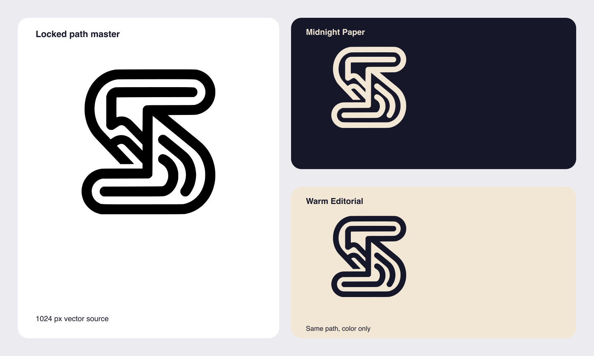
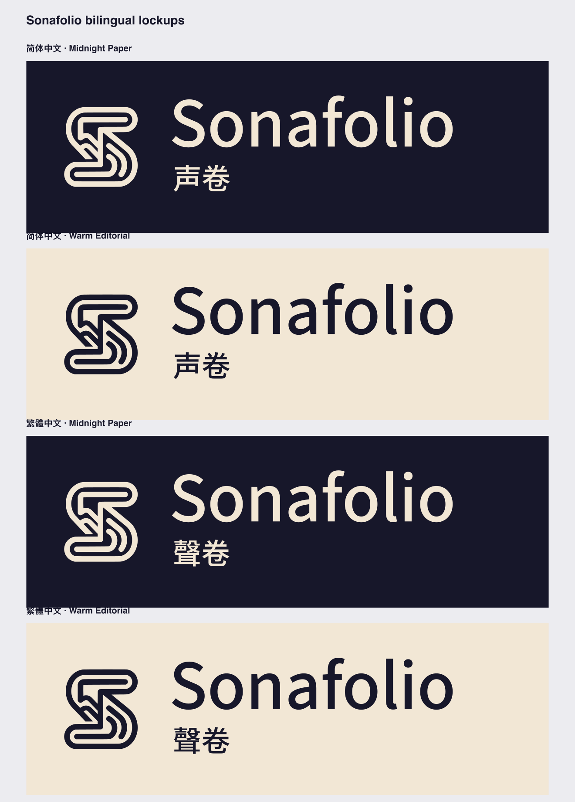
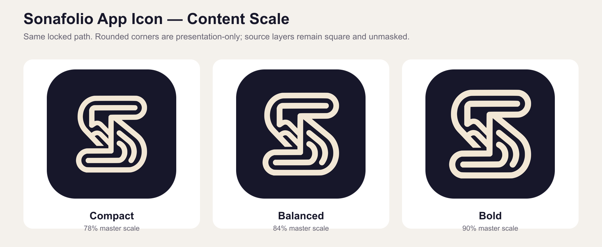

# Sonafolio 品牌视觉规范

> 版本：v0.1，2026-07-23。  
> 状态：商业候选规范；视觉路径已经锁定，真实系统验收、商标近似检索和公司权利确认尚未完成。  
> 范围：macOS 首发品牌资产；iOS 图标与移动端适配暂不处理。

## 1. 品牌结构

| 层级 | 标准内容 | 使用规则 |
| --- | --- | --- |
| 全球核心品牌 | `Sonafolio` | 所有语言保持同一拼写，仅首字母大写 |
| 简体中文辅助名 | `声卷` | 只作为辅助名称，不替代英文核心品牌 |
| 繁体中文辅助名 | `聲卷` | 只作为辅助名称，不替代英文核心品牌 |
| 中文口号 | `让每一页，自然成声。` | 用于商店、宣传和说明文字，不放进 App 图标 |
| 英文口号 | `Every page, naturally voiced.` | 同上 |
| 产品证明句 | `一篇长稿，一个完整 WAV。` | 用于首屏价值表达，不属于 Logo 固定组成 |

品牌标准拼写是 `Sonafolio`。日常品牌名不得写成 `SonaFolio`、`Sona Folio`，
也不以全大写 `SONAFOLIO` 作为默认形式。

## 2. 图形标志

### 2.1 标准母版

标准图形使用 `Final Refinement 2` 锁定路径：

- [SVG 母版](../assets/brand/sonafolio/final-refinement-2/sonafolio-symbol-master.svg)
- [母版说明](../assets/brand/sonafolio/final-refinement-2/README.md)
- 路径 SHA-256：`5183b7c7424a75d24246fbb533721e8b684b936b1e7cbdbdd60cece3ec9b3617`

该符号把书页折线、连续篇章和两级声音弧集中在一条复合路径中。标准版只能做等比缩放、
整体换色和位置调整，不得分别拉伸局部、改变转折、删改声音弧或重新自动描摹。


### 2.2 识别方向

预期识别顺序：

1. 第一眼是紧凑、可记忆的抽象符号；
2. 第二眼发现中心折页和连续书卷；
3. 第三眼发现右下方的自然声音弧；
4. 长期使用后，用户可以不依赖文字认出 Sonafolio。

图形不要求每位用户第一眼都说出“书”和“声音”。独立轮廓优先于把全部功能画进图标。

### 2.3 安全区

以图形可见高度的八分之一为一个安全单位 `X`：

```text
X = 图形可见高度 ÷ 8
```

图形四周至少保留 `1X` 空白。页面边缘、其他 Logo、标题、按钮和装饰线不得进入该区域。
在空间充足的文档封面、商店宣传图和启动画面中，优先保留 `1.5X`。

macOS App 图标使用独立平台规则，不把这里的品牌安全区机械套进 1024 × 1024 容器。

### 2.4 最小尺寸

| 用途 | 最小建议 |
| --- | ---: |
| 独立品牌图形 | 32 px |
| 图形 + 英文字标横排 | 高度 24 px |
| 图形 + 中英文组合 | 高度 32 px |
| macOS 极小图标 | 16 px 专用光学校正版 |

16 px 专用版只省略最小内侧声音弧，用于经典小图标或同等极小显示；不得把它当作主 Logo。
32 px 及以上统一使用完整锁定路径。

## 3. 标准颜色

### 3.1 核心色

| 名称 | HEX | RGB | 用途 |
| --- | --- | --- | --- |
| Midnight Paper | `#17172A` | 23, 23, 42 | 深色主背景、深色界面品牌应用 |
| Warm Paper | `#F2E7D5` | 242, 231, 213 | 深底图形、温和浅背景 |
| Dark Midnight | `#10101D` | 16, 16, 29 | 深色外观候选，不替代默认色 |
| Quiet Gray | `#E8E8EC` | 232, 232, 236 | 单色与系统着色外观的中性背景 |
| Ember Voice | `#D7A65A` | 215, 166, 90 | 小面积强调色，暂不进入默认 App 图标 |

### 3.2 标准配色组合

1. **Midnight Paper：** `#17172A` 背景 + `#F2E7D5` 图形。默认主方向。
2. **Warm Editorial：** `#F2E7D5` 背景 + `#17172A` 图形。用于浅色文档与商店材料。
3. **纯黑白：** 必须保持可用，用于合同、印刷、雕刻和不支持颜色的场景。
4. **Ember Voice：** 只允许做小面积强调实验，不得靠金色解释声音结构。



不要增加霓虹紫蓝、彩虹声谱、金属高光或高频渐变作为常规品牌色。App 图标中的系统材质
由 Icon Composer 与 macOS 处理，不写回品牌母版。

## 4. 英文字标

标准英文字标使用 Source Sans 3 Medium：

- 文字严格为 `Sonafolio`；
- 使用字体自带 OpenType kerning；
- 不额外增加字距；
- 正式 SVG 已转换为轮廓，不依赖用户本机字体；
- 字体以 SIL Open Font License 1.1 发布。

标准文件：

- [英文字标 SVG](../assets/brand/sonafolio/wordmark-source-sans3/sonafolio-wordmark-a-medium.svg)
- [来源与许可证记录](../assets/brand/sonafolio/wordmark-source-sans3/README.md)

不得使用科幻方体、游戏字体、手写体或过度圆润的儿童字体替代。不得在字标中突出
`AI`、`TTS`、`Sona` 或 `folio` 的局部字母。

## 5. 中文辅助名

简体 `声卷` 使用 Noto Sans SC Medium，繁体 `聲卷` 使用 Noto Sans TC Medium。
两者均已转换为自包含 SVG 轮廓，并保留 SIL Open Font License 1.1 记录。

- [中文辅助名文件与许可](../assets/brand/sonafolio/chinese-names/README.md)

中文辅助名的视觉重量低于英文主品牌。标准横排组合中，中文位于英文下方，不单独放大成
与 `Sonafolio` 等权的第二主品牌。

## 6. 标准组合

现有标准组合：

- 英文横排；
- 英文竖排；
- 简体中文横排；
- 繁体中文横排；
- Midnight Paper 深底版；
- Warm Editorial 浅底版。



源文件和比例说明见[品牌组合目录](../assets/brand/sonafolio/lockups/README.md)。

### 6.1 使用优先级

| 场景 | 首选 |
| --- | --- |
| App 图标、社交头像、小空间 | 仅图形标 |
| 应用关于页、启动页、商店宣传 | 英文横排 |
| 简体中文商店与中文宣传 | `Sonafolio + 声卷` |
| 繁体中文商店与中文宣传 | `Sonafolio + 聲卷` |
| 竖版海报、居中封面 | 英文竖排 |

### 6.2 禁止组合

- 不把口号塞进小尺寸 Logo；
- 不把中文名放大到超过英文主品牌；
- 不在图形标内部放字；
- 不随意改变图形与字标间距；
- 不把图形标当作字母 `S` 替换单词开头；
- 不在同一组合中混用简体 `声卷` 与繁体 `聲卷`。

## 7. macOS App 图标

平台图标使用 1024 × 1024 分层结构：

- 完整不透明背景层；
- 居中的独立矢量前景层；
- 前景使用主母版的 `84%`；
- 默认背景 `#17172A`；
- 默认前景 `#F2E7D5`；
- 源图层保持方形，不预先画 macOS 圆角；
- 不增加文字、描边、重阴影或伪玻璃高光。



完整图层、尺寸和 16 px 微调见
[macOS App 图标候选包](../assets/brand/sonafolio/app-icon-candidate/README.md)。

当前推荐使用 Icon Composer 组合背景与前景，再检查 Default、Dark、Clear Light/Dark 和
Tinted Light/Dark。专有 `.icon` 文件不是唯一母版，仓库必须继续保留开放 SVG/PNG 与清单。

## 8. 错误用法

以下任一情况都不得进入正式发布：

- 拉伸、压扁、倾斜或旋转图形；
- 重新自动描摹并产生另一条近似路径；
- 改成 Vocello 的 V 形、普通麦克风、播放按钮或心电波；
- 在图形周围画额外圆角方框作为品牌母版；
- 依靠渐变、发光、阴影或玻璃材质弥补轮廓问题；
- 使用低对比度颜色导致声音弧消失；
- 在 32 px 以上使用 16 px 光学校正版；
- 在未经确认的背景上使用 Ember Voice 金色强调；
- 使用未经授权的字体、图库图标或第三方 Logo；
- 把 `Qwen`、`Vocello` 或其他第三方品牌写入 Sonafolio 标志。

## 9. 文件与权利记录

正式商业发布前必须保留：

1. Google Stitch 概念生成提示词和输出日期；
2. `Final Refinement 2` 的清理、描摹和锁定路径记录；
3. 主路径 SHA-256；
4. Source Sans 3 与 Noto Sans CJK 的许可证副本；
5. 所有 SVG、PNG、组合和 App 图标清单；
6. 人工筛选、淘汰和光学校正说明；
7. 目标市场的文字及图形商标近似检索记录；
8. 最终资产由公司持有和使用的内部确认文件。

生成式概念、可编辑矢量母版、字体许可和商标检索是四件不同的事。拥有前两项不自动代表
已经取得注册商标或对相似图形的排他权。

## 10. 发布前验收

- [x] 图形路径已锁定并有 SHA-256；
- [x] 黑白、深底、浅底可用；
- [x] 64、32、16 px 已做缩小检查；
- [x] 英文字标和简繁中文辅助名已有转曲文件及许可证；
- [x] 英文、简体、繁体组合已生成；
- [x] macOS App 图标候选图层与 16 px 光学校正版已生成；
- [ ] 在 Icon Composer 中生成正式 `.icon`；
- [ ] 在真实 Dock、Finder、设置页和关于页验收；
- [ ] 完成 App Store 上传前的显示检查；
- [ ] 完成图形商标与文字商标近似检索；
- [ ] 确认最终权利主体为公司；
- [ ] 替换工程中的 Vocello 名称、Bundle ID 和 App 图标。
