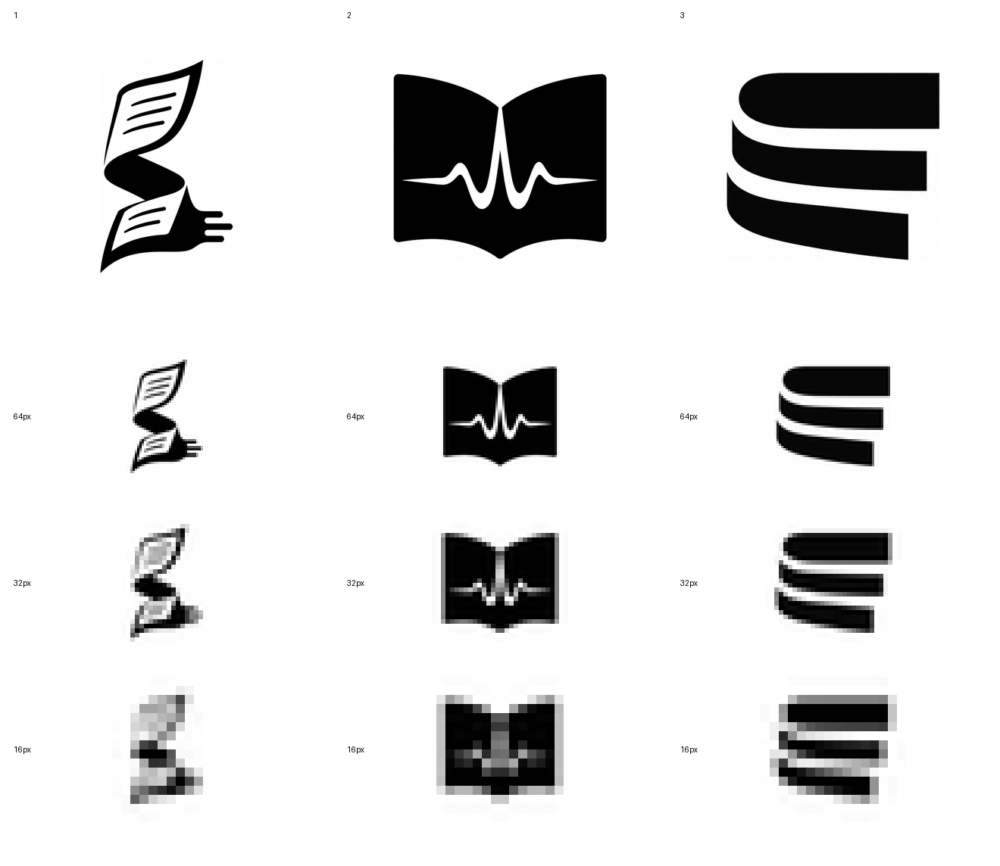
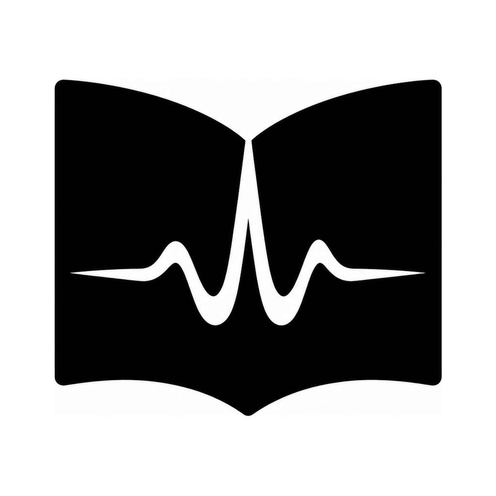

# Sonafolio “书页声波”黑白轮廓探索

> 版本：v0.1，2026-07-23。
> 状态：已降级为内部探索记录；不是正式设计需求，不应作为造型参考，也不是最终 Logo、商标图样或可直接发布的 App 图标。
> 范围：只比较黑白识别度、缩小表现和品牌独特性，不讨论颜色、材质与 macOS 图标容器。

后续概念探索已经选定与本页三张内部草图不同的 `Final Refinement 2`，并完成锁定路径、
字标组合和 macOS App 图标候选。当前进度见
[macOS App 图标候选包](../assets/brand/sonafolio/app-icon-candidate/README.md)；本页结论只代表早期草图淘汰记录。

正式对外委托和生成工具输入统一使用
[Sonafolio Logo 专业设计需求书](sonafolio-logo-design-brief.md)。本页保留的草图只用于说明已经发现的误读风险，
不要求后续设计方沿用或修改这些具体造型。

## 1. 方案 1：纸带成声（Page Current）

一条连续纸带形成隐约的 `S`，上下两端同时表现书页和声音输出。它最接近“长文连续变成声音”的完整叙事，
但当前轮廓包含页内横线、上下两张纸和三条输出线，缩小后信息相互粘连；右侧输出端也容易被误读为插头或手指。

**结论：本轮淘汰，不进入配色。** 可保留“连续纸带形成 S”的思路，但不能沿用当前具体造型。

## 2. 方案 2：书脊回响（Spine Echo）

打开的书本负责第一层识别，书脊与负形波形负责第二层“声音”识别。三种尺寸下都能快速看懂，适合作为商店截图、
功能图标或“长文转语音”的说明图形。问题是“打开的书 + 波形”在教育、播客、有声书和医疗心电图类标志中都很常见，
独占性较弱；当前脉冲也略像心电图。

**结论：保留为安全备选，不直接定稿。** 如果采用，下一轮必须把心电波形改成更平静的语音节奏，并重做书页比例。

## 3. 方案 3：页边声纹（Page-edge Voice）

三条粗页带既是叠放的长稿页边，也是连续声音的节奏。它的图形最少、缩小最稳定，视觉上也不像现成的麦克风或播放按钮，
更容易发展为 Sonafolio 自己的标志。当前不足是书页和声音语义都偏抽象，初看可能被理解为分层数据、书脊或字母 `E`。

**结论：建议作为第二轮主方向。** 下一轮应保留三条粗带和负形流动感，只做一次结构修正：让左侧更像翻页书脊，
让三条页边的长短产生一次柔和语音起伏，同时避免变成均衡器或数据库图标。

## 4. 第一轮判断

| 方案 | 书页识别 | 声音识别 | 16 px 稳定性 | 独特性 | 当前决定 |
| --- | ---: | ---: | ---: | ---: | --- |
| 纸带成声 | 4/5 | 3/5 | 2/5 | 4/5 | 淘汰当前造型 |
| 书脊回响 | 5/5 | 5/5 | 4/5 | 2/5 | 安全备选 |
| 页边声纹 | 3/5 | 3/5 | 5/5 | 4/5 | **建议主方向** |

第一轮不应进入上色。先在方案 3 基础上制作三张仅改变结构的变体，目标是把“书页识别”从 3/5 提高到 4/5，
同时保持 16 px 稳定性和独特性；确认其中一个轮廓后，再制作深靛、暖纸白和琥珀金的 macOS 图标精修稿。

## 5. 文件说明

源目录：[`docs/assets/brand/sonafolio/logo-exploration/`](../assets/brand/sonafolio/logo-exploration/)

- `*-raw.png`：内置图像生成工具的原始概念图；
- `*-normalized.png`：统一裁切、留白和尺寸后的判断稿；
- `*-64px.png`、`*-32px.png`、`*-16px.png`：实际缩小测试；
- `sonafolio-logo-silhouette-comparison.png`：统一对照板。

这些位图用于方向判断，不能代替最终矢量源文件。定稿时需要人工重建曲线、处理光学校正、检查近似图形，并由公司
保存完整的创作和权利记录。
