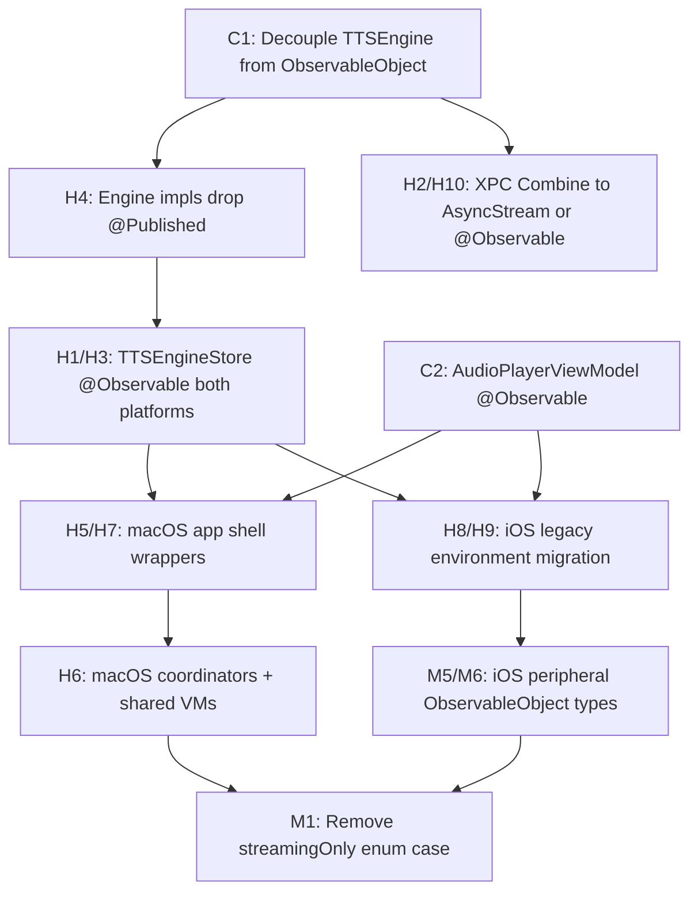

# Modernization Analysis — QwenVoice `Sources/`

**Date:** 2026-05-26  
**Scope:** `/Users/patricedery/Coding_Projects/QwenVoice/Sources/`  
**Deployment target:** macOS 26.0+ / iOS 26.0+ (`project.yml`) — full `@Observable` migration is not blocked by OS version.

## Summary

| Severity | Count | Theme |
|----------|------:|-------|
| **Critical** | 2 | Engine protocol + shared playback model pin the whole stack to `ObservableObject` / Combine |
| **High** | 12 | Engine stores, XPC/extension bridges, macOS app shell, hybrid iOS legacy zone |
| **Medium** | 11 | Coordinator split, publisher wiring, sleep/DispatchQueue idioms, deprecated enum case |
| **Low** | 6 | Cosmetic SwiftUI (deprioritized) |

**Headline:** iOS chrome is mid-migration (`AppModel` + `StudioGenerationCoordinator` are `@Observable`; new screens use `@Environment(AppModel.self)`). **Engine-boundary and macOS shell code remain on the legacy triplet** (`ObservableObject` / `@Published` / `@StateObject` / `@EnvironmentObject` / Combine publishers). That split is the main modernization debt — not Liquid Glass or `foregroundColor`.

**Recommended migration order (engine-first):**

1. Decouple `TTSEngine` from `ObservableObject`; expose snapshot/state via `@Observable` frontend stores or async observation.
2. Migrate `TTSEngineStore` (macOS + iOS), `AudioPlayerViewModel`, and `MacTTSEngine.snapshotPublisher` off Combine.
3. Flip macOS `QwenVoiceApp` + `ContentView` property wrappers once stores are `@Observable`.
4. Finish iOS legacy-zone `@EnvironmentObject` → `.environment(...)` after engine deps migrate.
5. Remove deprecated `NativeQwenPreparedLoadProfile.streamingOnly` handling; adopt `Task.sleep(for:)` in engine hot paths.

**iOS 26 adoption:** Liquid Glass (`.glassEffect`), ExtensionKit engine hosting, and modern `onChange` / `NavigationStack` / `.sheet(item:)` are already in place on the redesigned iOS surfaces. Gaps are mostly **state-management consistency**, not missing platform APIs.

---

## Critical

### C1 — `TTSEngine` protocol requires `ObservableObject`

| Field | Value |
|-------|-------|
| **File:line** | `Sources/QwenVoiceCore/TTSEngine.swift:97-98` |
| **Description** | The shared engine contract inherits `ObservableObject`, forcing every implementation (`MLXTTSEngine`, `ExtensionBackedTTSEngine`, `IOSSimulatorTTSEngine`, iOS `TTSEngineStore`) to use `@Published` and blocking `@Observable` at the core boundary. |
| **Fix** | Split protocol: keep `TTSEngine` as pure async capability surface; add a separate `@Observable TTSEngineObservation` (or struct snapshot + `withObservationTracking`) for UI. Update `TTSEngineStore` on both platforms to observe the new type instead of conforming engines to `ObservableObject`. |

### C2 — `AudioPlayerViewModel` is NSObject + nested `ObservableObject`

| Field | Value |
|-------|-------|
| **File:line** | `Sources/SharedSupport/ViewModels/AudioPlayerViewModel.swift:71,90-92,107-116` |
| **Description** | Shared macOS/iOS playback VM inherits `NSObject` for `AVAudioPlayerDelegate`, uses `@Published` throughout, and nests `PlaybackProgress: ObservableObject`. Injected via `@StateObject` / `@EnvironmentObject` in both app entry points. This is the second root dependency after the engine store. |
| **Fix** | Extract delegate shim to a small NSObject helper; mark the VM `@Observable @MainActor`. Migrate nested `PlaybackProgress` to `@Observable` or flatten into parent properties. Replace `@StateObject` with `@State` at app root; replace `.environmentObject(audioPlayer.playbackProgress)` with `.environment(progress)` or bind through parent. |

---

## High

### H1 — macOS `TTSEngineStore` bridges Combine → `ObservableObject`

| Field | Value |
|-------|-------|
| **File:line** | `Sources/QwenVoiceNative/TTSEngineStore.swift:19-44` |
| **Description** | macOS store subscribes to `MacTTSEngine.snapshotPublisher` via `AnyCancellable` and re-publishes four `@Published` fields. All macOS generation/settings/history views observe this object. |
| **Fix** | After C1: make `TTSEngineStore` `@Observable`, subscribe via `withObservationTracking` or async stream from engine, drop Combine import. |

### H2 — `MacTTSEngine` is Combine-first

| Field | Value |
|-------|-------|
| **File:line** | `Sources/QwenVoiceNative/MacTTSEngine.swift:5-7` |
| **Description** | macOS engine abstraction exposes `snapshotPublisher: AnyPublisher<TTSEngineSnapshot, Never>`. `XPCNativeEngineClient` backs this with `CurrentValueSubject`. |
| **Fix** | Replace publisher with `@Observable` snapshot holder on the client, or `AsyncStream<TTSEngineSnapshot>` for cross-actor delivery. Keep XPC boundary Sendable; drop Combine from public surface. |

### H3 — iOS `TTSEngineStore` duplicates legacy observation

| Field | Value |
|-------|-------|
| **File:line** | `Sources/iOS/TTSEngineStore.swift:38-62,78-79,368,436` |
| **Description** | iOS store is `ObservableObject` + `TTSEngine`, uses `@Published` engine state, `AnyCancellable` backend observer, and posts `NotificationCenter` for memory-context changes. Legacy IOS views and `QVoiceiOSApp` wire via `@EnvironmentObject` and `.onReceive(engine.$…)`. |
| **Fix** | Same as H1 after C1. Replace `NotificationCenter.default.post(name: .ttsEngineMemoryContextDidChange)` with observable property or `AsyncStream`. Update `QVoiceiOSApp.swift:67-77` and `IOSEngineLifecycleToast.swift:19` away from `$published` Combine publishers. |

### H4 — Engine implementations use `@Published` directly

| Field | Value |
|-------|-------|
| **File:line** | `Sources/QwenVoiceCore/MLXTTSEngine.swift:82-83,95` · `Sources/QwenVoiceCore/ExtensionBackedTTSEngine.swift:11-14` · `Sources/iOS/IOSSimulatorTTSEngine.swift:19-21` |
| **Description** | Core MLX and extension-backed engines publish load/clone/event state via `@Published` because of C1. |
| **Fix** | Collapse to internal mutable state + explicit snapshot updates once `TTSEngine` no longer requires `ObservableObject`. |

### H5 — macOS app root: seven `@StateObject` singletons

| Field | Value |
|-------|-------|
| **File:line** | `Sources/QwenVoiceApp.swift:9-16,23-27,125-131` |
| **Description** | Entry point owns engine store, audio player, model manager, saved voices, command router, library events, and startup coordinator as `@StateObject`; child tree gets six `.environmentObject(...)` injections. |
| **Fix** | After C1/C2/H1/H6: `@State private var …` for each `@Observable` model; `.environment(model)` instead of `.environmentObject`. |

### H6 — macOS view models still `ObservableObject`

| Field | Value |
|-------|-------|
| **File:line** | `Sources/ViewModels/ModelManagerViewModel.swift:6,109-112` · `Sources/ViewModels/SavedVoicesViewModel.swift:5-8` · `Sources/ViewModels/CustomVoiceCoordinator.swift:7-10` · `Sources/ViewModels/VoiceDesignCoordinator.swift:36-41` · `Sources/ViewModels/VoiceCloningCoordinator.swift:18-24` · `Sources/Services/BatchGenerationRunner.swift:611-617` · `Sources/Services/MacGenerationWarmupCoordinator.swift:7` · `Sources/Services/AppStartupCoordinator.swift:4-5` · `Sources/Services/AppCommandRouter.swift:5` · `Sources/Services/GenerationLibraryEvents.swift:5-18` |
| **Description** | macOS generation coordinators and shared VMs remain on `@Published`. iOS already has `@Observable StudioGenerationCoordinator` (`Sources/iOS/Studio/StudioGenerationCoordinator.swift:21-22`) but macOS coordinators are unchanged. |
| **Fix** | Migrate coordinators and `ModelManagerViewModel` / `SavedVoicesViewModel` to `@Observable`; macOS generation views switch `@StateObject` → `@State`, `@ObservedObject` → plain/`@Bindable`. Consider sharing coordinator pattern with iOS or extracting mode-agnostic generation lifecycle to core. |

### H7 — macOS `ContentView` + library: dense `@EnvironmentObject` graph

| Field | Value |
|-------|-------|
| **File:line** | `Sources/ContentView.swift:116-119,148,543-583` · `Sources/Views/Library/HistoryView.swift:115-118` · `Sources/Views/Components/BatchGenerationSheet.swift:5-8,22` · `Sources/Views/Generate/CustomVoiceView.swift:123-126` (and sibling generate views) |
| **Description** | ~53 `@EnvironmentObject` usages across `Sources/`; macOS shell is the densest cluster. Depends on H5/H6. |
| **Fix** | Mechanical pass after models migrate: `@Environment(Type.self)` + `@Bindable` where bindings needed. |

### H8 — iOS hybrid: modern `AppModel` + legacy `@EnvironmentObject` engine deps

| Field | Value |
|-------|-------|
| **File:line** | `Sources/iOS/App/AppModel.swift:47-48` (modern) vs `Sources/iOS/QVoiceiOSApp.swift:9-13,44-49` (legacy) · `Sources/iOS/IOSGenerationModeViews.swift:6-8,395-398,862-865` · `Sources/iOS/IOSGenerateFlowViews.swift:75-77,173-174` |
| **Description** | Phase-2+ screens use `@Environment(AppModel.self)` but legacy per-mode bodies still pull engine, model manager, and audio player via `@EnvironmentObject`. Two parallel DI styles in one app. |
| **Fix** | Migrate `IOSAppDependenciesContainer` (`Sources/iOS/IOSAppBootstrap.swift:8`) off `ObservableObject`; inject engine/manager/player with `.environment(...)` at `QVoiceiOSRootView`. Collapse legacy views behind `AppModel` accessors or environment keys. |

### H9 — iOS dependency container still `ObservableObject`

| Field | Value |
|-------|-------|
| **File:line** | `Sources/iOS/IOSAppBootstrap.swift:8` · `Sources/iOS/QVoiceiOSApp.swift:9` |
| **Description** | Bootstrap bag uses `@StateObject private var deps` only to hold startup state; not observation-heavy but blocks consistent `@State` + `.environment` pattern. |
| **Fix** | Replace with `@State` holding a struct/`@Observable` bootstrap result; drop `ObservableObject` conformance. |

### H10 — XPC client Combine subjects at engine boundary

| Field | Value |
|-------|-------|
| **File:line** | `Sources/QwenVoiceNative/XPCNativeEngineClient.swift:670,707,723` · `Sources/QwenVoiceNative/GenerationChunkBroker.swift:8` |
| **Description** | `CurrentValueSubject` / `PassthroughSubject` relay snapshots and streaming chunks across XPC. Couples engine transport to Combine lifetime. |
| **Fix** | Use `AsyncStream` + `Continuation` for events; or internal `@Observable` actor-isolated snapshot. Align with H2. |

### H11 — iOS chunk delivery falls back to `NotificationCenter`

| Field | Value |
|-------|-------|
| **File:line** | `Sources/SharedSupport/ViewModels/AudioPlayerViewModel.swift:617-621` |
| **Description** | Non-macOS code path registers `NotificationCenter.default.addObserver` for `.generationChunkReceived` instead of Combine/engine observation. |
| **Fix** | Route iOS chunks through the same typed async/stream path as macOS; remove notification bridge when engine store exposes chunk events. |

### H12 — Engine hosts: Combine `AnyCancellable` sets

| Field | Value |
|-------|-------|
| **File:line** | `Sources/QwenVoiceEngineService/EngineServiceHost.swift:50` · `Sources/iOSEngineExtension/VocelloEngineExtensionHost.swift:49` |
| **Description** | XPC/extension hosts retain Combine subscriptions for runtime wiring. Not UI, but part of engine-boundary legacy stack. |
| **Fix** | Audit subscriptions; replace with structured concurrency tasks tied to connection lifetime where possible. |

---

## Medium

### M1 — Deprecated `NativeQwenPreparedLoadProfile.streamingOnly`

| Field | Value |
|-------|-------|
| **File:line** | `Sources/QwenVoiceCore/NativeRuntimeFactory.swift:11-12` · `Sources/QwenVoiceCore/MLXTTSEngine.swift:1412-1413,1422,1445` |
| **Description** | Enum case marked `@available(*, deprecated, renamed: "withoutCloneEncoders")` but still handled in MLX load-profile switches. No external call sites use `.streamingOnly` — dead compatibility path. |
| **Fix** | Remove `.streamingOnly` case and collapse switch arms to `.withoutCloneEncoders` only; run engine load tests on iOS profile paths. |

### M2 — `onReceive` tied to `$published` engine fields (iOS)

| Field | Value |
|-------|-------|
| **File:line** | `Sources/iOS/QVoiceiOSApp.swift:67,77` · `Sources/iOS/IOSEngineLifecycleToast.swift:19` |
| **Description** | App lifecycle and toast UI subscribe via Combine publishers on `@Published` engine properties. Breaks when engine migrates to `@Observable`. |
| **Fix** | Replace with `.onChange(of: engine.extensionLifecycleState)` / observation tracking, or bind through `@Observable` TTSEngineStore properties in view body. |

### M3 — `GenerationLibraryEvents` Combine bus

| Field | Value |
|-------|-------|
| **File:line** | `Sources/Services/GenerationLibraryEvents.swift:5-18,24-26` · `Sources/Views/Library/HistoryView.swift:140` · `Sources/iOSSupport/Services/GenerationPersistence.swift:155` · `Sources/iOS/IOSBatchGenerationCoordinator.swift:166` |
| **Description** | Cross-surface “generation saved” signaling uses `PassthroughSubject` + `NotificationCenter` duplicate on iOS. |
| **Fix** | `@Observable` shared event hub with `generationRevision` counter or typed `AsyncStream`; History view observes via `@Environment` instead of `.onReceive`. |

### M4 — `AppCommandRouter` Combine subject

| Field | Value |
|-------|-------|
| **File:line** | `Sources/Services/AppCommandRouter.swift:5,8` · `Sources/ContentView.swift:280` |
| **Description** | Sidebar selection routed via `PassthroughSubject` on an `ObservableObject` singleton. |
| **Fix** | `@Observable AppCommandRouter` with `var pendingSidebarSelection: SidebarItem?` and `.onChange` in `ContentView`. |

### M5 — iOS shared VMs duplicate macOS legacy pattern

| Field | Value |
|-------|-------|
| **File:line** | `Sources/iOSSupport/ViewModels/ModelManagerViewModel.swift:91,94` · `Sources/iOSSupport/ViewModels/SavedVoicesViewModel.swift:5-8` · `Sources/iOS/IOSModelInstallerViewModel.swift:5,21` · `Sources/iOS/IOSBatchGenerationCoordinator.swift:5,22-26` |
| **Description** | iOS-specific VMs/coordinators still `ObservableObject` while `AppModel`/`StudioGenerationCoordinator` are modern. |
| **Fix** | Migrate after H8; prefer folding installer/batch state into `AppModel` where it crosses tabs. |

### M6 — Playback controllers: small `ObservableObject` NSObject types

| Field | Value |
|-------|-------|
| **File:line** | `Sources/iOS/Studio/IOSStudioInlinePlayerCard.swift:22-22,203-206` · `Sources/iOS/Sheets/IOSPlayerSheet.swift:18,529-533` · `Sources/iOS/Sheets/IOSVoicePreviewPlayer.swift:13,17` · `Sources/iOS/Overlays/IOSRecordingOverlay.swift:17,226-235` |
| **Description** | Local AVFoundation wrappers use `@StateObject` + `ObservableObject` for sheet/inline playback and recording. Isolated from engine but adds wrapper debt. |
| **Fix** | Extract shared `@Observable` playback controller after C2 patterns exist; use `@State` ownership. |

### M7 — `Task.sleep(nanoseconds:)` in engine/runtime paths

| Field | Value |
|-------|-------|
| **File:line** | `Sources/QwenVoiceCore/MLXTTSEngine.swift:171` · `Sources/QwenVoiceCore/NativeTelemetrySampler.swift:108` · `Sources/QwenVoiceCore/AudioPreparation.swift:601` · `Sources/iOS/TTSEngineStore.swift:562` · (+ UI/simulator sleeps) |
| **Description** | Engine code mixes legacy nanosecond sleeps with modern `Task.sleep(for:)` already used in `XPCNativeEngineClient.swift:407,586` and `ExtensionEngineCoordinator.swift:302`. |
| **Fix** | Standardize on `Task.sleep(for: .milliseconds(...))` / `Duration` in core for readability and clock API consistency. |

### M8 — `DispatchQueue.main.async` in UI bridges

| Field | Value |
|-------|-------|
| **File:line** | `Sources/iOS/Studio/IOSFlexibleTextEditor.swift:69,71` · `Sources/iOS/IOSGenerationInputControls.swift:112` · `Sources/Views/Components/TextInputView.swift:162` · `Sources/Views/Components/WindowChromeConfigurator.swift:27,34` · `Sources/Views/Settings/SettingsView.swift:627` |
| **Description** | Focus/responder and AppKit chrome still hop to main queue imperatively. |
| **Fix** | Prefer `@MainActor` methods + `Task { @MainActor in … }` where call sites aren't already MainActor-isolated. Low urgency for engine; OK to defer. |

### M9 — Background URLSession completion handlers (system-required)

| Field | Value |
|-------|-------|
| **File:line** | `Sources/iOS/IOSModelDeliveryBackgroundEvents.swift:9,23` · `Sources/iOS/IOSModelInstallerViewModel.swift:259` |
| **Description** | UIKit background transfer API requires `@escaping () -> Void` completionHandler storage. Not a SwiftUI deprecation — intentional. |
| **Fix** | No migration needed; wrap handler in `@MainActor` Task at invocation site if UI updates leak. |

### M10 — `@unchecked Sendable` concentration at boundaries

| Field | Value |
|-------|-------|
| **File:line** | `Sources/QwenVoiceNative/XPCNativeEngineClient.swift:669,79` · `Sources/QwenVoiceEngineService/EngineServiceHost.swift:71` · `Sources/iOSEngineExtension/VocelloEngineExtensionHost.swift:68` · `Sources/QwenVoiceCore/UnsafeSpeechGenerationModel.swift:55` (+ ~15 more) |
| **Description** | XPC, extension hosts, MLX model boxes, and download delegates use `@unchecked Sendable`. Swift 6 strict-concurrency audit item, not deprecated API. |
| **Fix** | Track with concurrency audit; prefer actors/isolated types when touching these files. Do not blanket-remove without proof. |

### M11 — iOS 26: partial `sensoryFeedback` / no `@Entry` environment keys

| Field | Value |
|-------|-------|
| **File:line** | `Sources/iOS/App/TabDock.swift:33` · `Sources/iOS/IOSGenerateFlowViews.swift:410` · `Sources/iOS/IOSAccessibility.swift:4-12` · `Sources/iOS/Sheets/IOSPlayerSheet.swift:473-477` |
| **Description** | iOS 26 haptics adopted in two places; custom environment values still use manual `EnvironmentKey` (works fine on 26). Not blocking. |
| **Fix** | Optional: migrate custom keys to `@Entry` when raising Swift tools version; expand `sensoryFeedback` to Generate CTA and sheet dismissals. Cosmetic — defer. |

---

## Low (deprioritized — cosmetic UI)

### L1 — `foregroundColor` vs `foregroundStyle`

| Field | Value |
|-------|-------|
| **File:line** | `Sources/Views/Generate/CustomVoiceView.swift:396` · `VoiceDesignView.swift:291` · `VoiceCloningView.swift:539` · `Sources/iOS/QVoiceiOSApp.swift:32,37` |
| **Description** | Four files still use deprecated-style `foregroundColor`. Rest of codebase predominantly uses `foregroundStyle`. |
| **Fix** | Mechanical rename when touching those views. |

### L2 — `withAnimation { }` closures

| Field | Value |
|-------|-------|
| **File:line** | `Sources/Views/Settings/SettingsView.swift:220,706` · `Sources/iOS/Overlays/IOSOnboardingFlow.swift:116,127` · `Sources/iOS/App/TabDock.swift:54` · `Sources/iOS/IOSDesignSystemPrimitives.swift:825` |
| **Description** | Small count; repo already routes most animation through `AppLaunchConfiguration` / `iosAppAnimation` for Reduce Motion. |
| **Fix** | Optional `.animation(_, value:)` migration; no engine impact. |

### L3 — Legacy `.sheet(isPresented:)` in iOS legacy zone

| Field | Value |
|-------|-------|
| **File:line** | `Sources/iOS/IOSGenerationModeViews.swift:534,1077` · `Sources/iOS/Sheets/IOSBottomSheets.swift:7` (comment) |
| **Description** | New chrome uses `.sheet(item:)` (`RootView.swift:88`); legacy mode views still use boolean sheets. |
| **Fix** | Convert to `Identifiable` presentation state when refactoring legacy bodies. |

### L4 — `GeometryReader` usage

| Field | Value |
|-------|-------|
| **File:line** | Waveforms/layout in `IOSPlayerSheet.swift`, `IOSStudioInlinePlayerCard.swift`, `GenerationWorkflowView.swift`, etc. |
| **Description** | Intentional for proportional waveform/scrubber layout; not an modernization defect. |
| **Fix** | None unless layout audit flags specific misuse. |

### L5 — macOS Liquid Glass already gated

| Field | Value |
|-------|-------|
| **File:line** | `Sources/Views/Components/AppTheme.swift:655-657,683-685` · widespread `.glassEffect` |
| **Description** | iOS 26 / macOS 26 glass APIs adopted with `#if QW_UI_LIQUID` and Reduce Transparency fallbacks (`ThemeModifiers.swift:51-53`). |
| **Fix** | None — already aligned with platform. |

### L6 — `NavigationView` / deprecated navigation

| Field | Value |
|-------|-------|
| **File:line** | *(none in `Sources/`)* |
| **Description** | No `NavigationView` usage found; iOS uses `NavigationStack`, macOS uses `NavigationSplitView` patterns. |
| **Fix** | N/A |

---

## Verified modern patterns (no action)

- **`onChange(of:perform:)` deprecated form:** not found — all `onChange` call sites use two-parameter `{ _, newValue in }` form.
- **`.alert(isPresented:)` / `.navigationView`:** not found.
- **iOS `@Observable` adoption:** `AppModel` (`AppModel.swift:47`), `StudioGenerationCoordinator` (`StudioGenerationCoordinator.swift:21`), new screens with `@Environment(AppModel.self)` + `@Bindable`.
- **ExtensionKit / AppExtension engine:** `VocelloEngineExtension.swift`, `ExtensionEngineTransport.swift`, `VocelloEngineExtensionPoint.swift`.
- **Deployment target 26.0:** no need for iOS 16/17 compatibility shims for Observation.

---

## Migration order (detailed)

---

## Counts reference

| Pattern | Approx. matches in `Sources/` |
|---------|-------------------------------|
| `ObservableObject` types | 24 classes (+ `TTSEngine` protocol) |
| `@Published` | ~60 property declarations |
| `@StateObject` | 14 declarations |
| `@EnvironmentObject` | ~53 declarations |
| `@ObservedObject` | ~10 declarations |
| `@Observable` | 2 types (`AppModel`, `StudioGenerationCoordinator`) |
| `@Environment(AppModel.self)` | 12 call sites (new iOS zone) |
| `Task.sleep(nanoseconds:)` | 15 |
| `Task.sleep(for:)` | 6 (prefer this in engine) |
| `.glassEffect` | 15+ (iOS 26 / macOS 26 — done) |

---

*Generated by modernization-helper scan on 2026-05-26. Engine-boundary items prioritized over cosmetic SwiftUI.*
